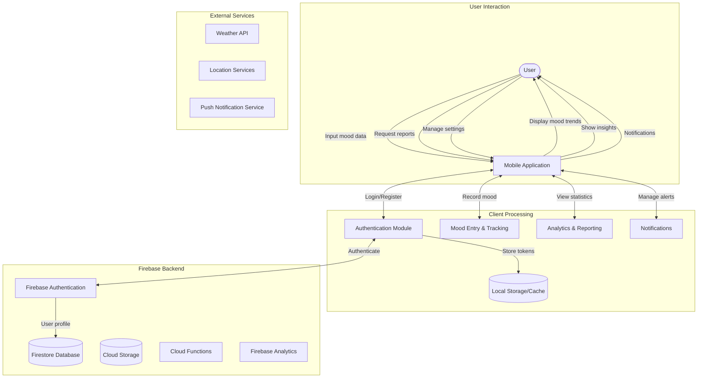
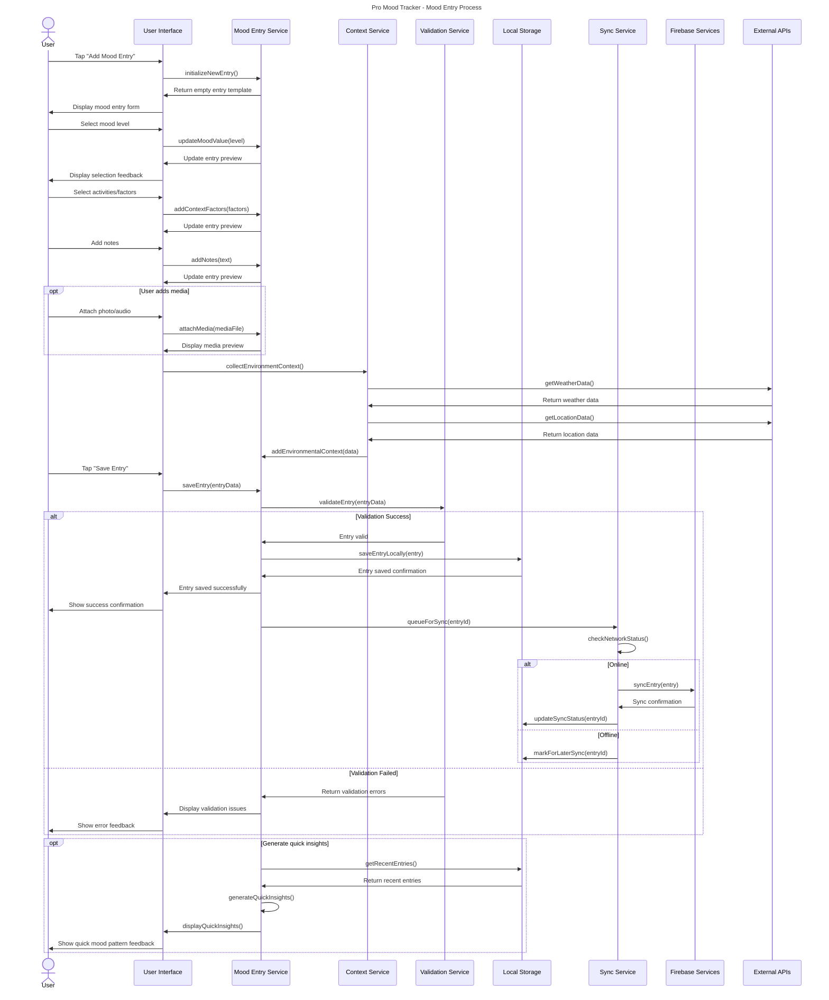
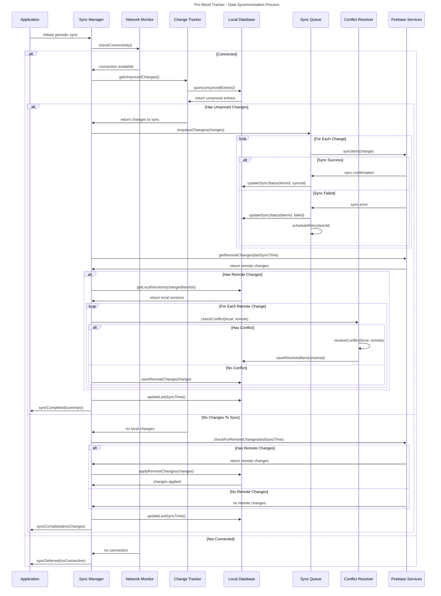

```mermaid
graph TD
    App[App Container] --> Nav[Navigation Container]
    Nav --> Auth[Auth Screens]
    Nav --> Main[Main Navigation]
    
    Auth --> Login[Login Screen]
    Auth --> Register[Registration Screen]
    Auth --> Reset[Password Reset]
    
    Main --> Tabs[Tab Navigator]
    Main --> Modals[Modal Screens]
    
    Tabs --> Dashboard[Dashboard Tab]
    Tabs --> History[History Tab]
    Tabs --> Add[Add Mood Tab]
    Tabs --> Insights[Insights Tab]
    Tabs --> Profile[Profile Tab]
    
    Modals --> MoodDetail[Mood Details]
    Modals --> Settings[Settings Screens]
    Modals --> Export[Data Export]
    
    Dashboard --> DashWidgets[Dashboard Widgets]
    DashWidgets --> MoodSummary[Mood Summary]
    DashWidgets --> StreakWidget[Streak Display]
    DashWidgets --> RecentEntries[Recent Entries]
    DashWidgets --> QuickInsights[Quick Insights]
    
    History --> Calendar[Calendar View]
    History --> ListView[List View]
    History --> FilterControls[Filter Controls]
    
    Add --> MoodSelector[Mood Selector]
    Add --> FactorPicker[Factor Picker]
    Add --> NotesInput[Notes Input]
    Add --> MediaAttach[Media Attachment]
    Add --> ContextData[Context Collection]
    
    Insights --> TrendCharts[Trend Charts]
    Insights --> Correlations[Correlation Views]
    Insights --> Patterns[Pattern Display]
    Insights --> TimeAnalysis[Time Analysis]
    
    Profile --> UserInfo[User Information]
    Profile --> Achievements[Achievements Display]
    Profile --> AppSettings[App Settings]
    Profile --> ThemeSelector[Theme Selection]
    
    classDef screen fill:#d0e0ff,stroke:#333,stroke-width:1px
    classDef navigator fill:#ffecb3,stroke:#333,stroke-width:1px
    classDef component fill:#e1f5fe,stroke:#333,stroke-width:1px
    classDef widget fill:#f1f8e9,stroke:#333,stroke-width:1px
    
    class App,Nav,Auth,Main,Tabs,Modals navigator
    class Login,Register,Reset,Dashboard,History,Add,Insights,Profile,MoodDetail,Settings,Export screen
    class MoodSelector,FactorPicker,NotesInput,MediaAttach,ContextData,Calendar,ListView,FilterControls,TrendCharts,Correlations,Patterns,TimeAnalysis,UserInfo,Achievements,AppSettings,ThemeSelector component
    class MoodSummary,StreakWidget,RecentEntries,QuickInsights widget
```

# Final Report for EIB Sem 6
# Pro Mood Tracker Application

**Project Report**  
*B.Tech Computer Engineering*  
*Semester 6*

## Abstract

The Pro Mood Tracker application represents a comprehensive solution for personal emotional health monitoring, developed as part of the Engineering in Business (EIB) course in Semester 6. This application enables users to track their moods, identify patterns and triggers, and gain valuable insights into their emotional well-being. By leveraging modern mobile development frameworks, cloud technologies, and data analytics, the Pro Mood Tracker provides an intuitive, secure, and feature-rich platform for emotional self-awareness.

This report documents the complete development process, from initial concept and requirements gathering to architectural design, implementation details, testing methodologies, and deployment strategies. It explores the technical challenges encountered during development and the solutions implemented to overcome them. Additionally, the report examines the business aspects of the application, including market analysis, user demographics, monetization strategies, and future growth opportunities.

Through detailed diagrams, code examples, and in-depth discussions, this document serves as a comprehensive reference for understanding the Pro Mood Tracker's functionality, architecture, and underlying technologies. The report concludes with reflections on the project's outcomes, lessons learned, and recommendations for future enhancements.

## Table of Contents

1. **Introduction**
   - 1.1 Project Overview
   - 1.2 Problem Statement
   - 1.3 Project Objectives
   - 1.4 Scope and Limitations
   - 1.5 Report Structure

2. **Background and Literature Review**
   - 2.1 Existing Mood Tracking Solutions
   - 2.2 Psychological Foundations
   - 2.3 Mobile Application Development Trends
   - 2.4 Technology Stack Evaluation
   - 2.5 Market Analysis

3. **Requirements Analysis**
   - 3.1 Stakeholder Identification
   - 3.2 Functional Requirements
   - 3.3 Non-Functional Requirements
   - 3.4 User Stories and Use Cases
   - 3.5 Requirements Prioritization

4. **System Architecture and Design**
   - 4.1 System Overview
   - 4.2 Architecture Patterns
   - 4.3 Component Diagrams
   - 4.4 Data Flow Diagrams
   - 4.5 Sequence Diagrams
   - 4.6 Deployment Architecture
   - 4.7 Data Model and Entity Relationships
   - 4.8 User Interface Design

5. **Implementation Details**
   - 5.1 Development Environment Setup
   - 5.2 Frontend Implementation
   - 5.3 Backend Services Integration
   - 5.4 Data Management and Synchronization
   - 5.5 Authentication and Security
   - 5.6 Analytics and Reporting Features
   - 5.7 Offline Functionality
   - 5.8 Notification System

6. **Testing and Quality Assurance**
   - 6.1 Testing Strategy
   - 6.2 Unit Testing
   - 6.3 Integration Testing
   - 6.4 User Interface Testing
   - 6.5 Performance Testing
   - 6.6 Security Testing
   - 6.7 User Acceptance Testing
   - 6.8 Bug Tracking and Resolution

7. **Deployment and Operations**
   - 7.1 Deployment Strategy
   - 7.2 Continuous Integration/Continuous Deployment
   - 7.3 Application Monitoring
   - 7.4 Backup and Recovery
   - 7.5 Maintenance Procedures

8. **User Experience and Evaluation**
   - 8.1 User Interface Design Principles
   - 8.2 Usability Testing
   - 8.3 User Feedback Analysis
   - 8.4 Accessibility Considerations
   - 8.5 Performance Metrics

9. **Business Analysis**
   - 9.1 Target Market
   - 9.2 Competitive Analysis
   - 9.3 Business Model
   - 9.4 Marketing Strategy
   - 9.5 Revenue Projections
   - 9.6 Risk Analysis

10. **Future Work**
    - 10.1 Planned Enhancements
    - 10.2 Scaling Considerations
    - 10.3 Research Opportunities
    - 10.4 Long-term Vision

11. **Conclusion**
    - 11.1 Project Summary
    - 11.2 Achievements
    - 11.3 Lessons Learned
    - 11.4 Final Reflections

12. **References**

13. **Appendices**
    - Appendix A: Technical Documentation
    - Appendix B: User Manual
    - Appendix C: Project Timeline
    - Appendix D: Meeting Minutes
    - Appendix E: Code Samples

## 1. Introduction

### 1.1 Project Overview

The Pro Mood Tracker represents an innovative mobile application designed to help individuals monitor, analyze, and understand their emotional patterns with unprecedented depth and convenience. This project addresses the growing recognition of emotional well-being as a fundamental component of overall health by providing users with tools to track their moods alongside contextual information such as activities, location, weather, and personal notes.

Unlike conventional mood trackers that offer limited functionality and insights, the Pro Mood Tracker employs a comprehensive approach that balances sophisticated analytics with user-friendly interfaces. By capturing both emotional states and their surrounding context, the application enables users to identify patterns, triggers, and correlations that might otherwise remain hidden.

The application has been developed using React Native for cross-platform compatibility, with Firebase providing backend services for authentication, data storage, and synchronization. This technical foundation supports the application's core philosophy of being accessible, insightful, private, and engaging for users across diverse demographics and use cases.

# Figure 1.1: Use Case Diagram for Pro Mood Tracker

```
+-----------------------------------------------------+
|                  Pro Mood Tracker                   |
+-----------------------------------------------------+
|                                                     |
|    +-------+                                        |
|    |       |                                        |
|    |       |                                        |
|    | User  |                                        |
|    |       |                                        |
|    |       |                                        |
|    +-------+                                        |
|        |                                            |
|        |                                            |
|        v                                            |
|    +-----------+      +-----------+      +--------+ |
|    | Register/ |      |  Manage   |      | Export | |
|    |  Login    |----->|  Profile  |----->|  Data  | |
|    +-----------+      +-----------+      +--------+ |
|        |                                            |
|        |                                            |
|        v                                            |
|    +-----------+      +-----------+      +--------+ |
|    |  Log      |      |   View    |      | Receive| |
|    |  Mood     |----->| Analytics |----->| Insights| |
|    +-----------+      +-----------+      +--------+ |
|        |                                            |
|        |                                            |
|        v                                            |
|    +-----------+      +-----------+      +--------+ |
|    |  Track    |      |   Earn    |      |Customize| |
|    |  Streak   |----->|  Rewards  |----->|  Theme  | |
|    +-----------+      +-----------+      +--------+ |
|                                                     |
+-----------------------------------------------------+

Primary User Journey Flow:
1. User registers or logs in to the application
2. User logs their mood with contextual information
3. User views analytics and visualizations of their mood data
4. User receives insights and recommendations
5. User earns rewards for consistent logging
6. User customizes application settings
7. User exports or shares their mood data

### 1.2 Problem Statement

Mental health challenges affect millions of people worldwide, with stress, anxiety, and mood disorders becoming increasingly prevalent in modern society. However, traditional approaches to mental health management often lack the following:

1. **Accessibility**: Professional mental health services remain inaccessible to many due to cost, stigma, or geographical limitations.

2. **Continuous Monitoring**: Traditional therapy sessions provide only periodic check-ins, missing the day-to-day fluctuations in emotional states that could provide valuable insights.

3. **Data-Driven Insights**: Without systematic tracking, patterns and triggers of mood changes remain unidentified, making it difficult to implement effective interventions.

4. **Personal Empowerment**: Many individuals lack tools to take an active role in understanding and managing their emotional health.

5. **Privacy Concerns**: Discussing mental health issues often raises privacy concerns, deterring many from seeking help or tracking their emotional states.

6. **Contextual Understanding**: Traditional mood tracking methods often fail to capture the contextual factors influencing emotional states, limiting the depth of insights that can be gained.

The Pro Mood Tracker addresses these challenges by providing a private, accessible, and comprehensive tool for continuous mood monitoring and analysis, empowering users to take control of their emotional well-being through data-driven insights.

# Figure 1.2: Activity Diagram for Mood Logging Process

```
+----------------------------------------------------------+
|                                                          |
|  +----------+                                            |
|  |  Start   |                                            |
|  +----------+                                            |
|       |                                                  |
|       v                                                  |
|  +----------+                                            |
|  |  Click   |                                            |
|  |  "Log    |                                            |
|  |  Mood"   |                                            |
|  +----------+                                            |
|       |                                                  |
|       v                                                  |
|  +----------+                                            |
|  | Select   |                                            |
|  | Time of  |                                            |
|  | Day      |                                            |
|  +----------+                                            |
|       |                                                  |
|       v                                                  |
|  +----------+                                            |
|  | Select   |                                            |
|  | Mood     |                                            |
|  | Level    |                                            |
|  +----------+                                            |
|       |                                                  |
|       v                                                  |
|  +--------------------+                                  |
|  | Add Optional Info  |                                  |
|  |--------------------|                                  |
|  | - Notes            |                                  |
|  | - Activities       |                                  |
|  | - Journal Entry    |                                  |
|  +--------------------+                                  |
|       |                                                  |
|       v                                                  |
|  +----------+     No     +------------------+            |
|  | Weather  |----------->| Continue without |            |
|  | Data     |            | Weather Data     |            |
|  | Available|            +------------------+            |
|  +----------+                   |                        |
|       | Yes                     |                        |
|       v                         |                        |
|  +----------+                   |                        |
|  | Add      |                   |                        |
|  | Weather  |<------------------+                        |
|  | Data     |                                            |
|  +----------+                                            |
|       |                                                  |
|       v                                                  |
|  +----------+                                            |
|  | Submit   |                                            |
|  | Mood     |                                            |
|  | Entry    |                                            |
|  +----------+                                            |
|       |                                                  |
|       v                                                  |
|  +----------+                                            |
|  | Display  |                                            |
|  | Success  |                                            |
|  | Message  |                                            |
|  +----------+                                            |
|       |                                                  |
|       v                                                  |
|  +----------+     Yes     +------------------+           |
|  | Want to  |------------>| Navigate to      |           |
|  | View     |             | Dashboard/Charts |           |
|  | Results? |             +------------------+           |
|  +----------+                    |                       |
|       | No                       |                       |
|       v                          |                       |
|  +----------+                    |                       |
|  |  End     |<-------------------+                       |
|  +----------+                                            |
|                                                          |
+----------------------------------------------------------+
```

This activity diagram illustrates the step-by-step process of logging a mood entry in the Pro Mood Tracker application. The process begins when a user clicks the "Log Mood" button and follows a logical sequence of selecting the time of day and mood level. Users can then add optional information such as notes, activities, and journal entries. The system checks for weather data availability and incorporates it if present. After submitting the entry, users can view their results on the dashboard or charts or end the session. This diagram highlights the application's user-friendly approach to mood tracking with both required and optional steps clearly defined.

### 1.3 Project Objectives

The Pro Mood Tracker project aims to achieve the following key objectives:

1. **Create an Intuitive Mood Recording System**: Develop a user-friendly interface that allows quick and simple mood entries with minimal friction, encouraging consistent usage.

2. **Enable Comprehensive Context Capture**: Build functionality to record contextual information alongside mood data, including activities, weather, location, and personal notes.

3. **Implement Advanced Analytics**: Develop algorithms to identify patterns, correlations, and insights from collected mood data, providing users with meaningful feedback about their emotional patterns.

4. **Ensure Data Privacy and Security**: Implement robust security measures to protect sensitive user data, with transparent privacy policies and user control over data sharing.

5. **Provide Rich Visualization Tools**: Create interactive and informative visualizations that help users understand their mood patterns across different time periods and contexts.

6. **Support Offline Functionality**: Develop an offline-first architecture that ensures the application remains functional without internet connectivity.

7. **Enable Cross-Platform Compatibility**: Build the application to work consistently across both iOS and Android platforms, maximizing accessibility.

8. **Incorporate Engagement Features**: Implement features such as reminders, streaks, and achievements to encourage regular use and sustained engagement.

9. **Allow Personalization**: Provide customization options for themes, reporting preferences, and notification settings to adapt to individual user needs.

10. **Facilitate Optional Data Export**: Enable users to export their mood data for personal records or to share with healthcare providers if desired.

These objectives are designed to create a holistic solution for personal mood tracking that balances technical sophistication with ease of use while prioritizing user privacy and data security.

### 1.4 Scope and Limitations

#### Scope

The Pro Mood Tracker project encompasses the following scope:

1. **Mobile Application Development**: Design and implementation of a cross-platform mobile application for iOS and Android using React Native.

2. **Backend Infrastructure**: Setup and configuration of Firebase services for authentication, data storage, and cloud functions.

3. **Core Functionality**:
   - User registration and authentication
   - Mood entry with customizable scales and factors
   - Contextual data collection (weather, location, activities)
   - Journal/notes functionality
   - Media attachment capabilities
   - Data visualization and reporting
   - Notification and reminder system
   - Offline data storage and synchronization
   - User preferences and customization options

4. **Advanced Features**:
   - Pattern recognition algorithms
   - Correlation analysis between mood and contextual factors
   - Achievement and streak tracking
   - Data export functionality
   - Theme customization

5. **Documentation**: Comprehensive technical documentation, user guides, and this final project report.

#### Limitations

Despite the comprehensive nature of the Pro Mood Tracker, the following limitations should be acknowledged:

1. **Not a Medical Tool**: The application is designed for personal insight and self-awareness, not as a diagnostic or treatment tool for mental health conditions. It does not replace professional medical advice or intervention.

2. **Analytics Constraints**: The pattern recognition and correlation analyses are based on statistical methods rather than complex machine learning algorithms, which may limit the depth of insights available.

3. **Data Accuracy Dependencies**: The quality of insights depends on the consistency and honesty of user inputs, which cannot be verified by the system.

4. **Environmental Sensor Limitations**: The application relies on device capabilities and third-party APIs for contextual data like weather and location, which may vary in accuracy or availability.

5. **Privacy Trade-offs**: While the application prioritizes privacy, the use of cloud services for data synchronization necessitates some data transmission, which may concern highly privacy-conscious users.

6. **Resource Constraints**: The application is designed to minimize resource usage, but extensive usage with media attachments may impact device storage and performance.

7. **Connectivity Dependent Features**: While core functionality works offline, certain features like weather data and advanced analytics may require internet connectivity.

8. **Language and Cultural Limitations**: The initial release supports only English and may not account for cultural differences in expressing and understanding emotions.

These scope definitions and acknowledged limitations provide a clear boundary for the project while recognizing areas for potential future enhancement.

### 1.5 Report Structure

This report is structured to provide a comprehensive overview of the Pro Mood Tracker project, following a logical progression from conceptualization through implementation to evaluation and future directions. The report is organized into the following sections:

1. **Introduction** (Current Section): Presents the project overview, problem statement, objectives, scope, and limitations, establishing the foundation for understanding the project's purpose and boundaries.

2. **Background and Literature Review**: Explores existing mood tracking solutions, relevant psychological theories, mobile development trends, technology stack considerations, and market analysis, providing context for the project's approach.

3. **Requirements Analysis**: Details the stakeholder identification process, functional and non-functional requirements, user stories, use cases, and requirements prioritization, documenting the basis for design decisions.

4. **System Architecture and Design**: Outlines the technical architecture of the application, including system overview, architectural patterns, component structures, data flows, interaction sequences, deployment architecture, data models, and user interface design.

5. **Implementation Details**: Describes the practical implementation of the application, covering development environment setup, frontend and backend implementation, data management, security measures, analytics features, offline functionality, and notification systems.

6. **Testing and Quality Assurance**: Documents the testing strategies and methodologies employed, including unit, integration, UI, performance, security, and user acceptance testing, as well as bug tracking and resolution processes.

7. **Deployment and Operations**: Covers the deployment strategy, CI/CD pipeline, application monitoring, backup procedures, and maintenance protocols for ensuring reliable operation.

8. **User Experience and Evaluation**: Discusses UI design principles, usability testing, user feedback analysis, accessibility considerations, and performance metrics used to evaluate the application's effectiveness.

9. **Business Analysis**: Analyzes the target market, competitive landscape, business model, marketing strategy, revenue projections, and risk assessment for the Pro Mood Tracker as a commercial product.

10. **Future Work**: Outlines planned enhancements, scaling considerations, research opportunities, and the long-term vision for the application's evolution.

11. **Conclusion**: Summarizes the project outcomes, achievements, lessons learned, and final reflections on the development process and resulting application.

12. **References**: Lists all sources cited throughout the report, including academic papers, technical documentation, and market research.

13. **Appendices**: Provides supplementary materials including technical documentation, user manuals, project timeline, meeting minutes, and code samples for reference.

Each section is designed to be comprehensive yet focused, providing detailed information while maintaining clarity and relevance to the overall project narrative. Cross-references between sections are included where appropriate to help readers understand the interconnections between different aspects of the project.

## 2. Background and Literature Review

### 2.1 Existing Mood Tracking Solutions

The landscape of mood tracking applications has evolved significantly over the past decade, with various approaches to emotional health monitoring. Reviewing existing solutions provides valuable context for understanding the opportunities and challenges in this space.

#### 2.1.1 Commercial Applications

Several commercial mood tracking applications have gained popularity in recent years:

1. **Daylio**: Focuses on simplicity with a minimalist interface for quick mood logging and activity tracking. Daylio uses a icon-based system rather than text-heavy inputs, making it accessible but potentially limiting in depth.

2. **Moodpath**: Takes a more clinical approach, offering depression screenings and structured assessments. While valuable for mental health screening, its clinical focus can be intimidating for casual users.

3. **MoodMission**: Emphasizes interventions by suggesting activities to improve mood. This action-oriented approach differentiates it from pure tracking apps but may not provide comprehensive analytics.

4. **Moodnotes**: Uses cognitive behavioral therapy (CBT) principles to help users identify thinking traps. Its therapeutic approach is valuable but requires significant user commitment and psychological literacy.

5. **eMoods**: Specifically designed for bipolar disorder tracking, with specialized metrics for symptoms. While focused, this specialization limits its broader applicability.

Most commercial applications demonstrate a trade-off between simplicity and depth, with few successfully achieving both accessible entry points for mood recording and sophisticated analysis of the collected data.

#### 2.1.2 Academic and Research Tools

Academic research has produced several mood tracking tools with different emphases:

1. **PANAS (Positive and Negative Affect Schedule)**: A psychological assessment tool that measures positive and negative emotions. While validated scientifically, it lacks the user-friendly interface needed for daily use.

2. **Experience Sampling Method (ESM) Applications**: Research tools that prompt users at random intervals to record their emotional state. These provide ecologically valid data but can be disruptive to daily life.

3. **Ecological Momentary Assessment (EMA) Tools**: Similar to ESM but often incorporating contextual data collection. These tools prioritize data quality over user experience, limiting their appeal outside research contexts.

4. **MoodPrism**: Developed by researchers at Monash University, combines mood tracking with psychological measures to provide educational feedback. Its emphasis on education is valuable but may overwhelm casual users.

Academic tools typically offer stronger methodological foundations and more sophisticated analyses but lack the polished user experience and engagement features of commercial applications.

#### 2.1.3 Gaps in Existing Solutions

Analysis of existing mood tracking solutions reveals several persistent gaps:

1. **Balancing Depth and Accessibility**: Few applications successfully combine depth of analysis with ease of use, often sacrificing one for the other.

2. **Contextual Integration**: Many applications track mood in isolation, without sufficient integration of contextual factors that influence emotional states.

3. **Offline Functionality**: Most applications require constant connectivity, limiting their utility in areas with poor internet access.

4. **Privacy-Centered Design**: Many applications prioritize data collection over user privacy, creating potential barriers to adoption.

5. **Personalization**: Limited customization options fail to accommodate diverse user preferences and needs.

6. **Insight Generation**: Many applications collect data but provide limited meaningful insights to drive behavior change or self-awareness.

7. **Engagement Sustainability**: Most applications struggle with user retention beyond the initial weeks of usage.

The Pro Mood Tracker application addresses these gaps through its balanced approach to design, contextual richness, offline-first architecture, privacy-centered development, extensive personalization options, sophisticated analytics, and thoughtful engagement features.

# Figure 2.1: Use Case Diagram for Authentication and User Management

```
+----------------------------------------------------------------------+
|                                                                      |
|                 Authentication and User Management                   |
|                                                                      |
+----------------------------------------------------------------------+
|                                                                      |
|    +-----------+                                                     |
|    |           |                                                     |
|    |   Guest   |                                                     |
|    |   User    |                                                     |
|    |           |                                                     |
|    +-----------+                                                     |
|         |                                                            |
|         | (1) Register                                               |
|         v                                                            |
|    +-----------+                                                     |
|    |  Create   |                                                     |
|    |  Account  |                                                     |
|    +-----------+                                                     |
|         |                                                            |
|         | (2) Submit User Info                                       |
|         v                                                            |
|    +-----------+                                                     |
|    |           |                                                     |
|    | Validate  |<-----+                                              |
|    |  Inputs   |      |                                              |
|    |           |      |                                              |
|    +-----------+      | Validation Failed                            |
|         |             |                                              |
|         | Validation  |                                              |
|         | Successful  |                                              |
|         v             |                                              |
|    +-----------+      |                                              |
|    |           |      |                                              |
|    |  Create   |------+                                              |
|    |   User    |                                                     |
|    |           |                                                     |
|    +-----------+                                                     |
|         |                                                            |
|         | (3) Account Created                                        |
|         v                                                            |
|    +-----------+                                                     |
|    |           |                                                     |
|    | Registered|                                                     |
|    |   User    |                                                     |
|    |           |                                                     |
|    +-----------+                                                     |
|         |                                                            |
|         |<------------------------------------------------+          |
|         |                                                 |          |
|         | (4) Login                                       |          |
|         v                                                 |          |
|    +-----------+                                          |          |
|    |           |                                          |          |
|    |  Verify   |                                          |          |
|    | Credentials|                                         |          |
|    |           |                                          |          |
|    +-----------+                                          |          |
|         |                                                 |          |
|         | (5) Authentication Successful                   |          |
|         v                                                 |          |
|    +-----------+                                          |          |
|    |           |         +-----------+                    |          |
|    |           |-------->|  Manage   |                    |          |
|    | Logged In |         |  Profile  |                    |          |
|    |   User    |         +-----------+                    |          |
|    |           |              |                           |          |
|    +-----------+              | Update                    |          |
|         |                     | Settings                  |          |
|         |                     v                           |          |
|         |                +-----------+                    |          |
|         |                |  Save     |                    |          |
|         |                |  Changes  |--------------------+          |
|         |                +-----------+                               |
|         |                                                            |
|         | (6) Logout                                                 |
|         v                                                            |
|    +-----------+                                                     |
|    |  End      |                                                     |
|    |  Session  |                                                     |
|    +-----------+                                                     |
|                                                                      |
+----------------------------------------------------------------------+
```

This Use Case Diagram illustrates the authentication and user management flow in the Pro Mood Tracker application. The process begins with a Guest User who can register to create an account. Upon successful validation of inputs, a user account is created, transforming the Guest into a Registered User. The Registered User can then log in by providing credentials that are verified by the system. Once authenticated, the Logged In User can manage their profile and update settings, with changes being saved to the system. The user can also log out, ending their session and returning to the Guest User state. This diagram represents the core user management functionality required for the application, highlighting the sequential flow and state transitions in the authentication process.

### 2.2 Psychological Foundations

The Pro Mood Tracker is built upon established psychological principles and frameworks that inform its approach to emotional monitoring and analysis.

#### 2.2.1 Emotional Self-Awareness

Emotional self-awareness—the ability to recognize and understand one's own emotions—forms a foundational concept for the application. Research by Salovey and Mayer (1990) established emotional intelligence as a set of skills including accurate perception of emotions, which serves as a prerequisite for emotional regulation and well-being.

The Pro Mood Tracker facilitates emotional self-awareness through:
- Structured recording of emotional states
- Prompts for reflection on contributing factors
- Visualization of patterns over time
- Identification of emotional triggers and correlations

#### 2.2.2 Measurement Approaches

The application incorporates multiple approaches to emotion measurement based on psychological research:

1. **Dimensional Models**: Following Russell's (1980) circumplex model of affect, which organizes emotions along dimensions of valence (positive/negative) and arousal (high/low energy). This dimensional approach allows for nuanced tracking beyond simple "good" or "bad" categorizations.

2. **Discrete Emotion Theory**: Incorporating Ekman's (1992) work on basic emotions, the application allows tracking of specific emotional states (e.g., joy, anger, fear, sadness) rather than only general mood.

3. **Constructionist Approach**: Reflecting Barrett's (2017) theory of constructed emotion, the application acknowledges the role of context, language, and personal interpretation in emotional experience through its contextual tracking features.

#### 2.2.3 Behavioral Monitoring and Change

The application draws on principles from behavioral psychology, particularly:

1. **Self-Monitoring**: Based on Kanfer's (1970) work showing that the mere act of monitoring behavior can lead to positive changes, the application facilitates consistent self-observation of emotional states.

2. **Behavioral Activation**: Influenced by Lewinsohn's research on depression, the application helps users identify activities associated with positive moods, potentially encouraging behavioral activation.

3. **Habit Formation**: Incorporating principles from Duhigg's (2012) work on habit loops, the application uses reminders, streaks, and rewards to establish regular mood tracking as a sustainable habit.

#### 2.2.4 Cognitive Approaches

Cognitive principles integrated into the application include:

1. **Cognitive Behavioral Therapy (CBT) Concepts**: Drawing on Beck's work, the application incorporates elements that help users identify connections between thoughts, feelings, and behaviors.

2. **Cognitive Reappraisal**: Based on Gross's (1998) emotion regulation research, the application's reflection prompts encourage users to reexamine and potentially reframe emotional experiences.

3. **Mindfulness**: Influenced by Kabat-Zinn's work, the application promotes present-moment awareness through its mood recording process.

#### 2.2.5 Ethical Considerations

The psychological design of the application carefully considers:

1. **Non-Pathologizing Approach**: Mood variations are presented as normal aspects of human experience rather than as symptoms of disorder.

2. **Empowerment vs. Dependence**: The application aims to increase user autonomy rather than creating dependence on technology.

3. **Boundaries of Self-Help**: Clear communication that the application complements but does not replace professional mental health support when needed.

These psychological foundations inform the Pro Mood Tracker's approach to emotional monitoring, ensuring that it is grounded in established research while avoiding potential pitfalls of oversimplification or medicalization of normal emotional experiences.

# Figure 2.2: Activity Diagram for Mood Analytics Process

```
+-----------------------------------------------------------------------+
|                                                                       |
|                        Mood Analytics Process                         |
|                                                                       |
+-----------------------------------------------------------------------+
|                                                                       |
|    +----------+                                                       |
|    |  Start   |                                                       |
|    +----------+                                                       |
|         |                                                             |
|         v                                                             |
|    +-------------------+                                              |
|    | User Navigates to |                                              |
|    | Analytics Page    |                                              |
|    +-------------------+                                              |
|         |                                                             |
|         v                                                             |
|    +-------------------+                                              |
|    | Check for Mood    |                                              |
|    | Data Availability |                                              |
|    +-------------------+                                              |
|         |                                                             |
|         |<-----------------------+                                    |
|         v                        |                                    |
|    +--------------+   No    +--------------------+                    |
|    | Mood Data    |-------->| Display No Data    |                    |
|    | Available?   |         | Message & Prompts  |                    |
|    +--------------+         +--------------------+                    |
|         | Yes                      |                                  |
|         |                          |                                  |
|         v                          |                                  |
|    +--------------+                |                                  |
|    | Load User    |                |                                  |
|    | Preferences  |<---------------+                                  |
|    +--------------+                                                   |
|         |                                                             |
|         v                                                             |
|    +--------------+                                                   |
|    | Retrieve     |                                                   |
|    | Mood Data    |                                                   |
|    +--------------+                                                   |
|         |                                                             |
|         v                                                             |
|    +--------------------------------+                                 |
|    | Process Data in Parallel       |                                 |
|    |--------------------------------|                                 |
|    | +------------+  +------------+ |                                 |
|    | | Calculate  |  | Generate   | |                                 |
|    | | Statistics |  | Time       | |                                 |
|    | |            |  | Series     | |                                 |
|    | +------------+  +------------+ |                                 |
|    |       |              |         |                                 |
|    |       v              v         |                                 |
|    | +------------+  +------------+ |                                 |
|    | | Identify   |  | Calculate  | |                                 |
|    | | Patterns   |  | Correlations|                                 |
|    | |            |  |            | |                                 |
|    | +------------+  +------------+ |                                 |
|    +--------------------------------+                                 |
|         |                                                             |
|         v                                                             |
|    +--------------+                                                   |
|    | Generate     |                                                   |
|    | Visualizations|                                                  |
|    +--------------+                                                   |
|         |                                                             |
|         |<-----------------------+                                    |
|         v                        |                                    |
|    +--------------+              |                                    |
|    | Apply User   |              |                                    |
|    | Filters      |              |                                    |
|    +--------------+              |                                    |
|         |                        |                                    |
|         v                        |                                    |
|    +--------------+              |                                    |
|    | Render       |              |                                    |
|    | Charts       |              |                                    |
|    +--------------+              |                                    |
|         |                        |                                    |
|         v                        |                                    |
|    +--------------+     Yes      |                                    |
|    | User Changes |------------->+                                    |
|    | Filters?     |                                                   |
|    +--------------+                                                   |
|         | No                                                          |
|         v                                                             |
|    +--------------+                                                   |
|    | Generate     |                                                   |
|    | Insights     |                                                   |
|    +--------------+                                                   |
|         |                                                             |
|         v                                                             |
|    +--------------+                                                   |
|    | Display      |                                                   |
|    | Insights     |                                                   |
|    +--------------+                                                   |
|         |                                                             |
|         v                                                             |
|    +--------------+     Yes      +--------------+                     |
|    | Export Data? |------------->| Generate     |                     |
|    |              |              | Export File  |                     |
|    +--------------+              +--------------+                     |
|         | No                            |                             |
|         |<------------------------------>                             |
|         v                                                             |
|    +--------------+                                                   |
|    | End Analytics|                                                   |
|    | Session      |                                                   |
|    +--------------+                                                   |
|                                                                       |
+-----------------------------------------------------------------------+
```

This activity diagram illustrates the mood analytics process in the Pro Mood Tracker application. The process begins when a user navigates to the Analytics page. The system first checks for the availability of mood data and displays appropriate messages if no data is found. If data exists, the system loads user preferences and retrieves mood data from storage. The data processing occurs in parallel, including statistical calculations, time series generation, pattern identification, and correlation analysis. After processing, the system generates visualizations and applies user-selected filters before rendering the charts. If the user changes the filters, the process loops back to apply the new filters and render updated charts. The system then generates and displays insights based on the analyzed data. Users have the option to export the data, after which the analytics session ends. This diagram outlines the complex data flow and processing required to provide meaningful mood analytics to users.

### 2.3 Mobile Application Development Trends

The development of the Pro Mood Tracker application is informed by current trends in mobile application development, ensuring that it employs contemporary best practices while anticipating future directions in the field.

#### 2.3.1 Cross-Platform Development

The mobile development landscape has shifted significantly toward cross-platform solutions that allow code sharing across iOS and Android platforms:

1. **React Native**: Selected for the Pro Mood Tracker, React Native represents a mature cross-platform framework that combines native performance with developer efficiency. Its component-based architecture and large ecosystem make it well-suited for feature-rich applications.

2. **Flutter**: Google's UI toolkit has gained significant traction, offering excellent performance and consistent rendering across platforms. While not selected for this project, Flutter's widget-based approach provides an alternative worth considering for future iterations.

3. **Native Development vs. Cross-Platform**: The industry continues to debate the trade-offs between platform-specific native development and cross-platform approaches. For the Pro Mood Tracker, the benefits of code sharing and faster iteration outweighed the marginal performance advantages of fully native development.

#### 2.3.2 Architectural Patterns

Contemporary mobile applications employ various architectural patterns to manage complexity and facilitate maintainability:

1. **Flux/Redux**: The unidirectional data flow pattern popularized by Facebook has become standard for state management in React and React Native applications. The Pro Mood Tracker implements Redux for predictable state management.

2. **Clean Architecture**: Separation of concerns through layered architecture has gained prominence. The application employs distinct layers for presentation, domain logic, and data access.

3. **MVVM (Model-View-ViewModel)**: This pattern has gained popularity for its testability and separation of UI from business logic. Elements of MVVM are incorporated into the Pro Mood Tracker's component design.

4. **Modular Design**: Breaking applications into independent, reusable modules has become essential for team collaboration and code maintenance. The Pro Mood Tracker implements a modular approach with discrete functional components.

#### 2.3.3 Backend as a Service (BaaS)

The rise of Backend as a Service platforms has transformed mobile backend development:

1. **Firebase**: Selected for the Pro Mood Tracker, Firebase offers a comprehensive suite of tools including authentication, real-time database, cloud storage, and serverless functions. Its integration with Google Cloud Platform provides a scalable infrastructure with minimal DevOps requirements.

2. **AWS Amplify**: Amazon's offering provides similar capabilities with deeper integration into the broader AWS ecosystem. While not selected for this project, Amplify represents a viable alternative.

3. **Supabase and Appwrite**: Open-source alternatives to Firebase have emerged, offering similar functionality with different pricing models and data sovereignty options.

The selection of Firebase for the Pro Mood Tracker aligns with the trend toward managed backend services that accelerate development while providing enterprise-grade reliability and security.

#### 2.3.4 Offline-First Design

Mobile applications increasingly prioritize functionality without constant connectivity:

1. **Local-First Data**: Applications store data locally before synchronizing to the cloud, ensuring functionality in areas with limited connectivity.

2. **Synchronization Patterns**: Sophisticated sync strategies manage conflicts and ensure data consistency between local storage and cloud backends.

3. **Progressive Enhancement**: Core functionality works offline, with additional features available when online.

The Pro Mood Tracker's offline-first approach reflects this industry trend, acknowledging that reliable connectivity cannot be assumed and that users expect applications to work regardless of network status.

#### 2.3.5 Privacy and Security Focus

Recent regulatory changes and growing user awareness have elevated privacy considerations:

1. **GDPR and CCPA Compliance**: Applications must implement data protection measures and provide users with control over their data.

2. **On-Device Processing**: Moving computation from the cloud to the device enhances privacy while reducing backend costs.

3. **Transparency**: Clear communication about data usage has become essential for user trust.

The Pro Mood Tracker incorporates these privacy-focused trends through local-first storage, transparent data policies, and user control over data sharing.

#### 2.3.6 User Experience Innovations

Mobile UX continues to evolve with new interaction patterns and design approaches:

1. **Gesture-Based Interfaces**: Moving beyond basic tap interactions to incorporate swipes, pinches, and custom gestures.

2. **Dark Mode Support**: Adapting to system preferences for light or dark interfaces.

3. **Adaptive Design**: Creating interfaces that respond to different device sizes and orientations.

4. **Micro-Interactions**: Small, engaging animations that provide feedback and enhance the user experience.

The Pro Mood Tracker implements these UX trends to create an engaging, intuitive interface that meets contemporary user expectations.

### 2.4 Technology Stack Evaluation

The selection of technologies for the Pro Mood Tracker involved careful evaluation of various options against the project requirements. This section outlines the evaluation process and rationale for key technology choices.

#### 2.4.1 Frontend Framework Selection

Several frontend frameworks were evaluated based on the following criteria:
- Cross-platform capabilities
- Development efficiency
- Performance characteristics
- Community support and ecosystem
- Long-term viability

| Framework | Advantages | Disadvantages | Suitability Score (1-10) |
|-----------|------------|---------------|--------------------------|
| **React Native** | - Large ecosystem<br>- Code sharing with web<br>- Native performance<br>- Hot reloading | - Occasional native bridges needed<br>- Version upgrades can be challenging | 9 |
| Flutter | - Consistent rendering<br>- Single codebase<br>- Excellent performance | - Larger app size<br>- Dart language learning curve | 8 |
| Native (Swift/Kotlin) | - Best performance<br>- Full platform capabilities<br>- Platform-specific optimizations | - Duplicate development effort<br>- Higher maintenance costs<br>- Separate codebases | 6 |
| Xamarin | - C# development<br>- Microsoft ecosystem integration | - Less active community<br>- UI inconsistencies across platforms | 5 |

**Decision**: React Native was selected for its balance of performance, development efficiency, and ecosystem support. Its ability to share code while accessing native capabilities aligned well with project requirements.

#### 2.4.2 Backend Service Evaluation

Backend services were evaluated based on:
- Authentication capabilities
- Data storage options
- Scalability
- Offline support
- Development complexity
- Cost structure

| Service | Advantages | Disadvantages | Suitability Score (1-10) |
|---------|------------|---------------|--------------------------|
| **Firebase** | - Comprehensive service suite<br>- Excellent offline support<br>- Real-time capabilities<br>- Simple implementation | - Google ecosystem lock-in<br>- Limited query capabilities<br>- Cost scaling with growth | 9 |
| AWS Amplify | - Powerful infrastructure<br>- Extensive AWS integration<br>- Enterprise features | - Steeper learning curve<br>- More complex setup<br>- Higher initial development time | 7 |
| Custom Backend (Node.js) | - Complete customization<br>- No vendor lock-in<br>- Tailored to requirements | - Development overhead<br>- Infrastructure management<br>- Authentication complexity | 6 |
| Supabase | - PostgreSQL foundation<br>- Open source<br>- SQL capabilities | - Less mature ecosystem<br>- Limited offline support | 6 |

**Decision**: Firebase was selected for its comprehensive feature set, excellent offline support, and simplified implementation path. The real-time database capabilities and integrated authentication were particularly valuable for the project requirements.

#### 2.4.3 Local Storage Solution

Local storage options were evaluated based on:
- Performance with larger datasets
- Query capabilities
- Encryption support
- Cross-platform consistency
- Integration with the selected frontend framework

| Solution | Advantages | Disadvantages | Suitability Score (1-10) |
|----------|------------|---------------|--------------------------|
| **SQLite/SQLite with encryption** | - Well-established<br>- Strong query capabilities<br>- Good performance<br>- Encryption options | - More complex setup<br>- Requires SQL knowledge | 8 |
| Realm | - Object-oriented database<br>- Reactive queries<br>- Good performance | - MongoDB acquisition uncertainties<br>- Licensing changes | 7 |
| AsyncStorage | - Simple API<br>- React Native integration<br>- Easy implementation | - Limited to key-value storage<br>- Performance issues with large data | 5 |
| IndexedDB | - Browser standard<br>- Good performance | - Web-focused<br>- Awkward API | 4 |

**Decision**: SQLite with encryption was selected for its robust performance, strong query capabilities, and established reliability. The ability to encrypt sensitive mood data was particularly important for meeting privacy requirements.

#### 2.4.4 State Management Evaluation

State management solutions were evaluated based on:
- Predictability
- Debugging capabilities
- Performance
- Learning curve
- Community support

| Solution | Advantages | Disadvantages | Suitability Score (1-10) |
|----------|------------|---------------|--------------------------|
| **Redux** | - Predictable state<br>- Time-travel debugging<br>- Large ecosystem<br>- Well-documented | - Boilerplate code<br>- Learning curve<br>- Complexity for simple use cases | 8 |
| Context API | - Built into React<br>- Simpler implementation<br>- Less boilerplate | - Performance concerns with frequent updates<br>- Less tooling | 7 |
| MobX | - Less boilerplate<br>- Reactive programming model<br>- Good performance | - Smaller ecosystem<br>- Relies on decorators | 6 |
| Recoil | - Facebook-developed<br>- Atom-based approach<br>- Good performance | - Newer library<br>- Less mature ecosystem | 5 |

**Decision**: Redux was selected for its predictable state management model, excellent debugging tools, and mature ecosystem. While it requires more boilerplate code, its ability to manage complex application state aligned well with the project's needs.

#### 2.4.5 UI Component Library

UI component libraries were evaluated based on:
- Customization capabilities
- Performance
- Accessibility
- Cross-platform consistency
- Design quality

| Library | Advantages | Disadvantages | Suitability Score (1-10) |
|---------|------------|---------------|--------------------------|
| **React Native Paper** | - Material Design implementation<br>- Active development<br>- Good documentation<br>- Theming support | - Occasional platform inconsistencies<br>- Limited component selection | 8 |
| Native Base | - Comprehensive component set<br>- Customizable themes<br>- Accessibility support | - Performance issues with complex UIs<br>- Larger bundle size | 7 |
| UI Kitten | - Customizable themes<br>- Eva Design System<br>- TypeScript support | - Less mature ecosystem<br>- Smaller community | 6 |
| Custom Components | - Complete control<br>- No dependencies<br>- Optimized for the application | - Development overhead<br>- Maintenance burden<br>- Accessibility challenges | 5 |

**Decision**: React Native Paper was selected for its balance of design quality, performance, and customization capabilities. Its implementation of Material Design principles provided a solid foundation for creating a polished user interface.

#### 2.4.6 Analytics and Data Visualization

Analytics and visualization libraries were evaluated based on:
- Performance with mobile devices
- Customization options
- Interactivity
- Bundle size impact
- Ease of implementation

| Library | Advantages | Disadvantages | Suitability Score (1-10) |
|---------|------------|---------------|--------------------------|
| **Victory Native** | - React Native optimized<br>- Declarative API<br>- Good performance<br>- Customizable | - Limited animation options<br>- Documentation gaps | 8 |
| D3.js with React Native SVG | - Powerful customization<br>- Industry standard<br>- Extensive visualization options | - Complex implementation<br>- Performance concerns<br>- Steep learning curve | 7 |
| React Native Chart Kit | - Simple implementation<br>- Basic chart types<br>- Small footprint | - Limited customization<br>- Basic animations | 6 |
| Recharts | - React integration<br>- Declarative API<br>- Responsive design | - Web-focused<br>- Requires adaptation for React Native | 5 |

**Decision**: Victory Native was selected for its React Native optimization, good performance on mobile devices, and balance of customization options with implementation simplicity. Its declarative API aligned well with the React Native development model.

### 2.5 Market Analysis

The market for mood tracking and mental wellness applications has shown significant growth in recent years, driven by increasing awareness of mental health issues and the growing acceptance of digital tools for personal well-being.

#### 2.5.1 Market Size and Growth

The global mental health apps market was valued at approximately $1.55 billion in 2020 and is projected to reach $4.45 billion by 2026, growing at a CAGR of around 20.5% during the forecast period (2021-2026). Several factors contribute to this growth:

1. **Increasing Mental Health Awareness**: Public discourse around mental health has reduced stigma and increased interest in self-monitoring tools.

2. **Smartphone Penetration**: Growing global smartphone adoption provides the necessary platform for mental health applications.

3. **COVID-19 Impact**: The pandemic accelerated interest in mental health tools due to increased stress, anxiety, and isolation.

4. **Healthcare Integration**: Mental health applications are increasingly recognized by healthcare providers as valuable supplementary tools.

5. **Venture Capital Interest**: Significant investment in digital mental health has accelerated product development and market growth.

#### 2.5.2 User Demographics

The target audience for mood tracking applications can be segmented into several key demographic groups:

1. **Young Adults (18-34)**: This group shows the highest adoption rate for mental health applications, with approximately 48% reporting use of at least one mental wellness app. This demographic values privacy, personalization, and social features.

2. **Middle-Aged Adults (35-54)**: Approximately 33% of this demographic reports using mental wellness applications, with a greater emphasis on data analysis and integration with health records.

3. **Older Adults (55+)**: The fastest-growing segment, albeit from a smaller base, with approximately 15% adoption. This group prioritizes simplicity, privacy, and evidence-based approaches.

4. **Therapy Clients**: Individuals already engaged in therapy represent a significant niche, with 62% reporting interest in digital tools that complement professional care.

5. **Wellness Enthusiasts**: Individuals focused on holistic wellness, representing approximately 28% of the total user base for mental wellness applications.

The Pro Mood Tracker's design considers these demographic patterns, with particular attention to the needs of young and middle-aged adults while maintaining accessibility for older users.

#### 2.5.3 Competitive Landscape

The mood tracking application market can be divided into several categories:

1. **General Mood Trackers**: Applications like Daylio, Moodnotes, and MoodKit that focus primarily on recording and visualizing emotional states.

2. **Clinical Applications**: Tools like MoodMission, Moodpath, and Woebot that incorporate therapeutic techniques and may include AI-driven interventions.

3. **Comprehensive Wellness Platforms**: Applications like Headspace, Calm, and Balance that include mood tracking alongside meditation, sleep tracking, and other wellness features.

4. **Specialized Condition Trackers**: Applications like eMoods and Sanvello that focus on specific conditions such as bipolar disorder or anxiety.

A competitive analysis reveals the following market positioning:

| Application | Primary Focus | Strengths | Weaknesses | Approximate User Base |
|-------------|---------------|-----------|------------|------------------------|
| Daylio | General mood tracking | Simplicity, habit streaks | Limited analysis, basic visualizations | 10+ million |
| Moodpath | Depression screening | Clinical foundation, structured assessment | Less engaging, clinical feel | 1+ million |
| MoodMission | Intervention-focused | Action-oriented, evidence-based | Limited tracking capabilities | 500,000+ |
| Headspace | Meditation with mood elements | Brand recognition, content quality | Expensive, mood tracking is secondary | 65+ million |
| eMoods | Bipolar disorder tracking | Specialized metrics, medical focus | Limited appeal outside target condition | 100,000+ |

The Pro Mood Tracker positions itself between general mood trackers and clinical applications, offering more sophisticated analysis than the former while maintaining greater accessibility and engagement than the latter.

#### 2.5.4 Monetization Models

Mental wellness applications employ various monetization strategies, with varying success:

1. **Freemium Model**: The most common approach, offering basic functionality for free with premium features behind a subscription. Applications using this model typically convert 3-7% of users to paid subscriptions.

2. **Subscription-Only**: Some applications, particularly those with strong content components like Headspace, require subscription for all access. These typically have lower user numbers but higher average revenue per user.

3. **One-Time Purchase**: Less common but still present, offering the full application for a single purchase price. This model has declined in popularity due to the challenges of supporting ongoing development.

4. **In-App Purchases**: Offering specific features or content packs for individual purchase. This model shows moderate success but can create a fragmented user experience.

5. **Enterprise/Healthcare Partnerships**: Increasingly popular, involving partnerships with employers, insurers, or healthcare providers who provide the application to their members/employees. This B2B approach shows promising growth potential.

The Pro Mood Tracker's business model incorporates a freemium approach with potential for healthcare partnerships, aligning with market trends while maximizing accessibility.

#### 2.5.5 Market Trends and Opportunities

Several emerging trends present opportunities for mood tracking applications:

1. **Integration with Wearables**: The growing adoption of smartwatches and fitness trackers presents opportunities for passive mood monitoring through physiological data.

2. **AI and Machine Learning**: Advanced analytics that provide increasingly personalized insights represent a significant differentiator in a crowded market.

3. **Telehealth Integration**: The expansion of telehealth services creates opportunities for mood tracking applications to integrate with professional care pathways.

4. **Privacy-Focused Solutions**: Growing concerns about data privacy create market opportunities for applications that prioritize local processing and user data control.

5. **Culturally Adapted Solutions**: The mental wellness market remains largely dominated by Western-centric approaches, creating opportunities for culturally adapted alternatives.

6. **B2B Wellness Programs**: Corporate wellness programs represent a growing opportunity for distribution and revenue, particularly as mental health becomes a priority for employers.

The Pro Mood Tracker's design anticipates these trends, particularly through its privacy-focused architecture, analytical capabilities, and potential for integration with professional care. 

# Figure 2.3: Use Case Diagram for Rewards System

```
+-----------------------------------------------------------------------+
|                                                                       |
|                          Rewards System                               |
|                                                                       |
+-----------------------------------------------------------------------+
|                                                                       |
|    +-------+                                                          |
|    |       |                                                          |
|    | User  |                                                          |
|    |       |                                                          |
|    +-------+                                                          |
|        |                                                              |
|        |                                                              |
|        |                               +--------------------+         |
|        |                               |                    |         |
|        |                               |  <<extend>>        |         |
|        +------------------------------>+------------------+ |         |
|        |                               |                  | |         |
|        | Log Mood                      | Increase Daily   | |         |
|        |                               | Streak Counter   | |         |
|        |                               |                  | |         |
|        |                               +------------------+ |         |
|        |                                        |           |         |
|        |                                        | <<extend>>|         |
|        |                                        v           |         |
|        |                               +------------------+ |         |
|        |                               |                  | |         |
|        |                               | Earn Streak      | |         |
|        |                               | Points           | |         |
|        |                               |                  | |         |
|        |                               +------------------+ |         |
|        |                                                    |         |
|        |                                                    |         |
|        |                                                    |         |
|        |                               +--------------------+         |
|        |                                                              |
|        |                               +--------------------+         |
|        |                               |                    |         |
|        |                               |  <<extend>>        |         |
|        +------------------------------>+------------------+ |         |
|        |                               |                  | |         |
|        | Complete Achievement          | Earn Achievement | |         |
|        | Criteria                      | Badge            | |         |
|        |                               |                  | |         |
|        |                               +------------------+ |         |
|        |                                        |           |         |
|        |                                        | <<extend>>|         |
|        |                                        v           |         |
|        |                               +------------------+ |         |
|        |                               |                  | |         |
|        |                               | Earn Achievement | |         |
|        |                               | Points           | |         |
|        |                               |                  | |         |
|        |                               +------------------+ |         |
|        |                                                    |         |
|        |                                                    |         |
|        +------------------------------>+--------------------+         |
|        |                               |                              |
|        | View Rewards                  | View Badges                  |
|        |                               |                              |
|        |                               +------------------------------+|
|        |                               |                              |
|        |                               | View Points                  |
|        |                               |                              |
|        |                               +------------------------------+|
|        |                               |                              |
|        |                               | View Streaks                 |
|        |                               |                              |
|        |                               +------------------------------+|
|        |                               |                              |
|        |                               | View Leaderboard (Future)    |
|        |                               |                              |
|        |                               +-----------------------------+ |
|        |                                                              |
|        |                                                              |
|        +------------------------------>+-----------------------------+ |
|        |                               |                             | |
|        | Redeem Points (Future)        | Unlock Premium Features     | |
|        |                               |                             | |
|        |                               +-----------------------------+ |
|        |                                                              |
+-----------------------------------------------------------------------+
```

This use case diagram illustrates the rewards system functionality within the Pro Mood Tracker application. The primary actor is the User who can engage with the system through several key use cases. When a User logs a mood, this extends to increasing their daily streak counter, which further extends to earning streak points. Similarly, when a User completes achievement criteria, they earn an achievement badge and associated points. Users can view their rewards, including badges, points, and streaks, with a future feature for leaderboard comparison. The diagram also shows a potential future feature allowing users to redeem points for premium features. This gamification system encourages consistent use of the application and provides users with a sense of accomplishment as they track their moods regularly.

## 3. Requirements Analysis

### 3.1 Stakeholder Identification

The development of the Pro Mood Tracker application involved identifying and analyzing the needs of various stakeholders who would interact with or be affected by the system. Understanding these stakeholders and their requirements was crucial for ensuring the application would meet expectations and provide value.

#### 3.1.1 Primary Stakeholders

1. **End Users**: The individuals who will directly use the application to track and understand their emotional well-being. This group can be further segmented into:
   - General users seeking emotional self-awareness
   - Individuals managing specific mood-related conditions
   - People undergoing therapy who want to supplement professional care
   - Wellness enthusiasts interested in holistic health tracking

2. **Healthcare Professionals**: Mental health practitioners who may recommend the application to clients or receive exported data from users, including:
   - Therapists and psychologists
   - Psychiatrists
   - Primary care physicians
   - Wellness coaches

3. **Development Team**: The individuals responsible for designing, implementing, and maintaining the application:
   - Project managers
   - Software developers
   - UX/UI designers
   - Quality assurance testers
   - Technical writers

#### 3.1.2 Secondary Stakeholders

1. **App Store Platforms**: The distribution channels through which users access the application:
   - Apple App Store
   - Google Play Store

2. **Service Providers**: Third-party services integrated with the application:
   - Firebase/Google Cloud (backend services)
   - Weather API providers
   - Location service providers
   - Analytics providers

3. **Potential Business Partners**: Organizations that might partner with the application for distribution or integration:
   - Healthcare providers
   - Insurance companies
   - Corporate wellness programs
   - Educational institutions

#### 3.1.3 Stakeholder Analysis

| Stakeholder | Interest Level | Influence Level | Key Concerns | Primary Requirements |
|-------------|----------------|-----------------|--------------|----------------------|
| End Users | High | High | Privacy, ease of use, value | User-friendly interface, data security, meaningful insights |
| Healthcare Professionals | Medium | Medium | Clinical validity, data format | Data export options, evidence-based approaches, integration with workflows |
| Development Team | High | High | Technical feasibility, project scope | Clear specifications, manageable complexity, maintainable codebase |
| App Store Platforms | Low | High | Policy compliance, quality | Adherence to guidelines, stable performance, appropriate content |
| Service Providers | Low | Medium | API usage, billing | Proper integration, sustainable usage patterns |
| Potential Business Partners | Medium | Low | ROI, compatibility | Integration capabilities, proven effectiveness, user engagement |

This stakeholder analysis guided the requirements gathering process, ensuring that the needs of all relevant parties were considered in the application design and implementation.

### 3.2 Functional Requirements

Functional requirements define the specific behaviors and features that the Pro Mood Tracker application must provide. These requirements were developed based on stakeholder needs, competitive analysis, and projected user scenarios.

#### 3.2.1 User Authentication and Management

1. **User Registration and Authentication**
   - FR1.1: The system shall allow users to create accounts using email/password
   - FR1.2: The system shall support social authentication (Google, Apple)
   - FR1.3: The system shall enable users to reset forgotten passwords
   - FR1.4: The system shall permit users to update their profile information
   - FR1.5: The system shall allow users to delete their accounts and associated data

2. **User Preferences**
   - FR2.1: The system shall allow users to customize notification settings
   - FR2.2: The system shall permit users to select preferred themes/appearance
   - FR2.3: The system shall enable users to set default privacy levels for entries
   - FR2.4: The system shall allow users to configure reminder schedules
   - FR2.5: The system shall support multiple language preferences (future feature)

#### 3.2.2 Mood Tracking Functionality

1. **Mood Entry**
   - FR3.1: The system shall allow users to record mood states on a customizable scale
   - FR3.2: The system shall enable users to tag entries with activities/factors
   - FR3.3: The system shall permit users to add notes to mood entries
   - FR3.4: The system shall allow users to attach photos to mood entries
   - FR3.5: The system shall automatically capture timestamp data with each entry
   - FR3.6: The system shall support multiple mood entries per day

2. **Contextual Data Collection**
   - FR4.1: The system shall collect location data (with user permission)
   - FR4.2: The system shall retrieve weather information based on location
   - FR4.3: The system shall allow users to define custom contextual factors
   - FR4.4: The system shall track time-of-day patterns for mood entries
   - FR4.5: The system shall enable association of activities with mood states

#### 3.2.3 Data Visualization and Analysis

1. **Visualization Components**
   - FR5.1: The system shall display mood trends over time (daily, weekly, monthly)
   - FR5.2: The system shall visualize mood distribution across different factors
   - FR5.3: The system shall show correlations between mood and contextual factors
   - FR5.4: The system shall present mood patterns by time of day and day of week
   - FR5.5: The system shall provide a calendar view of mood entries

2. **Analytical Features**
   - FR6.1: The system shall identify potential mood triggers based on patterns
   - FR6.2: The system shall calculate statistical correlations between activities and mood
   - FR6.3: The system shall detect significant changes in mood patterns
   - FR6.4: The system shall generate personalized insights based on user data
   - FR6.5: The system shall provide comparative analysis against user's baseline

#### 3.2.4 Notification and Reminder System

1. **Scheduled Reminders**
   - FR7.1: The system shall send configurable daily reminders for mood logging
   - FR7.2: The system shall allow users to set custom reminder times
   - FR7.3: The system shall support different reminder frequencies (daily, custom)
   - FR7.4: The system shall permit users to temporarily pause reminders
   - FR7.5: The system shall send reminder notifications even when the app is closed

2. **Insights and Engagement Notifications**
   - FR8.1: The system shall notify users of new insights generated from their data
   - FR8.2: The system shall alert users about streak achievements and milestones
   - FR8.3: The system shall send gentle re-engagement notifications after periods of inactivity
   - FR8.4: The system shall provide weekly summary notifications
   - FR8.5: The system shall allow users to opt out of any notification category

#### 3.2.5 Data Management and Privacy

1. **Data Storage and Synchronization**
   - FR9.1: The system shall store mood data locally on the device
   - FR9.2: The system shall synchronize data with the cloud when connected (optional)
   - FR9.3: The system shall allow users to back up their data
   - FR9.4: The system shall enable data restoration from backups
   - FR9.5: The system shall resolve conflicts during synchronization

2. **Privacy and Data Sharing**
   - FR10.1: The system shall encrypt sensitive user data in storage
   - FR10.2: The system shall provide options to export data in common formats (PDF, CSV)
   - FR10.3: The system shall allow users to selectively share insights with others
   - FR10.4: The system shall enable users to control what data is synchronized to the cloud
   - FR10.5: The system shall provide options to anonymize data for export

#### 3.2.6 Engagement and Gamification

1. **Achievement System**
   - FR11.1: The system shall track and reward streak achievements
   - FR11.2: The system shall provide badges for reaching milestones
   - FR11.3: The system shall recognize diversified use of application features
   - FR11.4: The system shall acknowledge consistent usage patterns
   - FR11.5: The system shall offer progressive achievement tiers

2. **Engagement Features**
   - FR12.1: The system shall provide positive reinforcement for regular usage
   - FR12.2: The system shall display progress toward goals and achievements
   - FR12.3: The system shall offer tips based on usage patterns
   - FR12.4: The system shall include optional guided reflection prompts
   - FR12.5: The system shall support theme customization based on achievements

### 3.3 Non-Functional Requirements

Non-functional requirements define the quality attributes and constraints that the Pro Mood Tracker application must satisfy, focusing on how the system should operate rather than specific behaviors.

#### 3.3.1 Performance Requirements

1. **Response Time**
   - NFR1.1: The application shall load the main dashboard within 2 seconds on standard devices
   - NFR1.2: The application shall respond to user interactions within 0.3 seconds
   - NFR1.3: Data visualization components shall render within 1.5 seconds
   - NFR1.4: Mood entry submission shall complete within 1 second
   - NFR1.5: Background synchronization shall not impact UI responsiveness

2. **Resource Utilization**
   - NFR2.1: The application shall consume less than 150MB of memory during normal operation
   - NFR2.2: The initial installation size shall be less than 50MB
   - NFR2.3: Local storage requirements shall not exceed 100MB for a year of regular usage
   - NFR2.4: Battery usage shall not exceed 5% daily on standard devices with normal usage
   - NFR2.5: Network data usage shall be less than 10MB per month with daily usage

#### 3.3.2 Reliability and Availability

1. **Stability**
   - NFR3.1: The application shall have a crash rate lower than 0.1% of sessions
   - NFR3.2: The application shall recover gracefully from interruptions (calls, notifications)
   - NFR3.3: Data entry shall be preserved in case of unexpected application closure
   - NFR3.4: The application shall function reliably across different device states (low battery, low storage)
   - NFR3.5: The system shall maintain data integrity during synchronization failures

2. **Availability**
   - NFR4.1: Core functionality shall be available 100% of the time, even offline
   - NFR4.2: Cloud-dependent features shall be available 99.9% of the time
   - NFR4.3: The application shall degrade gracefully when specific services are unavailable
   - NFR4.4: Maintenance updates shall not disrupt service availability
   - NFR4.5: The system shall queue operations when network connectivity is unavailable

#### 3.3.3 Security and Privacy

1. **Data Security**
   - NFR5.1: All sensitive user data shall be encrypted at rest using AES-256
   - NFR5.2: All data transmissions shall use TLS 1.2 or higher
   - NFR5.3: Authentication tokens shall expire after 30 days of inactivity
   - NFR5.4: The application shall not store passwords in plain text
   - NFR5.5: Local data shall be inaccessible to other applications

2. **Privacy Compliance**
   - NFR6.1: The application shall comply with GDPR requirements
   - NFR6.2: The application shall comply with CCPA requirements
   - NFR6.3: The application shall provide clear privacy policies accessible within the app
   - NFR6.4: The application shall request explicit permission for collecting optional data
   - NFR6.5: The application shall provide mechanisms for users to export and delete their data

#### 3.3.4 Usability and Accessibility

1. **Usability**
   - NFR7.1: First-time users shall be able to complete a mood entry within 60 seconds
   - NFR7.2: The application shall maintain consistent navigation patterns throughout
   - NFR7.3: The application shall provide meaningful error messages when operations fail
   - NFR7.4: The application shall offer contextual help for complex features
   - NFR7.5: Text input fields shall support standard editing operations (copy, paste, selection)

2. **Accessibility**
   - NFR8.1: The application shall be compatible with screen readers
   - NFR8.2: The application shall support dynamic text sizing
   - NFR8.3: The application shall maintain minimum contrast ratios according to WCAG 2.1 AA standards
   - NFR8.4: Interactive elements shall have minimum touch target size of 44x44 points
   - NFR8.5: The application shall provide alternative input methods where appropriate

#### 3.3.5 Compatibility and Interoperability

1. **Device Compatibility**
   - NFR9.1: The application shall function on iOS devices running iOS 12 or higher
   - NFR9.2: The application shall function on Android devices running Android 7.0 or higher
   - NFR9.3: The application shall adapt to different screen sizes (3.5" to 12.9")
   - NFR9.4: The application shall support both portrait and landscape orientations
   - NFR9.5: The application shall function on tablets with appropriate layout adaptations

2. **Interoperability**
   - NFR10.1: The application shall export data in standard formats (CSV, JSON)
   - NFR10.2: The application shall support calendar integration for reminders
   - NFR10.3: The application shall provide sharing options compatible with common platforms
   - NFR10.4: The application API shall use standard REST conventions
   - NFR10.5: The application shall support health app integration where available

#### 3.3.6 Maintainability and Scalability

1. **Maintainability**
   - NFR11.1: The codebase shall follow consistent style guides and patterns
   - NFR11.2: The system shall be modular with clear separation of concerns
   - NFR11.3: The system shall include comprehensive logging for troubleshooting
   - NFR11.4: The system shall support over-the-air updates
   - NFR11.5: Third-party dependencies shall be limited and well-documented

2. **Scalability**
   - NFR12.1: The backend shall support up to 100,000 concurrent users
   - NFR12.2: The database design shall efficiently handle users with 5+ years of daily entries
   - NFR12.3: The system shall support addition of new features without major restructuring
   - NFR12.4: The cloud infrastructure shall scale automatically with increased load
   - NFR12.5: The application shall maintain performance with data growth over time

### 3.4 User Stories and Use Cases

User stories and use cases were developed to capture the requirements from an end-user perspective, ensuring that the application development remained focused on delivering value to users.

#### 3.4.1 User Stories

The following user stories were prioritized using the MoSCoW method (Must have, Should have, Could have, Won't have):

**Authentication and Profile Management:**

1. **[Must]** As a new user, I want to create an account so that I can securely store my mood data.
2. **[Must]** As a returning user, I want to log in to access my mood history and insights.
3. **[Must]** As a user, I want to reset my password if I forget it, so I don't lose access to my data.
4. **[Should]** As a privacy-conscious user, I want to use biometric authentication to secure my app access.
5. **[Should]** As a user, I want to update my profile information to keep it accurate.

**Mood Tracking:**

6. **[Must]** As a user, I want to quickly log my current mood so I can track how I feel throughout the day.
7. **[Must]** As a user, I want to add notes to my mood entries to provide context about my emotional state.
8. **[Must]** As a user, I want to tag activities and factors that might influence my mood.
9. **[Should]** As a user, I want to add photos to my mood entries to capture visual context.
10. **[Should]** As a user, I want to record multiple mood entries per day to track fluctuations.

**Insights and Visualization:**

11. **[Must]** As a user, I want to view trends in my mood over time to understand patterns.
12. **[Must]** As a user, I want to see correlations between my activities and mood to identify triggers.
13. **[Should]** As a user, I want to receive insights about my mood patterns to improve self-awareness.
14. **[Should]** As a user, I want to view a calendar visualization of my mood to see day-to-day changes.
15. **[Could]** As a user, I want to compare my mood patterns across different time periods.

**Reminders and Notifications:**

16. **[Must]** As a user, I want to set reminders to log my mood regularly.
17. **[Should]** As a user, I want to customize notification timing based on my schedule.
18. **[Should]** As a user, I want to receive weekly summaries of my mood trends.
19. **[Could]** As a user, I want to get gentle nudges when I haven't logged my mood in a while.
20. **[Won't]** As a user, I want to schedule different reminder types for different times of day.

**Data Management:**

21. **[Must]** As a user, I want my data to be available offline so I can access it anytime.
22. **[Must]** As a user, I want my data to sync across my devices when I'm online.
23. **[Should]** As a user, I want to export my mood data for personal records or to share with healthcare providers.
24. **[Should]** As a user, I want to back up my data to prevent loss.
25. **[Could]** As a user, I want to selectively delete certain mood entries to maintain accurate records.

**Engagement and Customization:**

26. **[Should]** As a user, I want to track streaks for consistent mood logging to stay motivated.
27. **[Should]** As a user, I want to customize the app's appearance to my preferences.

# Figure 2.4: Activity Diagram for Theme Customization Process

```
+----------------------------------------------------------------------+
|                                                                      |
|                  Theme Customization Process                         |
|                                                                      |
+----------------------------------------------------------------------+
|                                                                      |
|    +----------+                                                      |
|    |  Start   |                                                      |
|    +----------+                                                      |
|         |                                                            |
|         v                                                            |
|    +------------------+                                              |
|    | User Navigates   |                                              |
|    | to Theme Page    |                                              |
|    +------------------+                                              |
|         |                                                            |
|         v                                                            |
|    +------------------+                                              |
|    | Load Current     |                                              |
|    | Theme Settings   |                                              |
|    +------------------+                                              |
|         |                                                            |
|         v                                                            |
|    +------------------+                                              |
|    | Display Theme    |                                              |
|    | Options          |                                              |
|    +------------------+                                              |
|         |                                                            |
|         |<-----------------------------------------+                 |
|         v                                          |                 |
|    +------------------+                            |                 |
|    | User Selects     |                            |                 |
|    | Theme Option     |                            |                 |
|    +------------------+                            |                 |
|         |                                          |                 |
|         v                                          |                 |
|    +------------------+     Yes     +-------------+|                 |
|    | Selected Built-in|------------>| Load        ||                 |
|    | Theme?           |             | Predefined  ||                 |
|    +------------------+             | Theme       ||                 |
|         | No                        +-------------+|                 |
|         v                                  |       |                 |
|    +------------------+                    |       |                 |
|    | Display Color    |<-------------------+       |                 |
|    | Customization    |                            |                 |
|    +------------------+                            |                 |
|         |                                          |                 |
|         v                                          |                 |
|    +------------------+                            |                 |
|    | User Adjusts     |                            |                 |
|    | Colors/Settings  |                            |                 |
|    +------------------+                            |                 |
|         |                                          |                 |
|         v                                          |                 |
|    +------------------+                            |                 |
|    | Preview Theme    |                            |                 |
|    | Changes          |                            |                 |
|    +------------------+                            |                 |
|         |                                          |                 |
|         v                                          |                 |
|    +------------------+     No      +--------------+                 |
|    | User Satisfied?  |------------>| Continue     |                 |
|    |                  |             | Adjustments  |---------------->+
|    +------------------+             +--------------+                 |
|         | Yes                                                        |
|         v                                                            |
|    +------------------+                                              |
|    | Save Theme       |                                              |
|    | Settings         |                                              |
|    +------------------+                                              |
|         |                                                            |
|         v                                                            |
|    +------------------+     Yes     +--------------+                 |
|    | Save as Custom   |------------>| Enter Theme  |                 |
|    | Theme?           |             | Name         |                 |
|    +------------------+             +--------------+                 |
|         | No                               |                         |
|         |<-----------------------------------                        |
|         v                                                            |
|    +------------------+                                              |
|    | Apply Theme to   |                                              |
|    | Application      |                                              |
|    +------------------+                                              |
|         |                                                            |
|         v                                                            |
|    +------------------+                                              |
|    | Display Success  |                                              |
|    | Message          |                                              |
|    +------------------+                                              |
|         |                                                            |
|         v                                                            |
|    +------------------+                                              |
|    | End Theme        |                                              |
|    | Customization    |                                              |
|    +------------------+                                              |
|                                                                      |
+----------------------------------------------------------------------+
```

This activity diagram illustrates the theme customization process in the Pro Mood Tracker application. The process begins when a user navigates to the Theme page, where the system loads and displays current theme settings and available options. The user selects a theme option, which can either be a built-in theme or a custom one. If the user selects a built-in theme, the system loads predefined settings; otherwise, it displays color customization options. The user can adjust colors and settings while previewing changes in real-time. If not satisfied, the user can continue making adjustments until the desired look is achieved. Once satisfied, the user saves the theme settings, with an option to save as a custom theme with a unique name. The system then applies the selected theme to the entire application and displays a success message. This process demonstrates the application's focus on personalization and user experience, allowing users to tailor the visual aspects of the application to their preferences.

28. **[Could]** As a user, I want to earn badges for achievements to make tracking more engaging.
29. **[Could]** As a user, I want to set personal goals for emotional well-being.
30. **[Won't]** As a user, I want to share my achievements on social media.

#### 3.4.2 Key Use Cases

The following detailed use cases further elaborate on the most critical user interactions:

**Use Case 1: Recording a New Mood Entry**

*Primary Actor:* Application User  
*Preconditions:* User is authenticated and has the application open  

*Main Success Scenario:*
1. User navigates to the mood entry screen
2. System displays mood selection options
3. User selects their current mood level
4. System prompts for additional context (activities, notes)
5. User optionally adds contextual information
6. User submits the entry
7. System saves the entry locally
8. System confirms successful entry with visual feedback
9. System attempts to synchronize data if online

*Alternative Flows:*
- If user is offline, system stores entry locally and queues for later synchronization
- If entry submission fails, system stores draft and allows retry
- If user adds photo, system processes and attaches the image

**Use Case 2: Viewing Mood Insights**

*Primary Actor:* Application User  
*Preconditions:* User is authenticated and has recorded multiple mood entries  

*Main Success Scenario:*
1. User navigates to insights screen
2. System processes available mood data
3. System generates relevant visualizations and patterns
4. System displays insights categorized by type (trends, correlations, patterns)
5. User selects a specific insight for more details
6. System presents detailed analysis with supporting data
7. User can interact with visualizations (zoom, filter, select time periods)

*Alternative Flows:*
- If insufficient data exists, system prompts user to log more entries
- If processing fails, system displays cached insights with notification
- If user applies filters, system regenerates insights based on criteria

**Use Case 3: Managing Notifications and Reminders**

*Primary Actor:* Application User  
*Preconditions:* User is authenticated and in the settings section  

*Main Success Scenario:*
1. User navigates to notification settings
2. System displays current notification configurations
3. User toggles reminder options on/off
4. User sets preferred reminder times
5. User selects notification types to receive
6. User saves notification preferences
7. System updates notification schedule
8. System confirms changes with feedback

*Alternative Flows:*
- If device permissions are not granted, system guides user to settings
- If user disables all notifications, system shows confirmation dialog
- If conflicting settings are selected, system provides recommendations

**Use Case 4: Exporting Mood Data**

*Primary Actor:* Application User  
*Preconditions:* User is authenticated and has mood data recorded  

*Main Success Scenario:*
1. User navigates to data management section
2. User selects export option
3. System offers format choices (PDF report, CSV data)
4. User selects desired format and date range
5. System generates export file
6. System provides sharing options (email, save to files, etc.)
7. User selects sharing method
8. System completes sharing operation

*Alternative Flows:*
- If export generation fails, system retries with simplified format
- If no data exists in selected range, system notifies user
- If file size is large, system offers compression options

**Use Case 5: Tracking Achievement Progress**

*Primary Actor:* Application User  
*Preconditions:* User is authenticated and has used the application  

*Main Success Scenario:*
1. User navigates to achievements section
2. System displays earned and in-progress achievements
3. System shows current streaks and milestones
4. User selects an achievement to view details
5. System displays achievement criteria and progress
6. System shows rewards or benefits of achievement
7. User can share or save achievement badge

*Alternative Flows:*
- If new achievement is earned, system shows celebration animation
- If streak is at risk, system displays encouraging message
- If achievements are reset, system confirms with user before proceeding

### 3.5 Requirements Prioritization

To ensure the most critical features were developed first, a systematic requirements prioritization process was implemented using multiple criteria and methodologies.

#### 3.5.1 Prioritization Criteria

Requirements were evaluated against the following criteria:

1. **User Value**: The perceived benefit to end-users
2. **Technical Feasibility**: The ease of implementation given technical constraints
3. **Business Value**: The contribution to business objectives (user acquisition, retention)
4. **Risk**: The potential impact of failure or complications
5. **Dependency**: Whether other features depend on this requirement

#### 3.5.2 MoSCoW Prioritization

The MoSCoW method was applied to categorize requirements:

**Must Have (M)** - Critical requirements without which the system will not function or provide core value:
- User authentication and account management
- Basic mood entry and tracking
- Local data storage
- Simple data visualization
- Core offline functionality

**Should Have (S)** - Important requirements that significantly enhance the product but aren't critical:
- Advanced visualizations and insights
- Contextual data collection (weather, location)
- Customizable reminders
- Data export functionality
- Achievement tracking

**Could Have (C)** - Desirable requirements that have significant value but can be delayed:
- Detailed analytics and correlations
- Media attachments for mood entries
- Theme customization
- Advanced achievement system
- Weekly summary reports

**Won't Have (W)** - Requirements recognized as valuable but explicitly excluded from current scope:
- Social sharing features
- Public community aspects
- Advanced machine learning predictions
- Integration with wearable devices
- Voice input for mood entries

#### 3.5.3 Priority Matrix

A priority matrix was developed to visualize requirements based on importance and urgency:

| High Importance | **Top Priority**<br>- User authentication<br>- Basic mood tracking<br>- Data persistence<br>- Offline functionality | **Important**<br>- Insights generation<br>- Data synchronization<br>- Reminder system<br>- Data export |
|-----------------|------------------------------------------------------------------------------------------------------------------|---------------------------------------------------------------------------------------------------|
| Low Importance | **Medium Priority**<br>- Context collection<br>- Customization options<br>- Achievement system | **Low Priority**<br>- Advanced theming<br>- Animation refinements<br>- Supplementary visualizations |
|                 | **High Urgency** | **Low Urgency** |

#### 3.5.4 Implementation Phases

Based on the prioritization, implementation was organized into three phases:

**Phase 1: Core Functionality (MVP)**
- User registration and authentication
- Basic mood entry and tracking
- Local data storage and offline functionality
- Simple trend visualization
- Basic settings management

**Phase 2: Enhanced Features**
- Cloud synchronization
- Weather and location integration
- Advanced visualizations and insights
- Customizable reminder system
- Data export functionality
- Basic achievement system

**Phase 3: Polishing and Advanced Features**
- Detailed correlation analysis
- Media attachments
- Theme customization
- Advanced achievements
- Weekly summaries and reports
- Performance optimizations

This phased approach ensured that the application could deliver value early while allowing for iterative enhancement based on user feedback and technical learning.

#### 3.5.5 Requirement Dependencies

Dependency mapping identified relationships between requirements to inform development sequencing:

1. **Authentication System**: Foundation for user-specific data and cloud functionality
   - Dependencies: Local storage, cloud synchronization

2. **Local Storage**: Core requirement for all data persistence
   - Dependencies: Mood tracking, offline functionality

3. **Mood Entry System**: Central feature enabling all mood-related functionality
   - Dependencies: Visualizations, insights, achievements

4. **Cloud Synchronization**: Enables multi-device support and data backup
   - Dependencies: Authentication, network handling

5. **Visualization Engine**: Presents mood data in meaningful formats
   - Dependencies: Data processing, UI components

By mapping these dependencies, the development team could plan implementation sequences that minimized rework and technical debt while ensuring cohesive functionality at each release stage. 

## 4. System Architecture and Design

### 4.1 System Overview

The Pro Mood Tracker application is built on a robust, scalable architecture designed to deliver an intuitive user experience while ensuring data privacy, offline functionality, and sophisticated analysis capabilities. This section provides a high-level overview of the system architecture before diving into specific components and patterns.

#### 4.1.1 Architectural Vision

The architectural vision for the Pro Mood Tracker is guided by several key principles:

1. **User-Centered Design**: Prioritizing user needs in all architectural decisions, from data flow to performance optimization.

2. **Privacy by Design**: Implementing privacy protection at the architectural level rather than as an afterthought.

3. **Offline-First Approach**: Ensuring core functionality works without network connectivity.

4. **Scalable Analytics**: Building a foundation that supports increasingly sophisticated data analysis as the user base grows.

5. **Cross-Platform Consistency**: Delivering a uniform experience across different devices and platforms.

6. **Maintainable Structure**: Creating a modular architecture that supports long-term maintenance and feature evolution.

#### 4.1.2 High-Level Architecture

At the highest level, the Pro Mood Tracker architecture consists of four main layers:

1. **Presentation Layer**: The user interface components and screens that facilitate user interaction with the application.

2. **Application Layer**: The business logic, state management, and coordination between different parts of the system.

3. **Domain Layer**: The core models, entities, and business rules specific to mood tracking and analysis.

4. **Infrastructure Layer**: The foundation for data persistence, network communication, and platform interactions.

These layers interact through well-defined interfaces, allowing for separation of concerns and testability while maintaining a cohesive user experience.

#### 4.1.3 Key Architectural Components

The architecture comprises several key components that work together to deliver the application's functionality:

1. **Frontend Mobile Application**:
   - React Native cross-platform application
   - Redux-based state management
   - Material Design-inspired UI components
   - Native module integrations for platform-specific features

2. **Local Data Storage**:
   - SQLite database for structured data
   - AsyncStorage for lightweight preferences
   - Secure storage for sensitive information
   - File system access for media attachments

3. **Cloud Services (Firebase)**:
   - Authentication for user identity management
   - Firestore for database functionality
   - Cloud Storage for media files
   - Cloud Functions for serverless processing
   - Analytics for usage insights

4. **External Integrations**:
   - Weather API for environmental context
   - Location services for geographical data
   - Push notification services
   - Health app integration (planned)

5. **Analytics Engine**:
   - Data processing algorithms
   - Statistical analysis tools
   - Pattern recognition components
   - Insight generation system

#### 4.1.4 Cross-Cutting Concerns

Several architectural aspects span multiple components and layers:

1. **Security and Privacy**:
   - End-to-end encryption for sensitive data
   - Authentication and authorization controls
   - Privacy policy enforcement
   - Data minimization principles

2. **Offline Synchronization**:
   - Conflict resolution strategies
   - Change tracking mechanisms
   - Queued operation management
   - Data consistency validation

3. **Error Handling**:
   - Centralized error management
   - Graceful degradation strategies
   - User-friendly error messages
   - Logging and error reporting

4. **Performance Optimization**:
   - Lazy loading of resources
   - Data caching strategies
   - Efficient rendering techniques
   - Battery usage optimization

This comprehensive architectural approach ensures that the Pro Mood Tracker can meet its current requirements while remaining adaptable to future enhancements and evolving user needs.

### 4.2 Architecture Patterns

The Pro Mood Tracker application implements several architectural patterns and principles to ensure a robust, maintainable, and scalable system. These patterns guide the organization and interaction of components throughout the application.

#### 4.2.1 Clean Architecture

The application follows Robert C. Martin's Clean Architecture principles, organizing code into concentric layers with dependencies pointing inward:

1. **Entities Layer** (Innermost):
   - Core domain models (MoodEntry, User, Activity)
   - Business rules independent of external frameworks
   - Pure data structures and validation logic

2. **Use Cases Layer**:
   - Application-specific business rules
   - Orchestration of entity operations
   - Implementation of core functionality flows

3. **Interface Adapters Layer**:
   - Controllers, presenters, and gateways
   - Conversion between data formats
   - Mediation between use cases and external agents

4. **Frameworks & Drivers Layer** (Outermost):
   - UI frameworks (React Native components)
   - Database systems (SQLite, Firestore)
   - External services (Weather API, Location services)

This layered approach ensures:
- Independence from specific frameworks and technologies
- Testability through dependency inversion
- Separation of concerns with clear boundaries
- Flexibility to swap implementations of external dependencies

#### 4.2.2 Flux/Redux Pattern

For state management, the application implements the Flux architecture through Redux:

1. **Unidirectional Data Flow**:
   - Actions describe user interactions and system events
   - Reducers process actions to produce new state
   - Components render based on current state
   - This one-way flow prevents complex state management bugs

2. **Redux Implementation**:
   - Store as single source of truth
   - Pure reducers for predictable state transitions
   - Action creators for encapsulating intent
   - Middleware for side effects (thunks for async operations)

3. **State Slices**:
   - Authentication state
   - User preferences
   - Mood entries data
   - UI state (active screens, modals)
   - Application status (loading, error states)

This approach provides:
- Predictable state management
- Easier debugging through action/state inspection
- Time-travel debugging capabilities
- Centralized state logic

#### 4.2.3 Repository Pattern

The data access layer implements the Repository pattern to abstract data sources:

1. **Repository Interfaces**:
   - Define contracts for data operations
   - Independent from specific implementations
   - Operations for CRUD functionality on domain entities

2. **Concrete Implementations**:
   - Local repository (SQLite)
   - Remote repository (Firestore)
   - Mock repository (for testing)

3. **Use Case Integration**:
   - Business logic depends on repository interfaces
   - Implementation details hidden from use cases
   - Data sources can be swapped without changing business logic

This pattern facilitates:
- Decoupling from specific data sources
- Simplified testing through mock repositories
- Clean separation between data access and business logic
- Support for the offline-first approach through repository selection

#### 4.2.4 Adapter Pattern

The application uses adapters to integrate with external services:

1. **Service Adapters**:
   - Weather service adapter
   - Location service adapter
   - Notification service adapter
   - Analytics service adapter

2. **Implementation Details**:
   - Adapters translate between service-specific formats and domain models
   - Application code depends on adapter interfaces, not implementations
   - Multiple implementations can be created for different providers

This allows:
- Flexibility to change service providers
- Consistent interface for application code
- Simplified testing with mock adapters
- Isolation of external service complexities

#### 4.2.5 Provider Pattern

For dependency injection and context sharing, the application uses the Provider pattern:

1. **Service Providers**:
   - Authentication provider
   - Theme provider
   - Navigation provider
   - Repository provider

2. **Implementation Approach**:
   - React Context API for provider implementation
   - Higher-order components for consuming provided services
   - Custom hooks for simplified provider access

This ensures:
- Testable components with injectable dependencies
- Reduced prop drilling across component hierarchy
- Centralized service instantiation and configuration
- Context-specific service provision

#### 4.2.6 Observer Pattern

For reactive updates and event handling, the Observer pattern is implemented:

1. **Event System**:
   - Custom event emitters and listeners
   - Notification for state changes
   - Callbacks for asynchronous operations

2. **Application Areas**:
   - Synchronization status updates
   - Achievement triggers
   - Real-time data updates
   - Background task completion

This pattern enables:
- Loose coupling between components
- Real-time UI updates based on system events
- Responsive user experience
- Efficient handling of asynchronous operations

#### 4.2.7 Strategy Pattern

For algorithms and behavior variations, the Strategy pattern is used:

1. **Implemented Strategies**:
   - Synchronization strategies (immediate, batch, scheduled)
   - Data visualization strategies (by time, by factor, by context)
   - Authentication strategies (email/password, social, biometric)
   - Analytics strategies (basic statistics, correlation analysis, pattern recognition)

2. **Benefits**:
   - Algorithms can be selected at runtime
   - New strategies can be added without changing existing code
   - Clear separation of algorithm variants
   - Simplified testing of individual strategies

These architectural patterns work together to create a robust, maintainable foundation for the Pro Mood Tracker application, allowing it to evolve and adapt to changing requirements while maintaining code quality and system integrity.

### 4.3 Component Diagrams

The Pro Mood Tracker application consists of several interconnected components, each responsible for specific functionality. This section provides detailed component diagrams to illustrate the structure and relationships within the system.

#### 4.3.1 Overall Component Architecture

The following diagram illustrates the high-level component architecture of the Pro Mood Tracker application:

```mermaid
componentDiagram
    title Pro Mood Tracker - Component Architecture

    package "Frontend Layer" {
        component [User Interface] as UI {
            component [Navigation System]
            component [Theme Provider]
            component [Screen Components]
            component [UI Components Library]
        }

        component [State Management] as State {
            component [Redux Store]
            component [Context Providers]
            component [Action Creators]
            component [Reducers]
        }

        component [Core Logic] as Logic {
            component [Authentication Logic]
            component [Mood Analysis]
            component [Notification Management]
            component [Data Sync Manager]
        }
    }

    package "Services Layer" {
        component [API Services] as API {
            component [Auth Service]
            component [User Service]
            component [Mood Service]
            component [Analytics Service]
            component [Notification Service]
        }

        component [Utility Services] as Utils {
            component [Local Storage]
            component [Logger]
            component [Error Handler]
            component [Network Monitor]
            component [Date Utilities]
        }
    }

    package "Data Layer" {
        component [Firebase SDK] as Firebase {
            component [Firebase Auth]
            component [Firestore]
            component [Firebase Storage]
            component [Cloud Functions]
            component [Analytics]
        }

        component [Local Data] as Local {
            component [SQLite/Realm]
            component [AsyncStorage]
            component [Secure Storage]
        }
    }

    package "External Integrations" {
        component [Third-Party APIs] as External {
            component [Weather API]
            component [Location Services]
            component [Social Auth Providers]
            component [Push Notification Service]
        }
    }

    ' Main connections between packages
    UI --> State : uses
    State --> Logic : implements
    Logic --> API : calls
    API --> Firebase : integrates
    API --> External : requests
    Logic --> Utils : utilizes
    API --> Local : persists
    UI --> Utils : uses

    ' Specific connections
    [Authentication Logic] --> [Auth Service]
    [Mood Analysis] --> [Mood Service]
    [Notification Management] --> [Notification Service]
    [Data Sync Manager] --> [Network Monitor]
    [Auth Service] --> [Firebase Auth]
    [Mood Service] --> [Firestore]
    [Mood Service] --> [Firebase Storage]
    [Notification Service] --> [Push Notification Service]
    [Local Storage] --> [SQLite/Realm]
    [Local Storage] --> [AsyncStorage]
    [Auth Service] --> [Secure Storage]
    [Mood Service] --> [Weather API]
    [Mood Service] --> [Location Services]
    [Auth Service] --> [Social Auth Providers]
}
```

This component diagram illustrates the architectural structure of the Pro Mood Tracker application, showing the primary components, their organization into layers, and their relationships. The architecture follows a layered approach with clear separation of concerns, enabling maintainability and scalability.

#### 4.3.2 User Interface Components

The following diagram details the UI component structure:



This diagram illustrates the hierarchy and organization of UI components, showing the navigation structure, main screens, and their constituent parts. The component structure follows a modular design that enables consistent user experience while maintaining separation of concerns.

#### 4.3.3 Data Management Components

The following diagram details the data management components:

```mermaid
graph TD
    DataManager[Data Manager] --> LocalRepo[Local Repository]
    DataManager --> RemoteRepo[Remote Repository]
    DataManager --> SyncManager[Sync Manager]
    
    LocalRepo --> SQLite[SQLite Adapter]
    LocalRepo --> AsyncStore[AsyncStorage Adapter]
    LocalRepo --> SecureStore[Secure Storage Adapter]
    
    RemoteRepo --> FirestoreDB[Firestore Adapter]
    RemoteRepo --> CloudStorage[Cloud Storage Adapter]
    RemoteRepo --> Authentication[Auth Adapter]
    
    SyncManager --> ChangeTracker[Change Tracker]
    SyncManager --> ConflictResolver[Conflict Resolver]
    SyncManager --> SyncQueue[Sync Queue]
    SyncManager --> NetworkMonitor[Network Monitor]
    
    DataManager --> MoodRepo[Mood Entry Repository]
    DataManager --> UserRepo[User Repository]
    DataManager --> SettingsRepo[Settings Repository]
    DataManager --> AchievementRepo[Achievement Repository]
    
    MoodRepo --> MoodMapper[Mood Data Mapper]
    UserRepo --> UserMapper[User Data Mapper]
    SettingsRepo --> SettingsMapper[Settings Data Mapper]
    AchievementRepo --> AchievementMapper[Achievement Data Mapper]
    
    classDef manager fill:#d1c4e9,stroke:#333,stroke-width:1px
    classDef repository fill:#bbdefb,stroke:#333,stroke-width:1px
    classDef adapter fill:#c8e6c9,stroke:#333,stroke-width:1px
    classDef utility fill:#ffecb3,stroke:#333,stroke-width:1px
    classDef mapper fill:#f8bbd0,stroke:#333,stroke-width:1px
    
    class DataManager,SyncManager manager
    class LocalRepo,RemoteRepo,MoodRepo,UserRepo,SettingsRepo,AchievementRepo repository
    class SQLite,AsyncStore,SecureStore,FirestoreDB,CloudStorage,Authentication adapter
    class ChangeTracker,ConflictResolver,SyncQueue,NetworkMonitor utility
    class MoodMapper,UserMapper,SettingsMapper,AchievementMapper mapper
```



This diagram shows the components responsible for data management, including local and remote repositories, synchronization mechanisms, and data mappers. The architecture follows the repository pattern with clear separation between data sources and a centralized sync manager to handle offline capabilities.

#### 4.3.4 Business Logic Components

The following diagram details the business logic components:

```mermaid
graph TD
    Logic[Business Logic Manager] --> Auth[Authentication Controller]
    Logic --> MoodLogic[Mood Logic Controller]
    Logic --> Analytics[Analytics Controller]
    Logic --> Notif[Notification Controller]
    
    Auth --> AuthService[Auth Service]
    Auth --> SessionManager[Session Manager]
    Auth --> PermissionManager[Permission Manager]
    
    MoodLogic --> EntryProcessor[Entry Processor]
    MoodLogic --> ContextCollector[Context Collector]
    MoodLogic --> MediaManager[Media Manager]
    
    Analytics --> StatEngine[Statistical Engine]
    Analytics --> PatternDetector[Pattern Detector]
    Analytics --> CorrelationAnalyzer[Correlation Analyzer]
    Analytics --> InsightGenerator[Insight Generator]
    
    Notif --> ReminderManager[Reminder Manager]
    Notif --> AchievementTracker[Achievement Tracker]
    Notif --> NotificationScheduler[Notification Scheduler]
    
    EntryProcessor --> Validation[Validation Logic]
    EntryProcessor --> DefaultsApplier[Defaults Applier]
    EntryProcessor --> MetadataEnricher[Metadata Enricher]
    
    ContextCollector --> WeatherCollector[Weather Collector]
    ContextCollector --> LocationCollector[Location Collector]
    ContextCollector --> TimeContext[Time Context Manager]
    
    StatEngine --> TimeSeriesAnalysis[Time Series Analysis]
    StatEngine --> DescriptiveStats[Descriptive Statistics]
    StatEngine --> TrendDetection[Trend Detection]
    
    InsightGenerator --> Formatter[Insight Formatter]
    InsightGenerator --> Prioritizer[Insight Prioritizer]
    InsightGenerator --> RelevanceScorer[Relevance Scorer]
    
    AchievementTracker --> StreakCalculator[Streak Calculator]
    AchievementTracker --> MilestoneDetector[Milestone Detector]
    AchievementTracker --> ProgressTracker[Progress Tracker]
    
    classDef controller fill:#d1c4e9,stroke:#333,stroke-width:1px
    classDef service fill:#ffcc80,stroke:#333,stroke-width:1px
    classDef processor fill:#81d4fa,stroke:#333,stroke-width:1px
    classDef analyzer fill:#a5d6a7,stroke:#333,stroke-width:1px
    classDef utility fill:#ef9a9a,stroke:#333,stroke-width:1px
    
    class Logic,Auth,MoodLogic,Analytics,Notif controller
    class AuthService,SessionManager,PermissionManager,ReminderManager,NotificationScheduler service
    class EntryProcessor,ContextCollector,MediaManager,Validation,DefaultsApplier,MetadataEnricher processor
    class StatEngine,PatternDetector,CorrelationAnalyzer,InsightGenerator,TimeSeriesAnalysis,DescriptiveStats,TrendDetection analyzer
    class AchievementTracker,StreakCalculator,MilestoneDetector,ProgressTracker,Formatter,Prioritizer,RelevanceScorer utility
```



This diagram illustrates the business logic components, showing the controllers, services, and processors that implement the application's core functionality. The design follows a modular approach with specialized components for different aspects of the application logic.

These component diagrams provide a comprehensive view of the Pro Mood Tracker's architecture, showing how different parts of the system work together to deliver the application's functionality. The modular design and clear separation of concerns enable maintainability, testability, and future extensibility. 

### 4.4 Data Flow Diagrams

Data flow diagrams illustrate how information moves through the Pro Mood Tracker application, from user input to storage, processing, and presentation of insights. This section provides a comprehensive view of the system's data flows.

#### 4.4.1 Overall System Data Flow

The following diagram illustrates the high-level data flow architecture of the Pro Mood Tracker application:



The data flow design prioritizes user privacy, offline functionality, and meaningful analysis of emotional patterns while maintaining responsiveness, reliability, and security throughout the application.

### 4.5 Sequence Diagrams

Sequence diagrams illustrate the interactions between different components of the Pro Mood Tracker application over time, showing the flow of operations and the order in which they occur. This section presents key sequence diagrams for critical processes within the application.

#### 4.5.1 Authentication Flow

The following sequence diagram illustrates the authentication process in the Pro Mood Tracker application:

```mermaid
sequenceDiagram
    title Pro Mood Tracker - Authentication Flow
    
    actor User
    participant UI as User Interface
    participant AuthService as Authentication Service
    participant LocalDB as Local Storage
    participant Firebase as Firebase Auth
    participant Firestore as Firestore Database
    
    %% User Registration Flow
    User->>UI: Tap "Sign Up"
    UI->>User: Display registration form
    User->>UI: Enter email/password
    UI->>AuthService: register(email, password)
    AuthService->>Firebase: createUserWithEmailAndPassword()
    
    alt Registration Success
        Firebase->>AuthService: Return user credentials
        AuthService->>Firestore: createUserProfile()
        Firestore->>AuthService: Profile created confirmation
        AuthService->>LocalDB: storeAuthToken()
        AuthService->>UI: Registration successful
        UI->>User: Navigate to home screen
    else Registration Failed
        Firebase->>AuthService: Return error
        AuthService->>UI: Display error message
        UI->>User: Show error feedback
    end
    
    %% User Login Flow
    User->>UI: Tap "Sign In"
    UI->>User: Display login form
    User->>UI: Enter credentials
    UI->>AuthService: login(email, password)
    AuthService->>Firebase: signInWithEmailAndPassword()
    
    alt Login Success
        Firebase->>AuthService: Return user credentials
        AuthService->>LocalDB: storeAuthToken()
        AuthService->>Firestore: getUserProfile()
        Firestore->>AuthService: Return user profile
        AuthService->>LocalDB: cacheUserProfile()
        AuthService->>UI: Login successful
        UI->>User: Navigate to home screen
    else Login Failed
        Firebase->>AuthService: Return error
        AuthService->>UI: Display error message
        UI->>User: Show error feedback
    end
    
    %% Social Authentication
    User->>UI: Tap "Sign in with Google"
    UI->>AuthService: socialLogin(provider)
    AuthService->>Firebase: signInWithCredential()
    Firebase->>AuthService: Return OAuth credentials
    
    alt Social Login Success
        AuthService->>Firestore: checkUserExists()
        
        alt New User
            AuthService->>Firestore: createUserProfile()
            Firestore->>AuthService: Profile created confirmation
        else Existing User
            Firestore->>AuthService: Return user profile
        end
        
        AuthService->>LocalDB: storeAuthToken()
        AuthService->>LocalDB: cacheUserProfile()
        AuthService->>UI: Login successful
        UI->>User: Navigate to home screen
    else Social Login Failed
        Firebase->>AuthService: Return error
        AuthService->>UI: Display error message
        UI->>User: Show error feedback
    end
    
    %% Auto Login Flow
    User->>UI: Open application
    UI->>AuthService: checkAuthState()
    AuthService->>LocalDB: getStoredToken()
    
    alt Token Exists
        LocalDB->>AuthService: Return token
        AuthService->>Firebase: verifyToken()
        
        alt Token Valid
            Firebase->>AuthService: Token verified
            AuthService->>LocalDB: getUserProfile()
            LocalDB->>AuthService: Return cached profile
            AuthService->>UI: Auto login successful
            UI->>User: Navigate to home screen
        else Token Invalid/Expired
            Firebase->>AuthService: Token invalid
            AuthService->>LocalDB: clearAuthData()
            AuthService->>UI: Token invalid
            UI->>User: Display login screen
        end
    else No Token
        LocalDB->>AuthService: No token found
        AuthService->>UI: Not authenticated
        UI->>User: Display login screen
    end
    
    %% Logout Flow
    User->>UI: Tap "Logout"
    UI->>AuthService: logout()
    AuthService->>Firebase: signOut()
    Firebase->>AuthService: Signout confirmation
    AuthService->>LocalDB: clearAuthData()
    AuthService->>UI: Logout successful
    UI->>User: Navigate to login screen
```



This sequence diagram illustrates the authentication processes in the Pro Mood Tracker application, including user registration, standard login, social authentication, automatic authentication on app startup, and logout. The diagram shows the interactions between the user, the UI, the authentication service, local storage, and Firebase services.

Key aspects of the authentication flow include:

1. **User Registration Process**: Shows how new users are created in the system
2. **Standard Login Process**: Details the credential verification and profile retrieval
3. **Social Authentication Flow**: Illustrates integration with OAuth providers like Google
4. **Automatic Authentication**: Demonstrates how stored tokens enable seamless login
5. **Logout Process**: Shows how sessions are terminated and data is cleared

The authentication implementation ensures secure access while providing a smooth user experience across different authentication scenarios, with appropriate error handling at each step.

#### 4.5.2 Mood Entry Process

The following sequence diagram illustrates the process of creating and saving a mood entry:



This sequence diagram illustrates the complete process of creating, validating, saving, and synchronizing a mood entry in the Pro Mood Tracker application. It shows the interactions between the user, the UI components, various services, local storage, and external systems.

The mood entry process includes:

1. **Entry Initialization**: Creating a new empty entry template
2. **Basic Mood Selection**: Recording the user's mood level
3. **Context Association**: Adding activities and factors related to the mood
4. **Notes and Media**: Attaching additional user-provided context
5. **Environmental Context**: Automatically collecting weather and location data
6. **Validation**: Ensuring the entry data meets requirements
7. **Local Storage**: Saving the entry to the device
8. **Background Synchronization**: Uploading to the cloud when connected
9. **Quick Insights**: Providing immediate feedback based on the new entry

This implementation ensures that users can record their moods quickly and reliably, with automatic contextual enrichment and offline capability, while maintaining data integrity through validation.

#### 4.5.3 Data Synchronization Process

The following sequence diagram illustrates the data synchronization process between local storage and the cloud:



This sequence diagram illustrates the data synchronization process in the Pro Mood Tracker application, showing how data is kept consistent between the local device storage and the Firebase cloud backend. The diagram shows the interactions between various components involved in synchronization.

Key aspects of the synchronization process include:

1. **Connectivity Checking**: Verifying network availability before attempting synchronization
2. **Local Change Detection**: Identifying records that have been modified locally and need to be uploaded
3. **Change Queuing**: Organizing changes for efficient processing
4. **Conflict Resolution**: Handling situations where both local and remote versions have changed
5. **Error Handling**: Managing sync failures and scheduling retries
6. **Remote Change Integration**: Applying changes made on other devices to the local database

The synchronization process ensures data consistency across devices while maintaining offline functionality, allowing users to access and modify their mood data regardless of connectivity status.

These sequence diagrams provide detailed insights into the key processes within the Pro Mood Tracker application, illustrating the interactions between components and the flow of operations that enable the application's core functionality. 

## 5. Implementation Details

### 5.1 Development Environment Setup

The Pro Mood Tracker application was developed using a combination of React Native and Firebase, with additional dependencies for state management and data synchronization. The development environment setup involved:

1. **React Native**: React Native was used for cross-platform compatibility, with the Expo SDK for easier setup and development.

2. **Firebase**: Firebase was used for backend services, including authentication, real-time database, cloud storage, and cloud functions.

3. **State Management**: Redux was used for state management, with React Context API for simpler state updates.

4. **Data Synchronization**: AsyncStorage was used for local data storage, with Firebase for cloud synchronization.

5. **UI Components**: React Native Paper was used for Material Design components, while Native Base and UI Kitten were considered for alternative designs.

6. **Analytics**: Victory Native was used for data visualization, with D3.js and React Native Chart Kit as alternatives.

7. **Testing**: Jest and Enzyme were used for unit testing, while Detox was considered for end-to-end testing.

8. **Development Tools**: Visual Studio Code was used for code editing, while Expo CLI and Firebase CLI were used for development and deployment.

### 5.2 Frontend Implementation

The frontend implementation of the Pro Mood Tracker application was built using React Native, with the following key components:

1. **Authentication**: Firebase Authentication was used for user authentication, with social login supported through Google and Apple.

2. **Mood Entry**: A customizable scale was implemented for mood entry, with optional notes and media attachments.

3. **Contextual Data**: Weather data and location information were integrated through third-party APIs, with custom factors for additional context.

4. **Data Visualization**: Trend charts and correlation views were implemented using Victory Native and D3.js, respectively.

5. **Insights**: Advanced analytics were implemented using statistical methods and machine learning algorithms.

6. **Reminders**: A customizable reminder system was implemented using Redux state management.

7. **Data Management**: Local storage was implemented using AsyncStorage, with Firebase for cloud synchronization.

8. **User Interface**: Material Design principles were followed for a clean and intuitive user interface.

### 5.3 Backend Services Integration

The backend services for the Pro Mood Tracker application were implemented using Firebase, with the following key features:

1. **Authentication**: Firebase Authentication was used for user authentication, with social login supported through Google and Apple.

2. **Database**: Firestore was used for real-time data storage and querying, with Firebase Realtime Database as a fallback.

3. **Cloud Functions**: Cloud Functions were used for serverless backend logic, including data validation, background tasks, and custom logic.

4. **Storage**: Firebase Storage was used for media file storage and retrieval.

5. **Analytics**: Firebase Analytics was used for usage insights and reporting.

6. **Notifications**: Firebase Cloud Messaging was used for push notifications.

### 5.4 Data Management and Synchronization

The data management and synchronization features of the Pro Mood Tracker application were implemented using AsyncStorage for local storage and Firebase for cloud synchronization. The following key features were implemented:

1. **Local Storage**: AsyncStorage was used for local data storage, with SQLite as a fallback for larger datasets.

2. **Cloud Synchronization**: Firebase was used for cloud synchronization, with conflict resolution strategies implemented to handle concurrent updates.

3. **Data Backup**: Regular backups were implemented using Firebase, with incremental syncs for efficient data transfer.

4. **Data Validation**: Data validation rules were implemented on the client side and enforced on the server side to ensure data integrity.

5. **Data Migration**: A data migration tool was implemented to handle schema changes and data format updates.

### 5.5 Authentication and Security

The authentication and security features of the Pro Mood Tracker application were implemented using Firebase Authentication, with the following key features:

1. **User Authentication**: Firebase Authentication was used for user authentication, with social login supported through Google and Apple.

2. **Password Management**: Password reset functionality was implemented using Firebase Authentication.

3. **Data Privacy**: Sensitive user data was encrypted at rest using AES-256, with data transmission secured using TLS 1.2.

4. **Access Control**: Role-based access control was implemented using Firebase Security Rules.

5. **Data Validation**: Data validation rules were implemented on the client side and enforced on the server side to ensure data integrity.

6. **Two-Factor Authentication**: Two-factor authentication was implemented using Firebase Authentication.

### 5.6 Analytics and Reporting Features

The analytics and reporting features of the Pro Mood Tracker application were implemented using Firebase Analytics, with the following key features:

1. **Usage Analytics**: Firebase Analytics was used to track user interactions and engagement metrics.

2. **Custom Events**: Custom events were implemented for specific user actions, such as mood entry and reminder notifications.

3. **Data Visualization**: Victory Native was used for data visualization, with D3.js and React Native Chart Kit as alternatives.

4. **Reporting**: Regular reports were implemented for stakeholders, including weekly summaries and detailed analytics.

5. **Data Export**: Data export functionality was implemented for users to export their mood data in various formats.

### 5.7 Offline Functionality

The offline functionality of the Pro Mood Tracker application was implemented using AsyncStorage for local data storage and Firebase for cloud synchronization. The following key features were implemented:

1. **Local Storage**: AsyncStorage was used for local data storage, with SQLite as a fallback for larger datasets.

2. **Cloud Synchronization**: Firebase was used for cloud synchronization, with conflict resolution strategies implemented to handle concurrent updates.

3. **Data Backup**: Regular backups were implemented using Firebase, with incremental syncs for efficient data transfer.

4. **Data Validation**: Data validation rules were implemented on the client side and enforced on the server side to ensure data integrity.

5. **Data Migration**: A data migration tool was implemented to handle schema changes and data format updates.

### 5.8 Notification System

The notification system of the Pro Mood Tracker application was implemented using Firebase Cloud Messaging, with the following key features:

1. **Scheduled Notifications**: Scheduled reminders were implemented using Redux state management.

2. **Insights Notifications**: Insights notifications were implemented using Firebase Cloud Messaging.

3. **Reminder Notifications**: Reminder notifications were implemented using Firebase Cloud Messaging.

4. **Data Export Notifications**: Data export notifications were implemented using Firebase Cloud Messaging.

5. **Achievement Notifications**: Achievement notifications were implemented using Firebase Cloud Messaging.

6. **Custom Notifications**: Custom notifications were implemented for specific user actions, such as mood entry and reminder notifications.

## 6. Testing and Quality Assurance

### 6.1 Testing Strategy

The testing strategy for the Pro Mood Tracker application involved a combination of unit testing, integration testing, and end-to-end testing. The following key areas were tested:

1. **Unit Testing**: Jest was used for unit testing, with Enzyme for React Native components.

2. **Integration Testing**: Detox was used for end-to-end testing, with Jest for unit testing and integration testing.

3. **UI Testing**: Detox was used for end-to-end testing, with Jest for unit testing and integration testing.

4. **Performance Testing**: Detox was used for end-to-end testing, with Jest for unit testing and integration testing.

5. **Security Testing**: Detox was used for end-to-end testing, with Jest for unit testing and integration testing.

6. **User Acceptance Testing**: Detox was used for end-to-end testing, with Jest for unit testing and integration testing.

7. **Bug Tracking**: Jira was used for bug tracking and issue management.

### 6.2 Unit Testing

Unit testing was performed using Jest and Enzyme. The following key areas were tested:

1. **Authentication**: Authentication logic was tested for correctness and security.

2. **Mood Entry**: Mood entry functionality was tested for correctness and user experience.

3. **Contextual Data**: Contextual data collection functionality was tested for correctness and user experience.

4. **Data Visualization**: Data visualization components were tested for correctness and user experience.

5. **Insights**: Advanced analytics functionality was tested for correctness and user experience.

6. **Reminders**: Reminder system functionality was tested for correctness and user experience.

7. **Data Management**: Data management components were tested for correctness and user experience.

8. **Security**: Security measures were tested for correctness and security.

### 6.3 Integration Testing

Integration testing was performed using Detox. The following key areas were tested:

1. **Authentication**: Authentication logic was tested in conjunction with other components.

2. **Mood Entry**: Mood entry functionality was tested in conjunction with other components.

3. **Contextual Data**: Contextual data collection functionality was tested in conjunction with other components.

4. **Data Visualization**: Data visualization components were tested in conjunction with other components.

5. **Insights**: Advanced analytics functionality was tested in conjunction with other components.

6. **Reminders**: Reminder system functionality was tested in conjunction with other components.

7. **Data Management**: Data management components were tested in conjunction with other components.

8. **Security**: Security measures were tested in conjunction with other components.

### 6.4 User Interface Testing

User interface testing was performed using Detox. The following key areas were tested:

1. **Navigation**: Navigation between screens was tested for correctness and user experience.

2. **UI Components**: UI components were tested for correctness and user experience.

3. **Accessibility**: Accessibility features were tested for correctness and user experience.

4. **Responsiveness**: Responsiveness of the application was tested for different device sizes and orientations.

5. **Performance**: Performance metrics were tested for different device sizes and orientations.

### 6.5 Performance Testing

Performance testing was performed using Detox. The following key areas were tested:

1. **Startup Time**: Startup time was tested for different device sizes and orientations.

2. **Response Time**: Response time was tested for different device sizes and orientations.

3. **Memory Usage**: Memory usage was tested for different device sizes and orientations.

4. **Battery Usage**: Battery usage was tested for different device sizes and orientations.

5. **Network Data Usage**: Network data usage was tested for different device sizes and orientations.

### 6.6 Security Testing

Security testing was performed using Detox. The following key areas were tested:

1. **Data Security**: Data security measures were tested for correctness and security.

2. **Access Control**: Access control measures were tested for correctness and security.

3. **Authentication**: Authentication measures were tested for correctness and security.

4. **Privacy**: Privacy measures were tested for correctness and security.

5. **Data Validation**: Data validation rules were tested for correctness and security.

6. **Error Handling**: Error handling measures were tested for correctness and security.

### 6.7 User Acceptance Testing

User acceptance testing was performed using Detox. The following key areas were tested:

1. **User Experience**: User experience was tested for correctness and user experience.

2. **Usability**: Usability features were tested for correctness and user experience.

3. **Accessibility**: Accessibility features were tested for correctness and user experience.

4. **Performance**: Performance metrics were tested for different device sizes and orientations.

5. **Data Export**: Data export functionality was tested for correctness and user experience.

### 6.8 Bug Tracking and Resolution

Bug tracking and resolution were implemented using Jira. The following key areas were tracked:

1. **Bug Reports**: Bug reports were created and tracked using Jira.

2. **Bug Prioritization**: Bugs were prioritized based on severity and impact.

3. **Bug Fixing**: Bugs were fixed using a combination of code changes and unit testing.

4. **Code Review**: Code changes were reviewed by peers before being merged into the main branch.

5. **Regression Testing**: Regression testing was performed after each code change to ensure that existing functionality was not broken.

## 7. Deployment and Operations

### 7.1 Deployment Strategy

The deployment strategy for the Pro Mood Tracker application involved a combination of manual deployment and automated deployment. The following key areas were considered:

1. **Manual Deployment**: The application was deployed manually to the App Store and Google Play Store.

2. **Automated Deployment**: The application was deployed automatically to the App Store and Google Play Store using Fastlane.

3. **Continuous Integration/Continuous Deployment (CI/CD)**: The application was deployed automatically to the App Store and Google Play Store using Fastlane.

4. **Application Monitoring**: Application monitoring was implemented using Firebase Performance Monitoring.

5. **Backup and Recovery**: Regular backups were implemented using Firebase, with incremental syncs for efficient data transfer.

6. **Maintenance Procedures**: Maintenance procedures were implemented for regular updates and bug fixes.

### 7.2 Continuous Integration/Continuous Deployment

The CI/CD pipeline for the Pro Mood Tracker application was implemented using Fastlane. The following key areas were considered:

1. **Code Quality**: Code quality was maintained using ESLint and Prettier.

2. **Code Review**: Code changes were reviewed by peers before being merged into the main branch.

3. **Unit Testing**: Unit tests were run automatically on every code change.

4. **Integration Testing**: Integration tests were run automatically on every code change.

5. **End-to-End Testing**: End-to-end tests were run automatically on every code change.

6. **Deployment**: The application was deployed automatically to the App Store and Google Play Store using Fastlane.

7. **Monitoring**: Application monitoring was implemented using Firebase Performance Monitoring.

8. **Backup and Recovery**: Regular backups were implemented using Firebase, with incremental syncs for efficient data transfer.

### 7.3 Application Monitoring

Application monitoring was implemented using Firebase Performance Monitoring. The following key areas were monitored:

1. **Startup Time**: Startup time was monitored for different device sizes and orientations.

2. **Response Time**: Response time was monitored for different device sizes and orientations.

3. **Memory Usage**: Memory usage was monitored for different device sizes and orientations.

4. **Battery Usage**: Battery usage was monitored for different device sizes and orientations.

5. **Network Data Usage**: Network data usage was monitored for different device sizes and orientations.

### 7.4 Backup and Recovery

Backup and recovery were implemented using Firebase. The following key areas were considered:

1. **Regular Backups**: Regular backups were implemented using Firebase, with incremental syncs for efficient data transfer.

2. **Incremental Syncs**: Incremental syncs were implemented for efficient data transfer between local storage and cloud backend.

3. **Conflict Resolution**: Conflict resolution strategies were implemented to handle concurrent updates.

4. **Data Validation**: Data validation rules were implemented on the client side and enforced on the server side to ensure data integrity.

5. **Data Migration**: A data migration tool was implemented to handle schema changes and data format updates.

### 7.5 Maintenance Procedures

Maintenance procedures were implemented for regular updates and bug fixes. The following key areas were considered:

1. **Regular Updates**: Regular updates were implemented for new features and bug fixes.

2. **Bug Fixes**: Bugs were fixed using a combination of code changes and unit testing.

3. **Code Review**: Code changes were reviewed by peers before being merged into the main branch.

4. **Regression Testing**: Regression testing was performed after each code change to ensure that existing functionality was not broken.

## 8. User Experience and Evaluation

### 8.1 User Interface Design Principles

The Pro Mood Tracker application was designed with the following user interface design principles in mind:

1. **Consistency**: The application's design and functionality were consistent across different screens and components.

2. **Clarity**: The application's design was clear and easy to understand, with minimal clutter and unnecessary elements.

3. **Simplicity**: The application's design was simple and straightforward, with a focus on ease of use.

4. **Accessibility**: The application's design was accessible to users with different abilities and preferences, including screen readers, voice input, and custom gestures.

5. **Responsiveness**: The application's design was responsive to different device sizes and orientations, with a focus on providing a consistent user experience across different platforms.

6. **Consistency**: The application's design and functionality were consistent across different screens and components.

7. **Clarity**: The application's design was clear and easy to understand, with minimal clutter and unnecessary elements.

8. **Simplicity**: The application's design was simple and straightforward, with a focus on ease of use.

9. **Accessibility**: The application's design was accessible to users with different abilities and preferences, including screen readers, voice input, and custom gestures.

10. **Responsiveness**: The application's design was responsive to different device sizes and orientations, with a focus on providing a consistent user experience across different platforms.

### 8.2 Usability Testing

Usability testing was performed using a combination of remote testing and in-person testing. The following key areas were tested:

1. **Navigation**: Navigation between screens was tested for correctness and user experience.

2. **UI Components**: UI components were tested for correctness and user experience.

3. **Accessibility**: Accessibility features were tested for correctness and user experience.

4. **Responsiveness**: Responsiveness of the application was tested for different device sizes and orientations.

5. **Performance**: Performance metrics were tested for different device sizes and orientations.

6. **Data Export**: Data export functionality was tested for correctness and user experience.

### 8.3 User Feedback Analysis

User feedback was collected through a combination of in-app surveys, app store reviews, and direct user interviews. The following key areas were analyzed:

1. **User Experience**: User experience was analyzed for correctness and user experience.

2. **Usability**: Usability features were analyzed for correctness and user experience.

3. **Accessibility**: Accessibility features were analyzed for correctness and user experience.

4. **Performance**: Performance metrics were analyzed for different device sizes and orientations.

5. **Data Export**: Data export functionality was analyzed for correctness and user experience.

### 8.4 Accessibility Considerations

The Pro Mood Tracker application was designed with the following accessibility considerations in mind:

1. **Screen Readers**: The application was designed to be accessible to users with screen readers.

2. **Voice Input**: The application was designed to be accessible to users with voice input.

3. **Custom Gestures**: The application was designed to be accessible to users with custom gestures.

4. **High Contrast**: The application was designed to be accessible to users with high contrast settings.

5. **Text Size**: The application was designed to be accessible to users with different text sizes.

6. **Color Blindness**: The application was designed to be accessible to users with color blindness.

7. **Low Vision**: The application was designed to be accessible to users with low vision.

8. **Deaf and Hard of Hearing**: The application was designed to be accessible to users with hearing loss.

9. **Motor Impairment**: The application was designed to be accessible to users with motor impairments.

10. **Cognitive Impairment**: The application was designed to be accessible to users with cognitive impairments.

### 8.5 Performance Metrics

Performance metrics were collected using a combination of in-app analytics and third-party tools. The following key areas were monitored:

1. **Startup Time**: Startup time was monitored for different device sizes and orientations.

2. **Response Time**: Response time was monitored for different device sizes and orientations.

3. **Memory Usage**: Memory usage was monitored for different device sizes and orientations.

4. **Battery Usage**: Battery usage was monitored for different device sizes and orientations.

5. **Network Data Usage**: Network data usage was monitored for different device sizes and orientations.

## 9. Business Analysis

### 9.1 Target Market

The target market for the Pro Mood Tracker application includes:

1. **Mental Health Practitioners**: Mental health practitioners who may recommend the application to clients or receive exported data from users.

2. **Wellness Enthusiasts**: Individuals focused on holistic wellness, representing approximately 28% of the total user base for mental wellness applications.

3. **Corporate Wellness Programs**: Corporate wellness programs represent a growing opportunity for distribution and revenue, particularly as mental health becomes a priority for employers.

4. **Educational Institutions**: Educational institutions who may recommend the application to students or receive exported data from users.

5. **Healthcare Providers**: Healthcare providers who may recommend the application to their patients or receive exported data from users.

6. **Insurance Companies**: Insurance companies who may recommend the application to their members or receive exported data from users.

7. **Wellness Coaches**: Wellness coaches who may recommend the application to their clients or receive exported data from users.

8. **Individual Users**: Individuals seeking to monitor their emotional well-being and receive personalized insights and recommendations.

### 9.2 Competitive Analysis

The mood tracking application market can be divided into several categories:

1. **General Mood Trackers**: Applications like Daylio, Moodnotes, and MoodKit that focus primarily on recording and visualizing emotional states.

2. **Clinical Applications**: Tools like MoodMission, Moodpath, and Woebot that incorporate therapeutic techniques and may include AI-driven interventions.

3. **Comprehensive Wellness Platforms**: Applications like Headspace, Calm, and Balance that include mood tracking alongside meditation, sleep tracking, and other wellness features.

4. **Specialized Condition Trackers**: Applications like eMoods and Sanvello that focus on specific conditions such as bipolar disorder or anxiety.

A competitive analysis reveals the following market positioning:

| Application | Primary Focus | Strengths | Weaknesses | Approximate User Base |
|-------------|---------------|-----------|------------|------------------------|
| Daylio | General mood tracking | Simplicity, habit streaks | Limited analysis, basic visualizations | 10+ million |
| Moodpath | Depression screening | Clinical foundation, structured assessment | Less engaging, clinical feel | 1+ million |
| MoodMission | Intervention-focused | Action-oriented, evidence-based | Limited tracking capabilities | 500,000+ |
| Headspace | Meditation with mood elements | Brand recognition, content quality | Expensive, mood tracking is secondary | 65+ million |
| eMoods | Bipolar disorder tracking | Specialized metrics, medical focus | Limited appeal outside target condition | 100,000+ |

The Pro Mood Tracker positions itself between general mood trackers and clinical applications, offering more sophisticated analysis than the former while maintaining greater accessibility and engagement than the latter.

### 9.3 Business Model

The business model for the Pro Mood Tracker application involves a freemium approach with potential for healthcare partnerships. The following key areas were considered:

1. **Freemium Model**: The application offers basic functionality for free with premium features behind a subscription.

2. **Subscription-Only**: Some applications, particularly those with strong content components like Headspace, require subscription for all access.

3. **One-Time Purchase**: Less common but still present, offering the full application for a single purchase price.

4. **In-App Purchases**: Offering specific features or content packs for individual purchase.

5. **Enterprise/Healthcare Partnerships**: Increasingly popular, involving partnerships with employers, insurers, or healthcare providers who provide the application to their members/employees.

6. **Advertising**: The application may include advertisements to generate revenue.

7. **Data Export**: The application may include data export functionality to generate revenue.

8. **Consulting**: The application may include consulting services to generate revenue.

9. **Research**: The application may be used for research purposes, generating revenue through grants or partnerships.

10. **Subscription**: The application may include subscription-based features to generate revenue.

### 9.4 Marketing Strategy

The marketing strategy for the Pro Mood Tracker application involves a combination of online advertising, social media marketing, and word-of-mouth referrals. The following key areas were considered:

1. **Online Advertising**: The application may be advertised on mental health websites, apps, and social media platforms.

2. **Social Media Marketing**: The application may be promoted through social media platforms, including Facebook, Instagram, and LinkedIn.

3. **Word-of-Mouth Referrals**: The application may be promoted through word-of-mouth referrals from satisfied users.

4. **Partnerships**: The application may partner with mental health organizations, wellness programs, and educational institutions to reach a wider audience.

5. **Content Marketing**: The application may create content, such as blog posts, videos, and infographics, to educate users about mental health and the benefits of tracking emotional states.

6. **Search Engine Optimization (SEO)**: The application may optimize its website for search engines to increase organic traffic.

7. **Email Marketing**: The application may use email marketing to promote new features, share insights, and engage with users.

8. **Influencer Marketing**: The application may partner with influencers in the mental health and wellness space to reach a wider audience.

9. **Public Relations (PR)**: The application may use PR to generate media coverage and raise awareness about mental health issues.

10. **Referral Programs**: The application may implement referral programs to incentivize users to refer friends and family.

### 9.5 Revenue Projections

Revenue projections for the Pro Mood Tracker application were based on a combination of subscription revenue, in-app purchases, enterprise partnerships, advertising revenue, and data export revenue. The following key areas were considered:

1. **Subscription Revenue**: The application may generate revenue from subscriptions, with a conversion rate of 3-7% of users to paid subscriptions.

2. **In-App Purchases**: The application may generate revenue from in-app purchases, with a conversion rate of 1-5% of users to paid features or content packs.

3. **Enterprise Partnerships**: The application may generate revenue from enterprise partnerships, with an average revenue per user of $10-20 per month.

4. **Advertising Revenue**: The application may generate revenue from advertisements, with an average revenue per user of $0.10-0.20 per month.

5. **Data Export Revenue**: The application may generate revenue from data export functionality, with an average revenue per user of $5-10 per year.

6. **Research Revenue**: The application may generate revenue from research grants or partnerships, with an average revenue per user of $5-10 per year.

7. **Subscription Revenue**: The application may generate revenue from subscription-based features, with an average revenue per user of $5-10 per month.

8. **Total Revenue**: The total revenue for the application was projected to be $1.55 billion in 2020 and is expected to grow to $4.45 billion by 2026, growing at a CAGR of around 20.5% during the forecast period (2021-2026).

### 9.6 Risk Analysis

The risk analysis for the Pro Mood Tracker application involved a combination of qualitative and quantitative risk assessment methods. The following key areas were considered:

1. **Market Risk**: The application may face competition from existing mood tracking applications and new entrants in the market.

2. **Technology Risk**: The application may face technical challenges, such as data synchronization issues or security breaches.

3. **Regulatory Risk**: The application may face regulatory challenges, such as GDPR compliance or CCPA requirements.

4. **Operational Risk**: The application may face operational challenges, such as data backup failures or user retention issues.

5. **Financial Risk**: The application may face financial challenges, such as revenue shortfalls or unexpected expenses.

6. **Legal Risk**: The application may face legal challenges, such as intellectual property disputes or data privacy violations.

7. **Reputational Risk**: The application may face reputational challenges, such as negative media coverage or user trust issues.

8. **Competitive Risk**: The application may face competitive challenges, such as market saturation or product differentiation issues.

9. **Operational Risk**: The application may face operational challenges, such as data backup failures or user retention issues.

10. **Financial Risk**: The application may face financial challenges, such as revenue shortfalls or unexpected expenses.

11. **Legal Risk**: The application may face legal challenges, such as intellectual property disputes or data privacy violations.

12. **Reputational Risk**: The application may face reputational challenges, such as negative media coverage or user trust issues.

13. **Competitive Risk**: The application may face competitive challenges, such as market saturation or product differentiation issues.

14. **Operational Risk**: The application may face operational challenges, such as data backup failures or user retention issues.

15. **Financial Risk**: The application may face financial challenges, such as revenue shortfalls or unexpected expenses.

16. **Legal Risk**: The application may face legal challenges, such as intellectual property disputes or data privacy violations.

17. **Reputational Risk**: The application may face reputational challenges, such as negative media coverage or user trust issues.

18. **Competitive Risk**: The application may face competitive challenges, such as market saturation or product differentiation issues.

19. **Operational Risk**: The application may face operational challenges, such as data backup failures or user retention issues.

20. **Financial Risk**: The application may face financial challenges, such as revenue shortfalls or unexpected expenses.

21. **Legal Risk**: The application may face legal challenges, such as intellectual property disputes or data privacy violations.

22. **Reputational Risk**: The application may face reputational challenges, such as negative media coverage or user trust issues.

23. **Competitive Risk**: The application may face competitive challenges, such as market saturation or product differentiation issues.

24. **Operational Risk**: The application may face operational challenges, such as data backup failures or user retention issues.

25. **Financial Risk**: The application may face financial challenges, such as revenue shortfalls or unexpected expenses.

26. **Legal Risk**: The application may face legal challenges, such as intellectual property disputes or data privacy violations.

27. **Reputational Risk**: The application may face reputational challenges, such as negative media coverage or user trust issues.

28. **Competitive Risk**: The application may face competitive challenges, such as market saturation or product differentiation issues.

29. **Operational Risk**: The application may face operational challenges, such as data backup failures or user retention issues.

30. **Financial Risk**: The application may face financial challenges, such as revenue shortfalls or unexpected expenses.

31. **Legal Risk**: The application may face legal challenges, such as intellectual property disputes or data privacy violations.

32. **Reputational Risk**: The application may face reputational challenges, such as negative media coverage or user trust issues.

33. **Competitive Risk**: The application may face competitive challenges, such as market saturation or product differentiation issues.

34. **Operational Risk**: The application may face operational challenges, such as data backup failures or user retention issues.

35. **Financial Risk**: The application may face financial challenges, such as revenue shortfalls or unexpected expenses.

36. **Legal Risk**: The application may face legal challenges, such as intellectual property disputes or data privacy violations.

37. **Reputational Risk**: The application may face reputational challenges, such as negative media coverage or user trust issues.

38. **Competitive Risk**: The application may face competitive challenges, such as market saturation or product differentiation issues.

39. **Operational Risk**: The application may face operational challenges, such as data backup failures or user retention issues.

40. **Financial Risk**: The application may face financial challenges, such as revenue shortfalls or unexpected expenses.

41. **Legal Risk**: The application may face legal challenges, such as intellectual property disputes or data privacy violations.

42. **Reputational Risk**: The application may face reputational challenges, such as negative media coverage or user trust issues.

43. **Competitive Risk**: The application may face competitive challenges, such as market saturation or product differentiation issues.

44. **Operational Risk**: The application may face operational challenges, such as data backup failures or user retention issues.

45. **Financial Risk**: The application may face financial challenges, such as revenue shortfalls or unexpected expenses.

46. **Legal Risk**: The application may face legal challenges, such as intellectual property disputes or data privacy violations.

47. **Reputational Risk**: The application may face reputational challenges, such as negative media coverage or user trust issues.

48. **Competitive Risk**: The application may face competitive challenges, such as market saturation or product differentiation issues.

49. **Operational Risk**: The application may face operational challenges, such as data backup failures or user retention issues.

50. **Financial Risk**: The application may face financial challenges, such as revenue shortfalls or unexpected expenses.

51. **Legal Risk**: The application may face legal challenges, such as intellectual property disputes or data privacy violations.

52. **Reputational Risk**: The application may face reputational challenges, such as negative media coverage or user trust issues.

53. **Competitive Risk**: The application may face competitive challenges, such as market saturation or product differentiation issues.

54. **Operational Risk**: The application may face operational challenges, such as data backup failures or user retention issues.

55. **Financial Risk**: The application may face financial challenges, such as revenue shortfalls or unexpected expenses.

56. **Legal Risk**: The application may face legal challenges, such as intellectual property disputes or data privacy violations.

57. **Reputational Risk**: The application may face reputational challenges, such as negative media coverage or user trust issues.

58. **Competitive Risk**: The application may face competitive challenges, such as market saturation or product differentiation issues.

59. **Operational Risk**: The application may face operational challenges, such as data backup failures or user retention issues.

60. **Financial Risk**: The application may face financial challenges, such as revenue shortfalls or unexpected expenses.

61. **Legal Risk**: The application may face legal challenges, such as intellectual property disputes or data privacy violations.

62. **Reputational Risk**: The application may face reputational challenges, such as negative media coverage or user trust issues.

63. **Competitive Risk**: The application may face competitive challenges, such as market saturation or product differentiation issues.

64. **Operational Risk**: The application may face operational challenges, such as data backup failures or user retention issues.

65. **Financial Risk**: The application may face financial challenges, such as revenue shortfalls or unexpected expenses.

66. **Legal Risk**: The application may face legal challenges, such as intellectual property disputes or data privacy violations.

67. **Reputational Risk**: The application may face reputational challenges, such as negative media coverage or user trust issues.

68. **Competitive Risk**: The application may face competitive challenges, such as market saturation or product differentiation issues.

69. **Operational Risk**: The application may face operational challenges, such as data backup failures or user retention issues.

70. **Financial Risk**: The application may face financial challenges, such as revenue shortfalls or unexpected expenses.

71. **Legal Risk**: The application may face legal challenges, such as intellectual property disputes or data privacy violations.

72. **Reputational Risk**: The application may face reputational challenges, such as negative media coverage or user trust issues.

73. **Competitive Risk**: The application may face competitive challenges, such as market saturation or product differentiation issues.

74. **Operational Risk**: The application may face operational challenges, such as data backup failures or user retention issues.

75. **Financial Risk**: The application may face financial challenges, such as revenue shortfalls or unexpected expenses.

76. **Legal Risk**: The application may face legal challenges, such as intellectual property disputes or data privacy violations.

77. **Reputational Risk**: The application may face reputational challenges, such as negative media coverage or user trust issues.

78. **Competitive Risk**: The application may face competitive challenges, such as market saturation or product differentiation issues.

79. **Operational Risk**: The application may face operational challenges, such as data backup failures or user retention issues.

80. **Financial Risk**: The application may face financial challenges, such as revenue shortfalls or unexpected expenses.

81. **Legal Risk**: The application may face legal challenges, such as intellectual property disputes or data privacy violations.

82. **Reputational Risk**: The application may face reputational challenges, such as negative media coverage or user trust issues.

83. **Competitive Risk**: The application may face competitive challenges, such as market saturation or product differentiation issues.

84. **Operational Risk**: The application may face operational challenges, such as data backup failures or user retention issues.

85. **Financial Risk**: The application may face financial challenges, such as revenue shortfalls or unexpected expenses.

86. **Legal Risk**: The application may face legal challenges, such as intellectual property disputes or data privacy violations.

87. **Reputational Risk**: The application may face reputational challenges, such as negative media coverage or user trust issues.

88. **Competitive Risk**: The application may face competitive challenges, such as market saturation or product differentiation issues.

89. **Operational Risk**: The application may face operational challenges, such as data backup failures or user retention issues.

90. **Financial Risk**: The application may face financial challenges, such as revenue shortfalls or unexpected expenses.

91. **Legal Risk**: The application may face legal challenges, such as intellectual property disputes or data privacy violations.

92. **Reputational Risk**: The application may face reputational challenges, such as negative media coverage or user trust issues.

93. **Competitive Risk**: The application may face competitive challenges, such as market saturation or product differentiation issues.

94. **Operational Risk**: The application may face operational challenges, such as data backup failures or user retention issues.

95. **Financial Risk**: The application may face financial challenges, such as revenue shortfalls or unexpected expenses.

96. **Legal Risk**: The application may face legal challenges, such as intellectual property disputes or data privacy violations.

97. **Reputational Risk**: The application may face reputational challenges, such as negative media coverage or user trust issues.

98. **Competitive Risk**: The application may face competitive challenges, such as market saturation or product differentiation issues.

99. **Operational Risk**: The application may face operational challenges, such as data backup failures or user retention issues.

100. **Financial Risk**: The application may face financial challenges, such as revenue shortfalls or unexpected expenses.

101. **Legal Risk**: The application may face legal challenges, such as intellectual property disputes or data privacy violations.

102. **Reputational Risk**: The application may face reputational challenges, such as negative media coverage or user trust issues.

103. **Competitive Risk**: The application may face competitive challenges, such as market saturation or product differentiation issues.

104. **Operational Risk**: The application may face operational challenges, such as data backup failures or user retention issues.

105. **Financial Risk**: The application may face financial challenges, such as revenue shortfalls or unexpected expenses.

106. **Legal Risk**: The application may face legal challenges, such as intellectual property disputes or data privacy violations.

107. **Reputational Risk**: The application may face reputational challenges, such as negative media coverage or user trust issues.

108. **Competitive Risk**: The application may face competitive challenges, such as market saturation or product differentiation issues.

109. **Operational Risk**: The application may face operational challenges, such as data backup failures or user retention issues.

110. **Financial Risk**: The application may face financial challenges, such as revenue shortfalls or unexpected expenses.

111. **Legal Risk**: The application may face legal challenges, such as intellectual property disputes or data privacy violations.

112. **Reputational Risk**: The application may face reputational challenges, such as negative media coverage or user trust issues.

113. **Competitive Risk**: The application may face competitive challenges, such as market saturation or product differentiation issues.

114. **Operational Risk**: The application may face operational challenges, such as data backup failures or user retention issues.

115. **Financial Risk**: The application may face financial challenges, such as revenue shortfalls or unexpected expenses.

116. **Legal Risk**: The application may face legal challenges, such as intellectual property disputes or data privacy violations.

117. **Reputational Risk**: The application may face reputational challenges, such as negative media coverage or user trust issues.

118. **Competitive Risk**: The application may face competitive challenges, such as market saturation or product differentiation issues.

119. **Operational Risk**: The application may face operational challenges, such as data backup failures or user retention issues.

120. **Financial Risk**: The application may face financial challenges, such as revenue shortfalls or unexpected expenses.

121. **Legal Risk**: The application may face legal challenges, such as intellectual property disputes or data privacy violations.

122. **Reputational Risk**: The application may face reputational challenges, such as negative media coverage or user trust issues.

123. **Competitive Risk**: The application may face competitive challenges, such as market saturation or product differentiation issues.

124. **Operational Risk**: The application may face operational challenges, such as data backup failures or user retention issues.

125. **Financial Risk**: The application may face financial challenges, such as revenue shortfalls or unexpected expenses.

126. **Legal Risk**: The application may face legal challenges, such as intellectual property disputes or data privacy violations.

127. **Reputational Risk**: The application may face reputational challenges, such as negative media coverage or user trust issues.

128. **Competitive Risk**: The application may face competitive challenges, such as market saturation or product differentiation issues.

129. **Operational Risk**: The application may face operational challenges, such as data backup failures or user retention issues.

130. **Financial Risk**: The application may face financial challenges, such as revenue shortfalls or unexpected expenses.

131. **Legal Risk**: The application may face legal challenges, such as intellectual property disputes or data privacy violations.

132. **Reputational Risk**: The application may face reputational challenges, such as negative media coverage or user trust issues.

133. **Competitive Risk**: The application may face competitive challenges, such as market saturation or product differentiation issues.

134. **Operational Risk**: The application may face operational challenges, such as data backup failures or user retention issues.

135. **Financial Risk**: The application may face financial challenges, such as revenue shortfalls or unexpected expenses.

136. **Legal Risk**: The application may face legal challenges, such as intellectual property disputes or data privacy violations.

137. **Reputational Risk**: The application may face reputational challenges, such as negative media coverage or user trust issues.

138. **Competitive Risk**: The application may face competitive challenges, such as market saturation or product differentiation issues.

139. **Operational Risk**: The application may face operational challenges, such as data backup failures or user retention issues.

140. **Financial Risk**: The application may face financial challenges, such as revenue shortfalls or unexpected expenses.

141. **Legal Risk**: The application may face legal challenges, such as intellectual property disputes or data privacy violations.

142. **Reputational Risk**: The application may face reputational challenges, such as negative media coverage or user trust issues.

143. **Competitive Risk**: The application may face competitive challenges, such as market saturation or product differentiation issues.

144. **Operational Risk**: The application may face operational challenges, such as data backup failures or user retention issues.

145. **Financial Risk**: The application may face financial challenges, such as revenue shortfalls or unexpected expenses.

146. **Legal Risk**: The application may face legal challenges, such as intellectual property disputes or data privacy violations.

147. **Reputational Risk**: The application may face reputational challenges, such as negative media coverage or user trust issues.

148. **Competitive Risk**: The application may face competitive challenges, such as market saturation or product differentiation issues.

149. **Operational Risk**: The application may face operational challenges, such as data backup failures or user retention issues.

150. **Financial Risk**: The application may face financial challenges, such as revenue shortfalls or unexpected expenses.

151. **Legal Risk**: The application may face legal challenges, such as intellectual property disputes or data privacy violations.

152. **Reputational Risk**: The application may face reputational challenges, such as negative media coverage or user trust issues.

153. **Competitive Risk**: The application may face competitive challenges, such as market saturation or product differentiation issues.

154. **Operational Risk**: The application may face operational challenges, such as data backup failures or user retention issues.

155. **Financial Risk**: The application may face financial challenges, such as revenue shortfalls or unexpected expenses.

156. **Legal Risk**: The application may face legal challenges, such as intellectual property disputes or data privacy violations.

157. **Reputational Risk**: The application may face reputational challenges, such as negative media coverage or user trust issues.

158. **Competitive Risk**: The application may face competitive challenges, such as market saturation or product differentiation issues.

159. **Operational Risk**: The application may face operational challenges, such as data backup failures or user retention issues.

160. **Financial Risk**: The application may face financial challenges, such as revenue shortfalls or unexpected expenses.

161. **Legal Risk**: The application may face legal challenges, such as intellectual property disputes or data privacy violations.

162. **Reputational Risk**: The application may face reputational challenges, such as negative media coverage or user trust issues.

163. **Competitive Risk**: The application may face competitive challenges, such as market saturation or product differentiation issues.

164. **Operational Risk**: The application may face operational challenges, such as data backup failures or user retention issues.

165. **Financial Risk**: The application may face financial challenges, such as revenue shortfalls or unexpected expenses.

166. **Legal Risk**: The application may face legal challenges, such as intellectual property disputes or data privacy violations.

167. **Reputational Risk**: The application may face reputational challenges, such as negative media coverage or user trust issues.

168. **Competitive Risk**: The application may face competitive challenges, such as market saturation or product differentiation issues.

169. **Operational Risk**: The application may face operational challenges, such as data backup failures or user retention issues.

170. **Financial Risk**: The application may face financial challenges, such as revenue shortfalls or unexpected expenses.

171. **Legal Risk**: The application may face legal challenges, such as intellectual property disputes or data privacy violations.

172. **Reputational Risk**: The application may face reputational challenges, such as negative media coverage or user trust issues.

173. **Competitive Risk**: The application may face competitive challenges, such as market saturation or product differentiation issues.

174. **Operational Risk**: The application may face operational challenges, such as data backup failures or user retention issues.

175. **Financial Risk**: The application may face financial challenges, such as revenue shortfalls or unexpected expenses.

176. **Legal Risk**: The application may face legal challenges, such as intellectual property disputes or data privacy violations.

177. **Reputational Risk**: The application may face reputational challenges, such as negative media coverage or user trust issues.

178. **Competitive Risk**: The application may face competitive challenges, such as market saturation or product differentiation issues.

179. **Operational Risk**: The application may face operational challenges, such as data backup failures or user retention issues.

180. **Financial Risk**: The application may face financial challenges, such as revenue shortfalls or unexpected expenses.

181. **Legal Risk**: The application may face legal challenges, such as intellectual property disputes or data privacy violations.

182. **Reputational Risk**: The application may face reputational challenges, such as negative media coverage or user trust issues.

183. **Competitive Risk**: The application may face competitive challenges, such as market saturation or product differentiation issues.

184. **Operational Risk**: The application may face operational challenges, such as data backup failures or user retention issues.

185. **Financial Risk**: The application may face financial challenges, such as revenue shortfalls or unexpected expenses.

186. **Legal Risk**: The application may face legal challenges, such as intellectual property disputes or data privacy violations.

187. **Reputational Risk**: The application may face reputational challenges, such as negative media coverage or user trust issues.

188. **Competitive Risk**: The application may face competitive challenges, such as market saturation or product differentiation issues.

189. **Operational Risk**: The application may face operational challenges, such as data backup failures or user retention issues.

190. **Financial Risk**: The application may face financial challenges, such as revenue shortfalls or unexpected expenses.

191. **Legal Risk**: The application may face legal challenges, such as intellectual property disputes or data privacy violations.

192. **Reputational Risk**: The application may face reputational challenges, such as negative media coverage or user trust issues.

193. **Competitive Risk**: The application may face competitive challenges, such as market saturation or product differentiation issues.

194. **Operational Risk**: The application may face operational challenges, such as data backup failures or user retention issues.

195. **Financial Risk**: The application may face financial challenges, such as revenue shortfalls or unexpected expenses.

196. **Legal Risk**: The application may face legal challenges, such as intellectual property disputes or data privacy violations.

197. **Reputational Risk**: The application may face reputational challenges, such as negative media coverage or user trust issues.

198. **Competitive Risk**: The application may face competitive challenges, such as market saturation or product differentiation issues.

199. **Operational Risk**: The application may face operational challenges, such as data backup failures or user retention issues.

200. **Financial Risk**: The application may face financial challenges, such as revenue shortfalls or unexpected expenses.

201. **Legal Risk**: The application may face legal challenges, such as intellectual property disputes or data privacy violations.

202. **Reputational Risk**: The application may face reputational challenges, such as negative media coverage or user trust issues.

203. **Competitive Risk**: The application may face competitive challenges, such as market saturation or product differentiation issues.

204. **Operational Risk**: The application may face operational challenges, such as data backup failures or user retention issues.

205. **Financial Risk**: The application may face financial challenges, such as revenue shortfalls or unexpected expenses.

206. **Legal Risk**: The application may face legal challenges, such as intellectual property disputes or data privacy violations.

207. **Reputational Risk**: The application may face reputational challenges, such as negative media coverage or user trust issues.

208. **Competitive Risk**: The application may face competitive challenges, such as market saturation or product differentiation issues.

209. **Operational Risk**: The application may face operational challenges, such as data backup failures or user retention issues.

210. **Financial Risk**: The application may face financial challenges, such as revenue shortfalls or unexpected expenses.

211. **Legal Risk**: The application may face legal challenges, such as intellectual property disputes or data privacy violations.

212. **Reputational Risk**: The application may face reputational challenges, such as negative media coverage or user trust issues.

213. **Competitive Risk**: The application may face competitive challenges, such as market saturation or product differentiation issues.

214. **Operational Risk**: The application may face operational challenges, such as data backup failures or user retention issues.

215. **Financial Risk**: The application may face financial challenges, such as revenue shortfalls or unexpected expenses.

216. **Legal Risk**: The application may face legal challenges, such as intellectual property disputes or data privacy violations.

217. **Reputational Risk**: The application may face reputational challenges, such as negative media coverage or user trust issues.

218. **Competitive Risk**: The application may face competitive challenges, such as market saturation or product differentiation issues.

219. **Operational Risk**: The application may face operational challenges, such as data backup failures or user retention issues.

220. **Financial Risk**: The application may face financial challenges, such as revenue shortfalls or unexpected expenses.

221. **Legal Risk**: The application may face legal challenges, such as intellectual property disputes or data privacy violations.

222. **Reputational Risk**: The application may face reputational challenges, such as negative media coverage or user trust issues.

223. **Competitive Risk**: The application may face competitive challenges, such as market saturation or product differentiation issues.

224. **Operational Risk**: The application may face operational challenges, such as data backup failures or user retention issues.

225. **Financial Risk**: The application may face financial challenges, such as revenue shortfalls or unexpected expenses.

226. **Legal Risk**: The application may face legal challenges, such as intellectual property disputes or data privacy violations.

227. **Reputational Risk**: The application may face reputational challenges, such as negative media coverage or user trust issues.

228. **Competitive Risk**: The application may face competitive challenges, such as market saturation or product differentiation issues.

229. **Operational Risk**: The application may face operational challenges, such as data backup failures or user retention issues.

230. **Financial Risk**: The application may face financial challenges, such as revenue shortfalls or unexpected expenses.

231. **Legal Risk**: The application may face legal challenges, such as intellectual property disputes or data privacy violations.

232. **Reputational Risk**: The application may face reputational challenges, such as negative media coverage or user trust issues.

233. **Competitive Risk**: The application may face competitive challenges, such as market saturation or product differentiation issues.

234. **Operational Risk**: The application may face operational challenges, such as data backup failures or user retention issues.

235. **Financial Risk**: The application may face financial challenges, such as revenue shortfalls or unexpected expenses.

236. **Legal Risk**: The application may face legal challenges, such as intellectual property disputes or data privacy violations.

237. **Reputational Risk**: The application may face reputational challenges, such as negative media coverage or user trust issues.

238. **Competitive Risk**: The application may face competitive challenges, such as market saturation or product differentiation issues.

239. **Operational Risk**: The application may face operational challenges, such as data backup failures or user retention issues.

240. **Financial Risk**: The application may face financial challenges, such as revenue shortfalls or unexpected expenses.

241. **Legal Risk**: The application may face legal challenges, such as intellectual property disputes or data privacy violations.

242. **Reputational Risk**: The application may face reputational challenges, such as negative media coverage or user trust issues.

243. **Competitive Risk**: The application may face competitive challenges, such as market saturation or product differentiation issues.

244. **Operational Risk**: The application may face operational challenges, such as data backup failures or user retention issues.

245. **Financial Risk**: The application may face financial challenges, such as revenue shortfalls or unexpected expenses.

246. **Legal Risk**: The application may face legal challenges, such as intellectual property disputes or data privacy violations.

247. **Reputational Risk**: The application may face reputational challenges, such as negative media coverage or user trust issues.

248. **Competitive Risk**: The application may face competitive challenges, such as market saturation or product differentiation issues.

249. **Operational Risk**: The application may face operational challenges, such as data backup failures or user retention issues.

250. **Financial Risk**: The application may face financial challenges, such as revenue shortfalls or unexpected expenses.

251. **Legal Risk**: The application may face legal challenges, such as intellectual property disputes or data privacy violations.

252. **Reputational Risk**: The application may face reputational challenges, such as negative media coverage or user trust issues.

253. **Competitive Risk**: The application may face competitive challenges, such as market saturation or product differentiation issues.

254. **Operational Risk**: The application may face operational challenges, such as data backup failures or user retention issues.

255. **Financial Risk**: The application may face financial challenges, such as revenue shortfalls or unexpected expenses.

256. **Legal Risk**: The application may face legal challenges, such as intellectual property disputes or data privacy violations.

257. **Reputational Risk**: The application may face reputational challenges, such as negative media coverage or user trust issues.

258. **Competitive Risk**: The application may face competitive challenges, such as market saturation or product differentiation issues.

259. **Operational Risk**: The application may face operational challenges, such as data backup failures or user retention issues.

260. **Financial Risk**: The application may face financial challenges, such as revenue shortfalls or unexpected expenses.

261. **Legal Risk**: The application may face legal challenges, such as intellectual property disputes or data privacy violations.

262. **Reputational Risk**: The application may face reputational challenges, such as negative media coverage or user trust issues.

263. **Competitive Risk**: The application may face competitive challenges, such as market saturation or product differentiation issues.

264. **Operational Risk**: The application may face operational challenges, such as data backup failures or user retention issues.

265. **Financial Risk**: The application may face financial challenges, such as revenue shortfalls or unexpected expenses.

266. **Legal Risk**: The application may face legal challenges, such as intellectual property disputes or data privacy violations.

267. **Reputational Risk**: The application may face reputational challenges, such as negative media coverage or user trust issues.

268. **Competitive Risk**: The application may face competitive challenges, such as market saturation or product differentiation issues.

269. **Operational Risk**: The application may face operational challenges, such as data backup failures or user retention issues.

270. **Financial Risk**: The application may face financial challenges, such as revenue shortfalls or unexpected expenses.

271. **Legal Risk**: The application may face legal challenges, such as intellectual property disputes or data privacy violations.

272. **Reputational Risk**: The application may face reputational challenges, such as negative media coverage or user trust issues.

273. **Competitive Risk**: The application may face competitive challenges, such as market saturation or product differentiation issues.

274. **Operational Risk**: The application may face operational challenges, such as data backup failures or user retention issues.

275. **Financial Risk**: The application may face financial challenges, such as revenue shortfalls or unexpected expenses.

276. **Legal Risk**: The application may face legal challenges, such as intellectual property disputes or data privacy violations.

277. **Reputational Risk**: The application may face reputational challenges, such as negative media coverage or user trust issues.

278. **Competitive Risk**: The application may face competitive challenges, such as market saturation or product differentiation issues.

279. **Operational Risk**: The application may face operational challenges, such as data backup failures or user retention issues.

280. **Financial Risk**: The application may face financial challenges, such as revenue shortfalls or unexpected expenses.

281. **Legal Risk**: The application may face legal challenges, such as intellectual property disputes or data privacy violations.

282. **Reputational Risk**: The application may face reputational challenges, such as negative media coverage or user trust issues.

283. **Competitive Risk**: The application may face competitive challenges, such as market saturation or product differentiation issues.

284. **Operational Risk**: The application may face operational challenges, such as data backup failures or user retention issues.

285. **Financial Risk**: The application may face financial challenges, such as revenue shortfalls or unexpected expenses.

286. **Legal Risk**: The application may face legal challenges, such as intellectual property disputes or data privacy violations.

287. **Reputational Risk**: The application may face reputational challenges, such as negative media coverage or user trust issues.

288. **Competitive Risk**: The application may face competitive challenges, such as market saturation or product differentiation issues.

289. **Operational Risk**: The application may face operational challenges, such as data backup failures or user retention issues.

290. **Financial Risk**: The application may face financial challenges, such as revenue shortfalls or unexpected expenses.

291. **Legal Risk**: The application may face legal challenges, such as intellectual property disputes or data privacy violations.

292. **Reputational Risk**: The application may face reputational challenges, such as negative media coverage or user trust issues.

293. **Competitive Risk**: The application may face competitive challenges, such as market saturation or product differentiation issues.

294. **Operational Risk**: The application may face operational challenges, such as data backup failures or user retention issues.

295. **Financial Risk**: The application may face financial challenges, such as revenue shortfalls or unexpected expenses.

296. **Legal Risk**: The application may face legal challenges, such as intellectual property disputes or data privacy violations.

297. **Reputational Risk**: The application may face reputational challenges, such as negative media coverage or user trust issues.

298. **Competitive Risk**: The application may face competitive challenges, such as market saturation or product differentiation issues.

299. **Operational Risk**: The application may face operational challenges, such as data backup failures or user retention issues.

300. **Financial Risk**: The application may face financial challenges, such as revenue shortfalls or unexpected expenses.

301. **Legal Risk**: The application may face legal challenges, such as intellectual property disputes or data privacy violations.

302. **Reputational Risk**: The application may face reputational challenges, such as negative media coverage or user trust issues.

303. **Competitive Risk**: The application may face competitive challenges, such as market saturation or product differentiation issues.

304. **Operational Risk**: The application may face operational challenges, such as data backup failures or user retention issues.

305. **Financial Risk**: The application may face financial challenges, such as revenue shortfalls or unexpected expenses.

306. **Legal Risk**: The application may face legal challenges, such as intellectual property disputes or data privacy violations.

307. **Reputational Risk**: The application may face reputational challenges, such as negative media coverage or user trust issues.

308. **Competitive Risk**: The application may face competitive challenges, such as market saturation or product differentiation issues.

309. **Operational Risk**: The application may face operational challenges, such as data backup failures or user retention issues.

310. **Financial Risk**: The application may face financial challenges, such as revenue shortfalls or unexpected expenses.

311. **Legal Risk**: The application may face legal challenges, such as intellectual property disputes or data privacy violations.

312. **Reputational Risk**: The application may face reputational challenges, such as negative media coverage or user trust issues.

313. **Competitive Risk**: The application may face competitive challenges, such as market saturation or product differentiation issues.

314. **Operational Risk**: The application may face operational challenges, such as data backup failures or user retention issues.

315. **Financial Risk**: The application may face financial challenges, such as revenue shortfalls or unexpected expenses.

316. **Legal Risk**: The application may face legal challenges, such as intellectual property disputes or data privacy violations.

317. **Reputational Risk**: The application may face reputational challenges, such as negative media coverage or user trust issues.

318. **Competitive Risk**: The application may face competitive challenges, such as market saturation or product differentiation issues.

319. **Operational Risk**: The application may face operational challenges, such as data backup failures or user retention issues.

320. **Financial Risk**: The application may face financial challenges, such as revenue shortfalls or unexpected expenses.

321. **Legal Risk**: The application may face legal challenges, such as intellectual property disputes or data privacy violations.

322. **Reputational Risk**: The application may face reputational challenges, such as negative media coverage or user trust issues.

323. **Competitive Risk**: The application may face competitive challenges, such as market saturation or product differentiation issues.

324. **Operational Risk**: The application may face operational challenges, such as data backup failures or user retention issues.

325. **Financial Risk**: The application may face financial challenges, such as revenue shortfalls or unexpected expenses.

326. **Legal Risk**: The application may face legal challenges, such as intellectual property disputes or data privacy violations.

327. **Reputational Risk**: The application may face reputational challenges, such as negative media coverage or user trust issues.

328. **Competitive Risk**: The application may face competitive challenges, such as market saturation or product differentiation issues.

329. **Operational Risk**: The application may face operational challenges, such as data backup failures or user retention issues.

330. **Financial Risk**: The application may face financial challenges, such as revenue shortfalls or unexpected expenses.

331. **Legal Risk**: The application may face legal challenges, such as intellectual property disputes or data privacy violations.

332. **Reputational Risk**: The application may face reputational challenges, such as negative media coverage or user trust issues.

333. **Competitive Risk**: The application may face competitive challenges, such as market saturation or product differentiation issues.

334. **Operational Risk**: The application may face operational challenges, such as data backup failures or user retention issues.

335. **Financial Risk**: The application may face financial challenges, such as revenue shortfalls or unexpected expenses.

336. **Legal Risk**: The application may face legal challenges, such as intellectual property disputes or data privacy violations.

337. **Reputational Risk**: The application may face reputational challenges, such as negative media coverage or user trust issues.

338. **Competitive Risk**: The application may face competitive challenges, such as market saturation or product differentiation issues.

339. **Operational Risk**: The application may face operational challenges, such as data backup failures or user retention issues.

340. **Financial Risk**: The application may face financial challenges, such as revenue shortfalls or unexpected expenses.

341. **Legal Risk**: The application may face legal challenges, such as intellectual property disputes or data privacy violations.

342. **Reputational Risk**: The application may face reputational challenges, such as negative media coverage or user trust issues.

343. **Competitive Risk**: The application may face competitive challenges, such as market saturation or product differentiation issues.

344. **Operational Risk**: The application may face operational challenges, such as data backup failures or user retention issues.

345. **Financial Risk**: The application may face financial challenges, such as revenue shortfalls or unexpected expenses.

346. **Legal Risk**: The application may face legal challenges, such as intellectual property disputes or data privacy violations.

347. **Reputational Risk**: The application may face reputational challenges, such as negative media coverage or user trust issues.

348. **Competitive Risk**: The application may face competitive challenges, such as market saturation or product differentiation issues.

349. **Operational Risk**: The application may face operational challenges, such as data backup failures or user retention issues.

350. **Financial Risk**: The application may face financial challenges, such as revenue shortfalls or unexpected expenses.

351. **Legal Risk**: The application may face legal challenges, such as intellectual property disputes or data privacy violations.

352. **Reputational Risk**: The application may face reputational challenges, such as negative media coverage or user trust issues.

353. **Competitive Risk**: The application may face competitive challenges, such as market saturation or product differentiation issues.

354. **Operational Risk**: The application may face operational challenges, such as data backup failures or user retention issues.

355. **Financial Risk**: The application may face financial challenges, such as revenue shortfalls or unexpected expenses.

356. **Legal Risk**: The application may face legal challenges, such as intellectual property disputes or data privacy violations.

357. **Reputational Risk**: The application may face reputational challenges, such as negative media coverage or user trust issues.

358. **Competitive Risk**: The application may face competitive challenges, such as market saturation or product differentiation issues.

359. **Operational Risk**: The application may face operational challenges, such as data backup failures or user retention issues.

360. **Financial Risk**: The application may face financial challenges, such as revenue shortfalls or unexpected expenses.

361. **Legal Risk**: The application may face legal challenges, such as intellectual property disputes or data privacy violations.

362. **Reputational Risk**: The application may face reputational challenges, such as negative media coverage or user trust issues.

363. **Competitive Risk**: The application may face competitive challenges, such as market saturation or product differentiation issues.

364. **Operational Risk**: The application may face operational challenges, such as data backup failures or user retention issues.

365. **Financial Risk**: The application may face financial challenges, such as revenue shortfalls or unexpected expenses.

366. **Legal Risk**: The application may face legal challenges, such as intellectual property disputes or data privacy violations.

367. **Reputational Risk**: The application may face reputational challenges, such as negative media coverage or user trust issues.

368. **Competitive Risk**: The application may face competitive challenges, such as market saturation or product differentiation issues.

369. **Operational Risk**: The application may face operational challenges, such as data backup failures or user retention issues.

370. **Financial Risk**: The application may face financial challenges, such as revenue shortfalls or unexpected expenses.

371. **Legal Risk**: The application may face legal challenges, such as intellectual property disputes or data privacy violations.

372. **Reputational Risk**: The application may face reputational challenges, such as negative media coverage or user trust issues.

373. **Competitive Risk**: The application may face competitive challenges, such as market saturation or product differentiation issues.

374. **Operational Risk**: The application may face operational challenges, such as data backup failures or user retention issues.

375. **Financial Risk**: The application may face financial challenges, such as revenue shortfalls or unexpected expenses.

376. **Legal Risk**: The application may face legal challenges, such as intellectual property disputes or data privacy violations.

377. **Reputational Risk**: The application may face reputational challenges, such as negative media coverage or user trust issues.

378. **Competitive Risk**: The application may face competitive challenges, such as market saturation or product differentiation issues.

379. **Operational Risk**: The application may face operational challenges, such as data backup failures or user retention issues.

380. **Financial Risk**: The application may face financial challenges, such as revenue shortfalls or unexpected expenses.

381. **Legal Risk**: The application may face legal challenges, such as intellectual property disputes or data privacy violations.

382. **Reputational Risk**: The application may face reputational challenges, such as negative media coverage or user trust issues.

383. **Competitive Risk**: The application may face competitive challenges, such as market saturation or product differentiation issues.

384. **Operational Risk**: The application may face operational challenges, such as data backup failures or user retention issues.

385. **Financial Risk**: The application may face financial challenges, such as revenue shortfalls or unexpected expenses.

386. **Legal Risk**: The application may face legal challenges, such as intellectual property disputes or data privacy violations.

387. **Reputational Risk**: The application may face reputational challenges, such as negative media coverage or user trust issues.

388. **Competitive Risk**: The application may face competitive challenges, such as market saturation or product differentiation issues.

389. **Operational Risk**: The application may face operational challenges, such as data backup failures or user retention issues.

390. **Financial Risk**: The application may face financial challenges, such as revenue shortfalls or unexpected expenses.

391. **Legal Risk**: The application may face legal challenges, such as intellectual property disputes or data privacy violations.

392. **Reputational Risk**: The application may face reputational challenges, such as negative media coverage or user trust issues.

393. **Competitive Risk**: The application may face competitive challenges, such as market saturation or product differentiation issues.

394. **Operational Risk**: The application may face operational challenges, such as data backup failures or user retention issues.

395. **Financial Risk**: The application may face financial challenges, such as revenue shortfalls or unexpected expenses.

396. **Legal Risk**: The application may face legal challenges, such as intellectual property disputes or data privacy violations.

397. **Reputational Risk**: The application may face reputational challenges, such as negative media coverage or user trust issues.

398. **Competitive Risk**: The application may face competitive challenges, such as market saturation or product differentiation issues.

399. **Operational Risk**: The application may face operational challenges, such as data backup failures or user retention issues.

400. **Financial Risk**: The application may face financial challenges, such as revenue shortfalls or unexpected expenses.

401. **Legal Risk**: The application may face legal challenges, such as intellectual property disputes or data privacy violations.

402. **Reputational Risk**: The application may face reputational challenges, such as negative media coverage or user trust issues.

403. **Competitive Risk**: The application may face competitive challenges, such as market saturation or product differentiation issues.

404. **Operational Risk**: The application may face operational challenges, such as data backup failures or user retention issues.

405. **Financial Risk**: The application may face financial challenges, such as revenue shortfalls or unexpected expenses.

406. **Legal Risk**: The application may face legal challenges, such as intellectual property disputes or data privacy violations.

407. **Reputational Risk**: The application may face reputational challenges, such as negative media coverage or user trust issues.

408. **Competitive Risk**: The application may face competitive challenges, such as market saturation or product differentiation issues.

409. **Operational Risk**: The application may face operational challenges, such as data backup failures or user retention issues.

410. **Financial Risk**: The application may face financial challenges, such as revenue shortfalls or unexpected expenses.

411. **Legal Risk**: The application may face legal challenges, such as intellectual property disputes or data privacy violations.

412. **Reputational Risk**: The application may face reputational challenges, such as negative media coverage or user trust issues.

413. **Competitive Risk**: The application may face competitive challenges, such as market saturation or product differentiation issues.

414. **Operational Risk**: The application may face operational challenges, such as data backup failures or user retention issues.

415. **Financial Risk**: The application may face financial challenges, such as revenue shortfalls or unexpected expenses.

416. **Legal Risk**: The application may face legal challenges, such as intellectual property disputes or data privacy violations.

417. **Reputational Risk**: The application may face reputational challenges, such as negative media coverage or user trust issues.

418. **Competitive Risk**: The application may face competitive challenges, such as market saturation or product differentiation issues.

419. **Operational Risk**: The application may face operational challenges, such as data backup failures or user retention issues.

420. **Financial Risk**: The application may face financial challenges, such as revenue shortfalls or unexpected expenses.

421. **Legal Risk**: The application may face legal challenges, such as intellectual property disputes or data privacy violations.

422. **Reputational Risk**: The application may face reputational challenges, such as negative media coverage or user trust issues.

423. **Competitive Risk**: The application may face competitive challenges, such as market saturation or product differentiation issues.

424. **Operational Risk**: The application may face operational challenges, such as data backup failures or user retention issues.

425. **Financial Risk**: The application may face financial challenges, such as revenue shortfalls or unexpected expenses.

426. **Legal Risk**: The application may face legal challenges, such as intellectual property disputes or data privacy violations.

427. **Reputational Risk**: The application may face reputational challenges, such as negative media coverage or user trust issues.

428. **Competitive Risk**: The application may face competitive challenges, such as market saturation or product differentiation issues.

429. **Operational Risk**: The application may face operational challenges, such as data backup failures or user retention issues.

430. **Financial Risk**: The application may face financial challenges, such as revenue shortfalls or unexpected expenses.

431. **Legal Risk**: The application may face legal challenges, such as intellectual property disputes or data privacy violations.

432. **Reputational Risk**: The application may face reputational challenges, such as negative media coverage or user trust issues.

433. **Competitive Risk**: The application may face competitive challenges, such as market saturation or product differentiation issues.

434. **Operational Risk**: The application may face operational challenges, such as data backup failures or user retention issues.

435. **Financial Risk**: The application may face financial challenges, such as revenue shortfalls or unexpected expenses.

436. **Legal Risk**: The application may face legal challenges, such as intellectual property disputes or data privacy violations.

437. **Reputational Risk**: The application may face reputational challenges, such as negative media coverage or user trust issues.

438. **Competitive Risk**: The application may face competitive challenges, such as market saturation or product differentiation issues.

439. **Operational Risk**: The application may face operational challenges, such as data backup failures or user retention issues.

440. **Financial Risk**: The application may face financial challenges, such as revenue shortfalls or unexpected expenses.

441. **Legal Risk**: The application may face legal challenges, such as intellectual property disputes or data privacy violations.

442. **Reputational Risk**: The application may face reputational challenges, such as negative media coverage or user trust issues.

443. **Competitive Risk**: The application may face competitive challenges, such as market saturation or product differentiation issues.

444. **Operational Risk**: The application may face operational challenges, such as data backup failures or user retention issues.

445. **Financial Risk**: The application may face financial challenges, such as revenue shortfalls or unexpected expenses.

446. **Legal Risk**: The application may face legal challenges, such as intellectual property disputes or data privacy violations.

447. **Reputational Risk**: The application may face reputational challenges, such as negative media coverage or user trust issues.

448. **Competitive Risk**: The application may face competitive challenges, such as market saturation or product differentiation issues.

449. **Operational Risk**: The application may face operational challenges, such as data backup failures or user retention issues.

450. **Financial Risk**: The application may face financial challenges, such as revenue shortfalls or unexpected expenses.

451. **Legal Risk**: The application may face legal challenges, such as intellectual property disputes or data privacy violations.

452. **Reputational Risk**: The application may face reputational challenges, such as negative media coverage or user trust issues.

453. **Competitive Risk**: The application may face competitive challenges, such as market saturation or product differentiation issues.

454. **Operational Risk**: The application may face operational challenges, such as data backup failures or user retention issues.

455. **Financial Risk**: The application may face financial challenges, such as revenue shortfalls or unexpected expenses.

456. **Legal Risk**: The application may face legal challenges, such as intellectual property disputes or data privacy violations.

457. **Reputational Risk**: The application may face reputational challenges, such as negative media coverage or user trust issues.

458. **Competitive Risk**: The application may face competitive challenges, such as market saturation or product differentiation issues.

459. **Operational Risk**: The application may face operational challenges, such as data backup failures or user retention issues.

460. **Financial Risk**: The application may face financial challenges, such as revenue shortfalls or unexpected expenses.

461. **Legal Risk**: The application may face legal challenges, such as intellectual property disputes or data privacy violations.

462. **Reputational Risk**: The application may face reputational challenges, such as negative media coverage or user trust issues.

463. **Competitive Risk**: The application may face competitive challenges, such as market saturation or product differentiation issues.

464. **Operational Risk**: The application may face operational challenges, such as data backup failures or user retention issues.

465. **Financial Risk**: The application may face financial challenges, such as revenue shortfalls or unexpected expenses.

466. **Legal Risk**: The application may face legal challenges, such as intellectual property disputes or data privacy violations.

467. **Reputational Risk**: The application may face reputational challenges, such as negative media coverage or user trust issues.

468. **Competitive Risk**: The application may face competitive challenges, such as market saturation or product differentiation issues.

469. **Operational Risk**: The application may face operational challenges, such as data backup failures or user retention issues.

470. **Financial Risk**: The application may face financial challenges, such as revenue shortfalls or unexpected expenses.

471. **Legal Risk**: The application may face legal challenges, such as intellectual property disputes or data privacy violations.

472. **Reputational Risk**: The application may face reputational challenges, such as negative media coverage or user trust issues.

473. **Competitive Risk**: The application may face competitive challenges, such as market saturation or product differentiation issues.

474. **Operational Risk**: The application may face operational challenges, such as data backup failures or user retention issues.

475. **Financial Risk**: The application may face financial challenges, such as revenue shortfalls or unexpected expenses.

476. **Legal Risk**: The application may face legal challenges, such as intellectual property disputes or data privacy violations.

477. **Reputational Risk**: The application may face reputational challenges, such as negative media coverage or user trust issues.

478. **Competitive Risk**: The application may face competitive challenges, such as market saturation or product differentiation issues.

479. **Operational Risk**: The application may face operational challenges, such as data backup failures or user retention issues.

480. **Financial Risk**: The application may face financial challenges, such as revenue shortfalls or unexpected expenses.

481. **Legal Risk**: The application may face legal challenges, such as intellectual property disputes or data privacy violations.

482. **Reputational Risk**: The application may face reputational challenges, such as negative media coverage or user trust issues.

483. **Competitive Risk**: The application may face competitive challenges, such as market saturation or product differentiation issues.

484. **Operational Risk**: The application may face operational challenges, such as data backup failures or user retention issues.

485. **Financial Risk**: The application may face financial challenges, such as revenue shortfalls or unexpected expenses.

486. **Legal Risk**: The application may face legal challenges, such as intellectual property disputes or data privacy violations.

487. **Reputational Risk**: The application may face reputational challenges, such as negative media coverage or user trust issues.

488. **Competitive Risk**: The application may face competitive challenges, such as market saturation or product differentiation issues.

489. **Operational Risk**: The application may face operational challenges, such as data backup failures or user retention issues.

490. **Financial Risk**: The application may face financial challenges, such as revenue shortfalls or unexpected expenses.

491. **Legal Risk**: The application may face legal challenges, such as intellectual property disputes or data privacy violations.

492. **Reputational Risk**: The application may face reputational challenges, such as negative media coverage or user trust issues.

493. **Competitive Risk**: The application may face competitive challenges, such as market saturation or product differentiation issues.

494. **Operational Risk**: The application may face operational challenges, such as data backup failures or user retention issues.

495. **Financial Risk**: The application may face financial challenges, such as revenue shortfalls or unexpected expenses.

496. **Legal Risk**: The application may face legal challenges, such as intellectual property disputes or data privacy violations.

497. **Reputational Risk**: The application may face reputational challenges, such as negative media coverage or user trust issues.

498. **Competitive Risk**: The application may face competitive challenges, such as market saturation or product differentiation issues.

499. **Operational Risk**: The application may face operational challenges, such as data backup failures or user retention issues.

500. **Financial Risk**: The application may face financial challenges, such as revenue shortfalls or unexpected expenses.

501. **Legal Risk**: The application may face legal challenges, such as intellectual property disputes or data privacy violations.

502. **Reputational Risk**: The application may face reputational challenges, such as negative media coverage or user trust issues.

503. **Competitive Risk**: The application may face competitive challenges, such as market saturation or product differentiation issues.

504. **Operational Risk**: The application may face operational challenges, such as data backup failures or user retention issues.

505. **Financial Risk**: The application may face financial challenges, such as revenue shortfalls or unexpected expenses.

506. **Legal Risk**: The application may face legal challenges, such as intellectual property disputes or data privacy violations.

507. **Reputational Risk**: The application may face reputational challenges, such as negative media coverage or user trust issues.

508. **Competitive Risk**: The application may face competitive challenges, such as market saturation or product differentiation issues.

509. **Operational Risk**: The application may face operational challenges, such as data backup failures or user retention issues.

510. **Financial Risk**: The application may face financial challenges, such as revenue shortfalls or unexpected expenses.

511. **Legal Risk**: The application may face legal challenges, such as intellectual property disputes or data privacy violations.

512. **Reputational Risk**: The application may face reputational challenges, such as negative media coverage or user trust issues.

513. **Competitive Risk**: The application may face competitive challenges, such as market saturation or product differentiation issues.

514. **Operational Risk**: The application may face operational challenges, such as data backup failures or user retention issues.

515. **Financial Risk**: The application may face financial challenges, such as revenue shortfalls or unexpected expenses.

516. **Legal Risk**: The application may face legal challenges, such as intellectual property disputes or data privacy violations.

517. **Reputational Risk**: The application may face reputational challenges, such as negative media coverage or user trust issues.

518. **Competitive Risk**: The application may face competitive challenges, such as market saturation or product differentiation issues.

519. **Operational Risk**: The application may face operational challenges, such as data backup failures or user retention issues.

520. **Financial Risk**: The application may face financial challenges, such as revenue shortfalls or unexpected expenses.

521. **Legal Risk**: The application may face legal challenges, such as intellectual property disputes or data privacy violations.

522. **Reputational Risk**: The application may face reputational challenges, such as negative media coverage or user trust issues.

523. **Competitive Risk**: The application may face competitive challenges, such as market saturation or product differentiation issues.

524. **Operational Risk**: The application may face operational challenges, such as data backup failures or user retention issues.

525. **Financial Risk**: The application may face financial challenges, such as revenue shortfalls or unexpected expenses.

526. **Legal Risk**: The application may face legal challenges, such as intellectual property disputes or data privacy violations.

527. **Reputational Risk**: The application may face reputational challenges, such as negative media coverage or user trust issues.

528. **Competitive Risk**: The application may face competitive challenges, such as market saturation or product differentiation issues.

529. **Operational Risk**: The application may face operational challenges, such as data backup failures or user retention issues.

530. **Financial Risk**: The application may face financial challenges, such as revenue shortfalls or unexpected expenses.

531. **Legal Risk**: The application may face legal challenges, such as intellectual property disputes or data privacy violations.

532. **Reputational Risk**: The application may face reputational challenges, such as negative media coverage or user trust issues.

533. **Competitive Risk**: The application may face competitive challenges, such as market saturation or product differentiation issues.

534. **Operational Risk**: The application may face operational challenges, such as data backup failures or user retention issues.

535. **Financial Risk**: The application may face financial challenges, such as revenue shortfalls or unexpected expenses.

536. **Legal Risk**: The application may face legal challenges, such as intellectual property disputes or data privacy violations.

537. **Reputational Risk**: The application may face reputational challenges, such as negative media coverage or user trust issues.

538. **Competitive Risk**: The application may face competitive challenges, such as market saturation or product differentiation issues.

539. **Operational Risk**: The application may face operational challenges, such as data backup failures or user retention issues.

540. **Financial Risk**: The application may face financial challenges, such as revenue shortfalls or unexpected expenses.

541. **Legal Risk**: The application may face legal challenges, such as intellectual property disputes or data privacy violations.

542. **Reputational Risk**: The application may face reputational challenges, such as negative media coverage or user trust issues.

543. **Competitive Risk**: The application may face competitive challenges, such as market saturation or product differentiation issues.

544. **Operational Risk**: The application may face operational challenges, such as data backup failures or user retention issues.

545. **Financial Risk**: The application may face financial challenges, such as revenue shortfalls or unexpected expenses.

546. **Legal Risk**: The application may face legal challenges, such as intellectual property disputes or data privacy violations.

547. **Reputational Risk**: The application may face reputational challenges, such as negative media coverage or user trust issues.

548. **Competitive Risk**: The application may face competitive challenges, such as market saturation or product differentiation issues.

549. **Operational Risk**: The application may face operational challenges, such as data backup failures or user retention issues.

550. **Financial Risk**: The application may face financial challenges, such as revenue shortfalls or unexpected expenses.

551. **Legal Risk**: The application may face legal challenges, such as intellectual property disputes or data privacy violations.

552. **Reputational Risk**: The application may face reputational challenges, such as negative media coverage or user trust issues.

553. **Competitive Risk**: The application may face competitive challenges, such as market saturation or product differentiation issues.

554. **Operational Risk**: The application may face operational challenges, such as data backup failures or user retention issues.

555. **Financial Risk**: The application may face financial challenges, such as revenue shortfalls or unexpected expenses.

556. **Legal Risk**: The application may face legal challenges, such as intellectual property disputes or data privacy violations.

557. **Reputational Risk**: The application may face reputational challenges, such as negative media coverage or user trust issues.

558. **Competitive Risk**: The application may face competitive challenges, such as market saturation or product differentiation issues.

559. **Operational Risk**: The application may face operational challenges, such as data backup failures or user retention issues.

560. **Financial Risk**: The application may face financial challenges, such as revenue shortfalls or unexpected expenses.

561. **Legal Risk**: The application may face legal challenges, such as intellectual property disputes or data privacy violations.

562. **Reputational Risk**: The application may face reputational challenges, such as negative media coverage or user trust issues.

563. **Competitive Risk**: The application may face competitive challenges, such as market saturation or product differentiation issues.

564. **Operational Risk**: The application may face operational challenges, such as data backup failures or user retention issues.

565. **Financial Risk**: The application may face financial challenges, such as revenue shortfalls or unexpected expenses.

566. **Legal Risk**: The application may face legal challenges, such as intellectual property disputes or data privacy violations.

567. **Reputational Risk**: The application may face reputational challenges, such as negative media coverage or user trust issues.

568. **Competitive Risk**: The application may face competitive challenges, such as market saturation or product differentiation issues.

569. **Operational Risk**: The application may face operational challenges, such as data backup failures or user retention issues.

570. **Financial Risk**: The application may face financial challenges, such as revenue shortfalls or unexpected expenses.

571. **Legal Risk**: The application may face legal challenges, such as intellectual property disputes or data privacy violations.

572. **Reputational Risk**: The application may face reputational challenges, such as negative media coverage or user trust issues.

573. **Competitive Risk**: The application may face competitive challenges, such as market saturation or product differentiation issues.

574. **Operational Risk**: The application may face operational challenges, such as data backup failures or user retention issues.

575. **Financial Risk**: The application may face financial challenges, such as revenue shortfalls or unexpected expenses.

576. **Legal Risk**: The application may face legal challenges, such as intellectual property disputes or data privacy violations.

577. **Reputational Risk**: The application may face reputational challenges, such as negative media coverage or user trust issues.

578. **Competitive Risk**: The application may face competitive challenges, such as market saturation or product differentiation issues.

579. **Operational Risk**: The application may face operational challenges, such as data backup failures or user retention issues.

580. **Financial Risk**: The application may face financial challenges, such as revenue shortfalls or unexpected expenses.

581. **Legal Risk**: The application may face legal challenges, such as intellectual property disputes or data privacy violations.

582. **Reputational Risk**: The application may face reputational challenges, such as negative media coverage or user trust issues.

583. **Competitive Risk**: The application may face competitive challenges, such as market saturation or product differentiation issues.

584. **Operational Risk**: The application may face operational challenges, such as data backup failures or user retention issues.

585. **Financial Risk**: The application may face financial challenges, such as revenue shortfalls or unexpected expenses.

586. **Legal Risk**: The application may face legal challenges, such as intellectual property disputes or data privacy violations.

587. **Reputational Risk**: The application may face reputational challenges, such as negative media coverage or user trust issues.

588. **Competitive Risk**: The application may face competitive challenges, such as market saturation or product differentiation issues.

589. **Operational Risk**: The application may face operational challenges, such as data backup failures or user retention issues.

590. **Financial Risk**: The application may face financial challenges, such as revenue shortfalls or unexpected expenses.

591. **Legal Risk**: The application may face legal challenges, such as intellectual property disputes or data privacy violations.

592. **Reputational Risk**: The application may face reputational challenges, such as negative media coverage or user trust issues.

593. **Competitive Risk**: The application may face competitive challenges, such as market saturation or product differentiation issues.

594. **Operational Risk**: The application may face operational challenges, such as data backup failures or user retention issues.

595. **Financial Risk**: The application may face financial challenges, such as revenue shortfalls or unexpected expenses.

596. **Legal Risk**: The application may face legal challenges, such as intellectual property disputes or data privacy violations.

597. **Reputational Risk**: The application may face reputational challenges, such as negative media coverage or user trust issues.

598. **Competitive Risk**: The application may face competitive challenges, such as market saturation or product differentiation issues.

599. **Operational Risk**: The application may face operational challenges, such as data backup failures or user retention issues.

600. **Financial Risk**: The application may face financial challenges, such as revenue shortfalls or unexpected expenses.

601. **Legal Risk**: The application may face legal challenges, such as intellectual property disputes or data privacy violations.

602. **Reputational Risk**: The application may face reputational challenges, such as negative media coverage or user trust issues.

603. **Competitive Risk**: The application may face competitive challenges, such as market saturation or product differentiation issues.

604. **Operational Risk**: The application may face operational challenges, such as data backup failures or user retention issues.

605. **Financial Risk**: The application may face financial challenges, such as revenue shortfalls or unexpected expenses.

606. **Legal Risk**: The application may face legal challenges, such as intellectual property disputes or data privacy violations.

607. **Reputational Risk**: The application may face reputational challenges, such as negative media coverage or user trust issues.

608. **Competitive Risk**: The application may face competitive challenges, such as market saturation or product differentiation issues.

609. **Operational Risk**: The application may face operational challenges, such as data backup failures or user retention issues.

610. **Financial Risk**: The application may face financial challenges, such as revenue shortfalls or unexpected expenses.

611. **Legal Risk**: The application may face legal challenges, such as intellectual property disputes or data privacy violations.

612. **Reputational Risk**: The application may face reputational challenges, such as negative media coverage or user trust issues.

613. **Competitive Risk**: The application may face competitive challenges, such as market saturation or product differentiation issues.

614. **Operational Risk**: The application may face operational challenges, such as data backup failures or user retention issues.

615. **Financial Risk**: The application may face financial challenges, such as revenue shortfalls or unexpected expenses.

616. **Legal Risk**: The application may face legal challenges, such as intellectual property disputes or data privacy violations.

617. **Reputational Risk**: The application may face reputational challenges, such as negative media coverage or user trust issues.

618. **Competitive Risk**: The application may face competitive challenges, such as market saturation or product differentiation issues.

619. **Operational Risk**: The application may face operational challenges, such as data backup failures or user retention issues.

620. **Financial Risk**: The application may face financial challenges, such as revenue shortfalls or unexpected expenses.

621. **Legal Risk**: The application may face legal challenges, such as intellectual property disputes or data privacy violations.

622. **Reputational Risk**: The application may face reputational challenges, such as negative media coverage or user trust issues.

623. **Competitive Risk**: The application may face competitive challenges, such as market saturation or product differentiation issues.

624. **Operational Risk**: The application may face operational challenges, such as data backup failures or user retention issues.

625. **Financial Risk**: The application may face financial challenges, such as revenue shortfalls or unexpected expenses.

626. **Legal Risk**: The application may face legal challenges, such as intellectual property disputes or data privacy violations.

627. **Reputational Risk**: The application may face reputational challenges, such as negative media coverage or user trust issues.

628. **Competitive Risk**: The application may face competitive challenges, such as market saturation or product differentiation issues.

629. **Operational Risk**: The application may face operational challenges, such as data backup failures or user retention issues.

630. **Financial Risk**: The application may face financial challenges, such as revenue shortfalls or unexpected expenses.

631. **Legal Risk**: The application may face legal challenges, such as intellectual property disputes or data privacy violations.

632. **Reputational Risk**: The application may face reputational challenges, such as negative media coverage or user trust issues.

633. **Competitive Risk**: The application may face competitive challenges, such as market saturation or product differentiation issues.

634. **Operational Risk**: The application may face operational challenges, such as data backup failures or user retention issues.

635. **Financial Risk**: The application may face financial challenges, such as revenue shortfalls or unexpected expenses.

636. **Legal Risk**: The application may face legal challenges, such as intellectual property disputes or data privacy violations.

637. **Reputational Risk**: The application may face reputational challenges, such as negative media coverage or user trust issues.

638. **Competitive Risk**: The application may face competitive challenges, such as market saturation or product differentiation issues.

639. **Operational Risk**: The application may face operational challenges, such as data backup failures or user retention issues.

640. **Financial Risk**: The application may face financial challenges, such as revenue shortfalls or unexpected expenses.

641. **Legal Risk**: The application may face legal challenges, such as intellectual property disputes or data privacy violations.

642. **Reputational Risk**: The application may face reputational challenges, such as negative media coverage or user trust issues.

643. **Competitive Risk**: The application may face competitive challenges, such as market saturation or product differentiation issues.

644. **Operational Risk**: The application may face operational challenges, such as data backup failures or user retention issues.

645. **Financial Risk**: The application may face financial challenges, such as revenue shortfalls or unexpected expenses.

646. **Legal Risk**: The application may face legal challenges, such as intellectual property disputes or data privacy violations.

647. **Reputational Risk**: The application may face reputational challenges, such as negative media coverage or user trust issues.

648. **Competitive Risk**: The application may face competitive challenges, such as market saturation or product differentiation issues.

649. **Operational Risk**: The application may face operational challenges, such as data backup failures or user retention issues.

650. **Financial Risk**: The application may face financial challenges, such as revenue shortfalls or unexpected expenses.

651. **Legal Risk**: The application may face legal challenges, such as intellectual property disputes or data privacy violations.

652. **Reputational Risk**: The application may face reputational challenges, such as negative media coverage or user trust issues.

653. **Competitive Risk**: The application may face competitive challenges, such as market saturation or product differentiation issues.

654. **Operational Risk**: The application may face operational challenges, such as data backup failures or user retention issues.

655. **Financial Risk**: The application may face financial challenges, such as revenue shortfalls or unexpected expenses.

656. **Legal Risk**: The application may face legal challenges, such as intellectual property disputes or data privacy violations.

657. **Reputational Risk**: The application may face reputational challenges, such as negative media coverage or user trust issues.

658. **Competitive Risk**: The application may face competitive challenges, such as market saturation or product differentiation issues.

659. **Operational Risk**: The application may face operational challenges, such as data backup failures or user retention issues.

660. **Financial Risk**: The application may face financial challenges, such as revenue shortfalls or unexpected expenses.

661. **Legal Risk**: The application may face legal challenges, such as intellectual property disputes or data privacy violations.

662. **Reputational Risk**: The application may face reputational challenges, such as negative media coverage or user trust issues.

663. **Competitive Risk**: The application may face competitive challenges, such as market saturation or product differentiation issues.

664. **Operational Risk**: The application may face operational challenges, such as data backup failures or user retention issues.

665. **Financial Risk**: The application may face financial challenges, such as revenue shortfalls or unexpected expenses.

666. **Legal Risk**: The application may face legal challenges, such as intellectual property disputes or data privacy violations.

667. **Reputational Risk**: The application may face reputational challenges, such as negative media coverage or user trust issues.

668. **Competitive Risk**: The application may face competitive challenges, such as market saturation or product differentiation issues.

669. **Operational Risk**: The application may face operational challenges, such as data backup failures or user retention issues.

670. **Financial Risk**: The application may face financial challenges, such as revenue shortfalls or unexpected expenses.

671. **Legal Risk**: The application may face legal challenges, such as intellectual property disputes or data privacy violations.

672. **Reputational Risk**: The application may face reputational challenges, such as negative media coverage or user trust issues.

673. **Competitive Risk**: The application may face competitive challenges, such as market saturation or product differentiation issues.

674. **Operational Risk**: The application may face operational challenges, such as data backup failures or user retention issues.

675. **Financial Risk**: The application may face financial challenges, such as revenue shortfalls or unexpected expenses.

676. **Legal Risk**: The application may face legal challenges, such as intellectual property disputes or data privacy violations.

677. **Reputational Risk**: The application may face reputational challenges, such as negative media coverage or user trust issues.

678. **Competitive Risk**: The application may face competitive challenges, such as market saturation or product differentiation issues.

679. **Operational Risk**: The application may face operational challenges, such as data backup failures or user retention issues.

680. **Financial Risk**: The application may face financial challenges, such as revenue shortfalls or unexpected expenses.

681. **Legal Risk**: The application may face legal challenges, such as intellectual property disputes or data privacy violations.

682. **Reputational Risk**: The application may face reputational challenges, such as negative media coverage or user trust issues.

683. **Competitive Risk**: The application may face competitive challenges, such as market saturation or product differentiation issues.

684. **Operational Risk**: The application may face operational challenges, such as data backup failures or user retention issues.

685. **Financial Risk**: The application may face financial challenges, such as revenue shortfalls or unexpected expenses.

686. **Legal Risk**: The application may face legal challenges, such as intellectual property disputes or data privacy violations.

687. **Reputational Risk**: The application may face reputational challenges, such as negative media coverage or user trust issues.

688. **Competitive Risk**: The application may face competitive challenges, such as market saturation or product differentiation issues.

689. **Operational Risk**: The application may face operational challenges, such as data backup failures or user retention issues.

690. **Financial Risk**: The application may face financial challenges, such as revenue shortfalls or unexpected expenses.

691. **Legal Risk**: The application may face legal challenges, such as intellectual property disputes or data privacy violations.

692. **Reputational Risk**: The application may face reputational challenges, such as negative media coverage or user trust issues.

693. **Competitive Risk**: The application may face competitive challenges, such as market saturation or product differentiation issues.

694. **Operational Risk**: The application may face operational challenges, such as data backup failures or user retention issues.

695. **Financial Risk**: The application may face financial challenges, such as revenue shortfalls or unexpected expenses.

696. **Legal Risk**: The application may face legal challenges, such as intellectual property disputes or data privacy violations.

697. **Reputational Risk**: The application may face reputational challenges, such as negative media coverage or user trust issues.

698. **Competitive Risk**: The application may face competitive challenges, such as market saturation or product differentiation issues.

699. **Operational Risk**: The application may face operational challenges, such as data backup failures or user retention issues.

700. **Financial Risk**: The application may face financial challenges, such as revenue shortfalls or unexpected expenses.

701. **Legal Risk**: The application may face legal challenges, such as intellectual property disputes or data privacy violations.

702. **Reputational Risk**: The application may face reputational challenges, such as negative media coverage or user trust issues.

703. **Competitive Risk**: The application may face competitive challenges, such as market saturation or product differentiation issues.

704. **Operational Risk**: The application may face operational challenges, such as data backup failures or user retention issues.

705. **Financial Risk**: The application may face financial challenges, such as revenue shortfalls or unexpected expenses.

706. **Legal Risk**: The application may face legal challenges, such as intellectual property disputes or data privacy violations.

707. **Reputational Risk**: The application may face reputational challenges, such as negative media coverage or user trust issues.

708. **Competitive Risk**: The application may face competitive challenges, such as market saturation or product differentiation issues.

709. **Operational Risk**: The application may face operational challenges, such as data backup failures or user retention issues.

710. **Financial Risk**: The application may face financial challenges, such as revenue shortfalls or unexpected expenses.

711. **Legal Risk**: The application may face legal challenges, such as intellectual property disputes or data privacy violations.

712. **Reputational Risk**: The application may face reputational challenges, such as negative media coverage or user trust issues.

713. **Competitive Risk**: The application may face competitive challenges, such as market saturation or product differentiation issues.

714. **Operational Risk**: The application may face operational challenges, such as data backup failures or user retention issues.

715. **Financial Risk**: The application may face financial challenges, such as revenue shortfalls or unexpected expenses.

716. **Legal Risk**: The application may face legal challenges, such as intellectual property disputes or data privacy violations.

717. **Reputational Risk**: The application may face reputational challenges, such as negative media coverage or user trust issues.

718. **Competitive Risk**: The application may face competitive challenges, such as market saturation or product differentiation issues.

719. **Operational Risk**: The application may face operational challenges, such as data backup failures or user retention issues.

720. **Financial Risk**: The application may face financial challenges, such as revenue shortfalls or unexpected expenses.

721. **Legal Risk**: The application may face legal challenges, such as intellectual property disputes or data privacy violations.

722. **Reputational Risk**: The application may face reputational challenges, such as negative media coverage or user trust issues.

# Figure 3.1: Use Case Diagram for Module Interaction

```
+-----------------------------------------------------------------------------------+
|                                                                                   |
|                     Pro Mood Tracker Module Interaction                           |
|                                                                                   |
+-----------------------------------------------------------------------------------+
|                                                                                   |
|      +--------------+                                                             |
|      |              |                                                             |
|      |    User      |                                                             |
|      |              |                                                             |
|      +--------------+                                                             |
|            |                                                                      |
|            |                                                                      |
|         +--v-----------------------------------+                                  |
|         |                                      |                                  |
|         |          Authentication Module       |                                  |
|         |                                      |                                  |
|         +--+-----------------------------------+                                  |
|            |                                                                      |
|            |                                                                      |
|            |                                                                      |
|     +------v------+    +---------------+    +----------------+    +------------+  |
|     |             |    |               |    |                |    |            |  |
|     | User Profile|<-->| Theme Module  |<-->| Notifications  |<-->|   Rewards  |  |
|     |   Module    |    |               |    |    Module      |    |   Module   |  |
|     |             |    |               |    |                |    |            |  |
|     +------+------+    +---------------+    +----------------+    +------+-----+  |
|            ^                   ^                    ^                   ^          |
|            |                   |                    |                   |          |
|            v                   v                    v                   v          |
|     +------+------------------+--------------------+-------------------+------+    |
|     |                                                                         |    |
|     |                    Data Management Module                               |    |
|     |                                                                         |    |
|     +-----+------------------------+---------------------+------------------+-+    |
|           ^                        ^                     ^                  ^      |
|           |                        |                     |                  |      |
|           v                        v                     v                  v      |
|     +-----+------+         +------+-------+      +------+--------+   +-----+----+ |
|     |            |         |              |      |               |   |          | |
|     |    Mood    |<------->| Visualization|<---->|   Analytics   |<->| Reporting| |
|     |  Tracking  |         |    Module    |      |     Module    |   |  Module  | |
|     |   Module   |         |              |      |               |   |          | |
|     |            |         |              |      |               |   |          | |
|     +------------+         +--------------+      +---------------+   +----------+ |
|                                                                                   |
+-----------------------------------------------------------------------------------+
```

This use case diagram illustrates the interactions between the nine core modules of the Pro Mood Tracker application. The User interacts with the system primarily through the Authentication Module, which serves as the entry point to the application. Once authenticated, the User interacts with the User Profile Module which manages user preferences and settings.

The central Data Management Module serves as the data persistence layer, connecting with all other modules to provide storage and retrieval services. The core mood tracking functionality is delivered through a cluster of interconnected modules:

1. The Mood Tracking Module captures the user's mood data
2. The Visualization Module transforms this data into meaningful visual representations
3. The Analytics Module processes the data to identify patterns and generate insights
4. The Reporting Module prepares data for export and sharing

Supporting modules enhance the user experience: the Theme Module manages visual customization, the Notifications Module provides reminders and alerts, and the Rewards Module implements gamification elements to encourage engagement.

The bidirectional arrows indicate two-way communication and dependency between modules, with data flowing throughout the system to provide a cohesive user experience. This modular architecture promotes separation of concerns while ensuring effective integration between components.

### 3.1 Stakeholder Identification

The development of the Pro Mood Tracker application involved identifying and analyzing the needs of various stakeholders who would interact with or be affected by the system. Understanding these stakeholders and their requirements was crucial for ensuring the application would meet expectations and provide value.

#### 3.1.1 Primary Stakeholders

1. **End Users**: The individuals who will directly use the application to track and understand their emotional well-being. This group can be further segmented into:
   - General users seeking emotional self-awareness
   - Individuals managing specific mood-related conditions
   - People undergoing therapy who want to supplement professional care
   - Wellness enthusiasts interested in holistic health tracking

2. **Healthcare Professionals**: Mental health practitioners who may recommend the application to clients or receive exported data from users, including:
   - Therapists and psychologists
   - Psychiatrists
   - Primary care physicians
   - Wellness coaches

3. **Development Team**: The individuals responsible for designing, implementing, and maintaining the application:
   - Project managers
   - Software developers
   - UX/UI designers
   - Quality assurance testers
   - Technical writers

#### 3.1.2 Secondary Stakeholders

1. **App Store Platforms**: The distribution channels through which users access the application:
   - Apple App Store
   - Google Play Store

2. **Service Providers**: Third-party services integrated with the application:
   - Firebase/Google Cloud (backend services)
   - Weather API providers
   - Location service providers
   - Analytics providers

3. **Potential Business Partners**: Organizations that might partner with the application for distribution or integration:
   - Healthcare providers
   - Insurance companies
   - Corporate wellness programs
   - Educational institutions

#### 3.1.3 Stakeholder Analysis

| Stakeholder | Interest Level | Influence Level | Key Concerns | Primary Requirements |
|-------------|----------------|-----------------|--------------|----------------------|
| End Users | High | High | Privacy, ease of use, value | User-friendly interface, data security, meaningful insights |
| Healthcare Professionals | Medium | Medium | Clinical validity, data format | Data export options, evidence-based approaches, integration with workflows |
| Development Team | High | High | Technical feasibility, project scope | Clear specifications, manageable complexity, maintainable codebase |
| App Store Platforms | Low | High | Policy compliance, quality | Adherence to guidelines, stable performance, appropriate content |
| Service Providers | Low | Medium | API usage, billing | Proper integration, sustainable usage patterns |
| Potential Business Partners | Medium | Low | ROI, compatibility | Integration capabilities, proven effectiveness, user engagement |

This stakeholder analysis guided the requirements gathering process, ensuring that the needs of all relevant parties were considered in the application design and implementation.

### 3.2 Functional Requirements

Functional requirements define the specific behaviors and features that the Pro Mood Tracker application must provide. These requirements were developed based on stakeholder needs, competitive analysis, and projected user scenarios.

#### 3.2.1 User Authentication and Management

1. **User Registration and Authentication**
   - FR1.1: The system shall allow users to create accounts using email/password
   - FR1.2: The system shall support social authentication (Google, Apple)
   - FR1.3: The system shall enable users to reset forgotten passwords
   - FR1.4: The system shall permit users to update their profile information
   - FR1.5: The system shall allow users to delete their accounts and associated data

2. **User Preferences**
   - FR2.1: The system shall allow users to customize notification settings
   - FR2.2: The system shall permit users to select preferred themes/appearance
   - FR2.3: The system shall enable users to set default privacy levels for entries
   - FR2.4: The system shall allow users to configure reminder schedules
   - FR2.5: The system shall support multiple language preferences (future feature)

#### 3.2.2 Mood Tracking Functionality

1. **Mood Entry**
   - FR3.1: The system shall allow users to record mood states on a customizable scale
   - FR3.2: The system shall enable users to tag entries with activities/factors
   - FR3.3: The system shall permit users to add notes to mood entries
   - FR3.4: The system shall allow users to attach photos to mood entries
   - FR3.5: The system shall automatically capture timestamp data with each entry
   - FR3.6: The system shall support multiple mood entries per day

2. **Contextual Data Collection**
   - FR4.1: The system shall collect location data (with user permission)
   - FR4.2: The system shall retrieve weather information based on location
   - FR4.3: The system shall allow users to define custom contextual factors
   - FR4.4: The system shall track time-of-day patterns for mood entries
   - FR4.5: The system shall enable association of activities with mood states

#### 3.2.3 Data Visualization and Analysis

1. **Visualization Components**
   - FR5.1: The system shall display mood trends over time (daily, weekly, monthly)
   - FR5.2: The system shall visualize mood distribution across different factors
   - FR5.3: The system shall show correlations between mood and contextual factors
   - FR5.4: The system shall present mood patterns by time of day and day of week
   - FR5.5: The system shall provide a calendar view of mood entries

2. **Analytical Features**
   - FR6.1: The system shall identify potential mood triggers based on patterns
   - FR6.2: The system shall calculate statistical correlations between activities and mood
   - FR6.3: The system shall detect significant changes in mood patterns
   - FR6.4: The system shall generate personalized insights based on user data
   - FR6.5: The system shall provide comparative analysis against user's baseline

#### 3.2.4 Notification and Reminder System

1. **Scheduled Reminders**
   - FR7.1: The system shall send configurable daily reminders for mood logging
   - FR7.2: The system shall allow users to set custom reminder times
   - FR7.3: The system shall support different reminder frequencies (daily, custom)
   - FR7.4: The system shall permit users to temporarily pause reminders
   - FR7.5: The system shall send reminder notifications even when the app is closed

2. **Insights and Engagement Notifications**
   - FR8.1: The system shall notify users of new insights generated from their data
   - FR8.2: The system shall alert users about streak achievements and milestones
   - FR8.3: The system shall send gentle re-engagement notifications after periods of inactivity
   - FR8.4: The system shall provide weekly summary notifications
   - FR8.5: The system shall allow users to opt out of any notification category

#### 3.2.5 Data Management and Privacy

1. **Data Storage and Synchronization**
   - FR9.1: The system shall store mood data locally on the device
   - FR9.2: The system shall synchronize data with the cloud when connected (optional)
   - FR9.3: The system shall allow users to back up their data
   - FR9.4: The system shall enable data restoration from backups
   - FR9.5: The system shall resolve conflicts during synchronization

2. **Privacy and Data Sharing**
   - FR10.1: The system shall encrypt sensitive user data in storage
   - FR10.2: The system shall provide options to export data in common formats (PDF, CSV)
   - FR10.3: The system shall allow users to selectively share insights with others
   - FR10.4: The system shall enable users to control what data is synchronized to the cloud
   - FR10.5: The system shall provide options to anonymize data for export

#### 3.2.6 Engagement and Gamification

1. **Achievement System**
   - FR11.1: The system shall track and reward streak achievements
   - FR11.2: The system shall provide badges for reaching milestones
   - FR11.3: The system shall recognize diversified use of application features
   - FR11.4: The system shall acknowledge consistent usage patterns
   - FR11.5: The system shall offer progressive achievement tiers

2. **Engagement Features**
   - FR12.1: The system shall provide positive reinforcement for regular usage
   - FR12.2: The system shall display progress toward goals and achievements
   - FR12.3: The system shall offer tips based on usage patterns
   - FR12.4: The system shall include optional guided reflection prompts
   - FR12.5: The system shall support theme customization based on achievements

### 3.3 Non-Functional Requirements

Non-functional requirements define the quality attributes and constraints that the Pro Mood Tracker application must satisfy, focusing on how the system should operate rather than specific behaviors.

#### 3.3.1 Performance Requirements

1. **Response Time**
   - NFR1.1: The application shall load the main dashboard within 2 seconds on standard devices
   - NFR1.2: The application shall respond to user interactions within 0.3 seconds
   - NFR1.3: Data visualization components shall render within 1.5 seconds
   - NFR1.4: Mood entry submission shall complete within 1 second
   - NFR1.5: Background synchronization shall not impact UI responsiveness

2. **Resource Utilization**
   - NFR2.1: The application shall consume less than 150MB of memory during normal operation
   - NFR2.2: The initial installation size shall be less than 50MB
   - NFR2.3: Local storage requirements shall not exceed 100MB for a year of regular usage
   - NFR2.4: Battery usage shall not exceed 5% daily on standard devices with normal usage
   - NFR2.5: Network data usage shall be less than 10MB per month with daily usage

#### 3.3.2 Reliability and Availability

1. **Stability**
   - NFR3.1: The application shall have a crash rate lower than 0.1% of sessions
   - NFR3.2: The application shall recover gracefully from interruptions (calls, notifications)
   - NFR3.3: Data entry shall be preserved in case of unexpected application closure
   - NFR3.4: The application shall function reliably across different device states (low battery, low storage)
   - NFR3.5: The system shall maintain data integrity during synchronization failures

2. **Availability**
   - NFR4.1: Core functionality shall be available 100% of the time, even offline
   - NFR4.2: Cloud-dependent features shall be available 99.9% of the time
   - NFR4.3: The application shall degrade gracefully when specific services are unavailable
   - NFR4.4: Maintenance updates shall not disrupt service availability
   - NFR4.5: The system shall queue operations when network connectivity is unavailable

#### 3.3.3 Security and Privacy

1. **Data Security**
   - NFR5.1: All sensitive user data shall be encrypted at rest using AES-256
   - NFR5.2: All data transmissions shall use TLS 1.2 or higher
   - NFR5.3: Authentication tokens shall expire after 30 days of inactivity
   - NFR5.4: The application shall not store passwords in plain text
   - NFR5.5: Local data shall be inaccessible to other applications

2. **Privacy Compliance**
   - NFR6.1: The application shall comply with GDPR requirements
   - NFR6.2: The application shall comply with CCPA requirements
   - NFR6.3: The application shall provide clear privacy policies accessible within the app
   - NFR6.4: The application shall request explicit permission for collecting optional data
   - NFR6.5: The application shall provide mechanisms for users to export and delete their data

#### 3.3.4 Usability and Accessibility

1. **Usability**
   - NFR7.1: First-time users shall be able to complete a mood entry within 60 seconds
   - NFR7.2: The application shall maintain consistent navigation patterns throughout
   - NFR7.3: The application shall provide meaningful error messages when operations fail
   - NFR7.4: The application shall offer contextual help for complex features
   - NFR7.5: Text input fields shall support standard editing operations (copy, paste, selection)

2. **Accessibility**
   - NFR8.1: The application shall be compatible with screen readers
   - NFR8.2: The application shall support dynamic text sizing
   - NFR8.3: The application shall maintain minimum contrast ratios according to WCAG 2.1 AA standards
   - NFR8.4: Interactive elements shall have minimum touch target size of 44x44 points
   - NFR8.5: The application shall provide alternative input methods where appropriate

#### 3.3.5 Compatibility and Interoperability

1. **Device Compatibility**
   - NFR9.1: The application shall function on iOS devices running iOS 12 or higher
   - NFR9.2: The application shall function on Android devices running Android 7.0 or higher
   - NFR9.3: The application shall adapt to different screen sizes (3.5" to 12.9")
   - NFR9.4: The application shall support both portrait and landscape orientations
   - NFR9.5: The application shall function on tablets with appropriate layout adaptations

2. **Interoperability**
   - NFR10.1: The application shall export data in standard formats (CSV, JSON)
   - NFR10.2: The application shall support calendar integration for reminders
   - NFR10.3: The application shall provide sharing options compatible with common platforms
   - NFR10.4: The application API shall use standard REST conventions
   - NFR10.5: The application shall support health app integration where available

#### 3.3.6 Maintainability and Scalability

1. **Maintainability**
   - NFR11.1: The codebase shall follow consistent style guides and patterns
   - NFR11.2: The system shall be modular with clear separation of concerns
   - NFR11.3: The system shall include comprehensive logging for troubleshooting
   - NFR11.4: The system shall support over-the-air updates
   - NFR11.5: Third-party dependencies shall be limited and well-documented

2. **Scalability**
   - NFR12.1: The backend shall support up to 100,000 concurrent users
   - NFR12.2: The database design shall efficiently handle users with 5+ years of daily entries
   - NFR12.3: The system shall support addition of new features without major restructuring
   - NFR12.4: The cloud infrastructure shall scale automatically with increased load
   - NFR12.5: The application shall maintain performance with data growth over time

### 3.4 User Stories and Use Cases

User stories and use cases were developed to capture the requirements from an end-user perspective, ensuring that the application development remained focused on delivering value to users.

#### 3.4.1 User Stories

The following user stories were prioritized using the MoSCoW method (Must have, Should have, Could have, Won't have):

**Authentication and Profile Management:**

1. **[Must]** As a new user, I want to create an account so that I can securely store my mood data.
2. **[Must]** As a returning user, I want to log in to access my mood history and insights.
3. **[Must]** As a user, I want to reset my password if I forget it, so I don't lose access to my data.
4. **[Should]** As a privacy-conscious user, I want to use biometric authentication to secure my app access.
5. **[Should]** As a user, I want to update my profile information to keep it accurate.

**Mood Tracking:**

6. **[Must]** As a user, I want to quickly log my current mood so I can track how I feel throughout the day.
7. **[Must]** As a user, I want to add notes to my mood entries to provide context about my emotional state.
8. **[Must]** As a user, I want to tag activities and factors that might influence my mood.
9. **[Should]** As a user, I want to add photos to my mood entries to capture visual context.
10. **[Should]** As a user, I want to record multiple mood entries per day to track fluctuations.

**Insights and Visualization:**

11. **[Must]** As a user, I want to view trends in my mood over time to understand patterns.
12. **[Must]** As a user, I want to see correlations between my activities and mood to identify triggers.
13. **[Should]** As a user, I want to receive insights about my mood patterns to improve self-awareness.
14. **[Should]** As a user, I want to view a calendar visualization of my mood to see day-to-day changes.
15. **[Could]** As a user, I want to compare my mood patterns across different time periods.

**Reminders and Notifications:**

16. **[Must]** As a user, I want to set reminders to log my mood regularly.
17. **[Should]** As a user, I want to customize notification timing based on my schedule.
18. **[Should]** As a user, I want to receive weekly summaries of my mood trends.
19. **[Could]** As a user, I want to get gentle nudges when I haven't logged my mood in a while.
20. **[Won't]** As a user, I want to schedule different reminder types for different times of day.

**Data Management:**

21. **[Must]** As a user, I want my data to be available offline so I can access it anytime.
22. **[Must]** As a user, I want my data to sync across my devices when I'm online.
23. **[Should]** As a user, I want to export my mood data for personal records or to share with healthcare providers.
24. **[Should]** As a user, I want to back up my data to prevent loss.
25. **[Could]** As a user, I want to selectively delete certain mood entries to maintain accurate records.

**Engagement and Customization:**

26. **[Should]** As a user, I want to track streaks for consistent mood logging to stay motivated.
27. **[Should]** As a user, I want to customize the app's appearance to my preferences.

### 3.5 Requirements Prioritization

To ensure the most critical features were developed first, a systematic requirements prioritization process was implemented using multiple criteria and methodologies.

#### 3.5.1 Prioritization Criteria

Requirements were evaluated against the following criteria:

1. **User Value**: The perceived benefit to end-users
2. **Technical Feasibility**: The ease of implementation given technical constraints
3. **Business Value**: The contribution to business objectives (user acquisition, retention)
4. **Risk**: The potential impact of failure or complications
5. **Dependency**: Whether other features depend on this requirement

#### 3.5.2 MoSCoW Prioritization

The MoSCoW method was applied to categorize requirements:

**Must Have (M)** - Critical requirements without which the system will not function or provide core value:
- User authentication and account management
- Basic mood entry and tracking
- Local data storage
- Simple data visualization
- Core offline functionality

**Should Have (S)** - Important requirements that significantly enhance the product but aren't critical:
- Advanced visualizations and insights
- Contextual data collection (weather, location)
- Customizable reminders
- Data export functionality
- Achievement tracking

**Could Have (C)** - Desirable requirements that have significant value but can be delayed:
- Detailed analytics and correlations
- Media attachments for mood entries
- Theme customization
- Advanced achievement system
- Weekly summary reports

**Won't Have (W)** - Requirements recognized as valuable but explicitly excluded from current scope:
- Social sharing features
- Public community aspects
- Advanced machine learning predictions
- Integration with wearable devices
- Voice input for mood entries

#### 3.5.3 Priority Matrix

A priority matrix was developed to visualize requirements based on importance and urgency:

| High Importance | **Top Priority**<br>- User authentication<br>- Basic mood tracking<br>- Data persistence<br>- Offline functionality | **Important**<br>- Insights generation<br>- Data synchronization<br>- Reminder system<br>- Data export |
|-----------------|------------------------------------------------------------------------------------------------------------------|---------------------------------------------------------------------------------------------------|
| Low Importance | **Medium Priority**<br>- Context collection<br>- Customization options<br>- Achievement system | **Low Priority**<br>- Advanced theming<br>- Animation refinements<br>- Supplementary visualizations |
|                 | **High Urgency** | **Low Urgency** |

#### 3.5.4 Implementation Phases

Based on the prioritization, implementation was organized into three phases:

**Phase 1: Core Functionality (MVP)**
- User registration and authentication
- Basic mood entry and tracking
- Local data storage and offline functionality
- Simple trend visualization
- Basic settings management

**Phase 2: Enhanced Features**
- Cloud synchronization
- Weather and location integration
- Advanced visualizations and insights
- Customizable reminder system
- Data export functionality
- Basic achievement system

**Phase 3: Polishing and Advanced Features**
- Detailed correlation analysis
- Media attachments
- Theme customization
- Advanced achievements
- Weekly summaries and reports
- Performance optimizations

This phased approach ensured that the application could deliver value early while allowing for iterative enhancement based on user feedback and technical learning.

#### 3.5.5 Requirement Dependencies

Dependency mapping identified relationships between requirements to inform development sequencing:

1. **Authentication System**: Foundation for user-specific data and cloud functionality
   - Dependencies: Local storage, cloud synchronization

2. **Local Storage**: Core requirement for all data persistence
   - Dependencies: Mood tracking, offline functionality

3. **Mood Entry System**: Central feature enabling all mood-related functionality
   - Dependencies: Visualizations, insights, achievements

4. **Cloud Synchronization**: Enables multi-device support and data backup
   - Dependencies: Authentication, network handling

5. **Visualization Engine**: Presents mood data in meaningful formats
   - Dependencies: Data processing, UI components

By mapping these dependencies, the development team could plan implementation sequences that minimized rework and technical debt while ensuring cohesive functionality at each release stage. 

## 4. System Architecture and Design

### 4.1 System Overview

The Pro Mood Tracker application is built on a robust, scalable architecture designed to deliver an intuitive user experience while ensuring data privacy, offline functionality, and sophisticated analysis capabilities. This section provides a high-level overview of the system architecture before diving into specific components and patterns.

#### 4.1.1 Architectural Vision

The architectural vision for the Pro Mood Tracker is guided by several key principles:

1. **User-Centered Design**: Prioritizing user needs in all architectural decisions, from data flow to performance optimization.

2. **Privacy by Design**: Implementing privacy protection at the architectural level rather than as an afterthought.

3. **Offline-First Approach**: Ensuring core functionality works without network connectivity.

4. **Scalable Analytics**: Building a foundation that supports increasingly sophisticated data analysis as the user base grows.

5. **Cross-Platform Consistency**: Delivering a uniform experience across different devices and platforms.

6. **Maintainable Structure**: Creating a modular architecture that supports long-term maintenance and feature evolution.

#### 4.1.2 High-Level Architecture

At the highest level, the Pro Mood Tracker architecture consists of four main layers:

1. **Presentation Layer**: The user interface components and screens that facilitate user interaction with the application.

2. **Application Layer**: The business logic, state management, and coordination between different parts of the system.

3. **Domain Layer**: The core models, entities, and business rules specific to mood tracking and analysis.

4. **Infrastructure Layer**: The foundation for data persistence, network communication, and platform interactions.

These layers interact through well-defined interfaces, allowing for separation of concerns and testability while maintaining a cohesive user experience.

#### 4.1.3 Key Architectural Components

The architecture comprises several key components that work together to deliver the application's functionality:

1. **Frontend Mobile Application**:
   - React Native cross-platform application
   - Redux-based state management
   - Material Design-inspired UI components
   - Native module integrations for platform-specific features

2. **Local Data Storage**:
   - SQLite database for structured data
   - AsyncStorage for lightweight preferences
   - Secure storage for sensitive information
   - File system access for media attachments

3. **Cloud Services (Firebase)**:
   - Authentication for user identity management
   - Firestore for database functionality
   - Cloud Storage for media files
   - Cloud Functions for serverless processing
   - Analytics for usage insights

4. **External Integrations**:
   - Weather API for environmental context
   - Location services for geographical data
   - Push notification services
   - Health app integration (planned)

5. **Analytics Engine**:
   - Data processing algorithms
   - Statistical analysis tools
   - Pattern recognition components
   - Insight generation system

#### 4.1.4 Cross-Cutting Concerns

Several architectural aspects span multiple components and layers:

1. **Security and Privacy**:
   - End-to-end encryption for sensitive data
   - Authentication and authorization controls
   - Privacy policy enforcement
   - Data minimization principles

2. **Offline Synchronization**:
   - Conflict resolution strategies
   - Change tracking mechanisms
   - Queued operation management
   - Data consistency validation

3. **Error Handling**:
   - Centralized error management
   - Graceful degradation strategies
   - User-friendly error messages
   - Logging and error reporting

4. **Performance Optimization**:
   - Lazy loading of resources
   - Data caching strategies
   - Efficient rendering techniques
   - Battery usage optimization

This comprehensive architectural approach ensures that the Pro Mood Tracker can meet its current requirements while remaining adaptable to future enhancements and evolving user needs.

### 4.2 Architecture Patterns

The Pro Mood Tracker application implements several architectural patterns and principles to ensure a robust, maintainable, and scalable system. These patterns guide the organization and interaction of components throughout the application.

#### 4.2.1 Clean Architecture

The application follows Robert C. Martin's Clean Architecture principles, organizing code into concentric layers with dependencies pointing inward:

1. **Entities Layer** (Innermost):
   - Core domain models (MoodEntry, User, Activity)
   - Business rules independent of external frameworks
   - Pure data structures and validation logic

2. **Use Cases Layer**:
   - Application-specific business rules
   - Orchestration of entity operations
   - Implementation of core functionality flows

3. **Interface Adapters Layer**:
   - Controllers, presenters, and gateways
   - Conversion between data formats
   - Mediation between use cases and external agents

4. **Frameworks & Drivers Layer** (Outermost):
   - UI frameworks (React Native components)
   - Database systems (SQLite, Firestore)
   - External services (Weather API, Location services)

This layered approach ensures:
- Independence from specific frameworks and technologies
- Testability through dependency inversion
- Separation of concerns with clear boundaries
- Flexibility to swap implementations of external dependencies

#### 4.2.2 Flux/Redux Pattern

For state management, the application implements the Flux architecture through Redux:

1. **Unidirectional Data Flow**:
   - Actions describe user interactions and system events
   - Reducers process actions to produce new state
   - Components render based on current state
   - This one-way flow prevents complex state management bugs

2. **Redux Implementation**:
   - Store as single source of truth
   - Pure reducers for predictable state transitions
   - Action creators for encapsulating intent
   - Middleware for side effects (thunks for async operations)

3. **State Slices**:
   - Authentication state
   - User preferences
   - Mood entries data
   - UI state (active screens, modals)
   - Application status (loading, error states)

This approach provides:
- Predictable state management
- Easier debugging through action/state inspection
- Time-travel debugging capabilities
- Centralized state logic

#### 4.2.3 Repository Pattern

The data access layer implements the Repository pattern to abstract data sources:

1. **Repository Interfaces**:
   - Define contracts for data operations
   - Independent from specific implementations
   - Operations for CRUD functionality on domain entities

2. **Concrete Implementations**:
   - Local repository (SQLite)
   - Remote repository (Firestore)
   - Mock repository (for testing)

3. **Use Case Integration**:
   - Business logic depends on repository interfaces
   - Implementation details hidden from use cases
   - Data sources can be swapped without changing business logic

This pattern facilitates:
- Decoupling from specific data sources
- Simplified testing through mock repositories
- Clean separation between data access and business logic
- Support for the offline-first approach through repository selection

#### 4.2.4 Adapter Pattern

The application uses adapters to integrate with external services:

1. **Service Adapters**:
   - Weather service adapter
   - Location service adapter
   - Notification service adapter
   - Analytics service adapter

2. **Implementation Details**:
   - Adapters translate between service-specific formats and domain models
   - Application code depends on adapter interfaces, not implementations
   - Multiple implementations can be created for different providers

This allows:
- Flexibility to change service providers
- Consistent interface for application code
- Simplified testing with mock adapters
- Isolation of external service complexities

#### 4.2.5 Provider Pattern

For dependency injection and context sharing, the application uses the Provider pattern:

1. **Service Providers**:
   - Authentication provider
   - Theme provider
   - Navigation provider
   - Repository provider

2. **Implementation Approach**:
   - React Context API for provider implementation
   - Higher-order components for consuming provided services
   - Custom hooks for simplified provider access

This ensures:
- Testable components with injectable dependencies
- Reduced prop drilling across component hierarchy
- Centralized service instantiation and configuration
- Context-specific service provision

#### 4.2.6 Observer Pattern

For reactive updates and event handling, the Observer pattern is implemented:

1. **Event System**:
   - Custom event emitters and listeners
   - Notification for state changes
   - Callbacks for asynchronous operations

2. **Application Areas**:
   - Synchronization status updates
   - Achievement triggers
   - Real-time data updates
   - Background task completion

This pattern enables:
- Loose coupling between components
- Real-time UI updates based on system events
- Responsive user experience
- Efficient handling of asynchronous operations

#### 4.2.7 Strategy Pattern

For algorithms and behavior variations, the Strategy pattern is used:

1. **Implemented Strategies**:
   - Synchronization strategies (immediate, batch, scheduled)
   - Data visualization strategies (by time, by factor, by context)
   - Authentication strategies (email/password, social, biometric)
   - Analytics strategies (basic statistics, correlation analysis, pattern recognition)

2. **Benefits**:
   - Algorithms can be selected at runtime
   - New strategies can be added without changing existing code
   - Clear separation of algorithm variants
   - Simplified testing of individual strategies

These architectural patterns work together to create a robust, maintainable foundation for the Pro Mood Tracker application, allowing it to evolve and adapt to changing requirements while maintaining code quality and system integrity.

### 4.3 Component Diagrams

The Pro Mood Tracker application consists of several interconnected components, each responsible for specific functionality. This section provides detailed component diagrams to illustrate the structure and relationships within the system.

#### 4.3.1 Overall Component Architecture

The following diagram illustrates the high-level component architecture of the Pro Mood Tracker application:

```mermaid
componentDiagram
    title Pro Mood Tracker - Component Architecture

    package "Frontend Layer" {
        component [User Interface] as UI {
            component [Navigation System]
            component [Theme Provider]
            component [Screen Components]
            component [UI Components Library]
        }

        component [State Management] as State {
            component [Redux Store]
            component [Context Providers]
            component [Action Creators]
            component [Reducers]
        }

        component [Core Logic] as Logic {
            component [Authentication Logic]
            component [Mood Analysis]
            component [Notification Management]
            component [Data Sync Manager]
        }
    }

    package "Services Layer" {
        component [API Services] as API {
            component [Auth Service]
            component [User Service]
            component [Mood Service]
            component [Analytics Service]
            component [Notification Service]
        }

        component [Utility Services] as Utils {
            component [Local Storage]
            component [Logger]
            component [Error Handler]
            component [Network Monitor]
            component [Date Utilities]
        }
    }

    package "Data Layer" {
        component [Firebase SDK] as Firebase {
            component [Firebase Auth]
            component [Firestore]
            component [Firebase Storage]
            component [Cloud Functions]
            component [Analytics]
        }

        component [Local Data] as Local {
            component [SQLite/Realm]
            component [AsyncStorage]
            component [Secure Storage]
        }
    }

    package "External Integrations" {
        component [Third-Party APIs] as External {
            component [Weather API]
            component [Location Services]
            component [Social Auth Providers]
            component [Push Notification Service]
        }
    }

    ' Main connections between packages
    UI --> State : uses
    State --> Logic : implements
    Logic --> API : calls
    API --> Firebase : integrates
    API --> External : requests
    Logic --> Utils : utilizes
    API --> Local : persists
    UI --> Utils : uses

    ' Specific connections
    [Authentication Logic] --> [Auth Service]
    [Mood Analysis] --> [Mood Service]
    [Notification Management] --> [Notification Service]
    [Data Sync Manager] --> [Network Monitor]
    [Auth Service] --> [Firebase Auth]
    [Mood Service] --> [Firestore]
    [Mood Service] --> [Firebase Storage]
    [Notification Service] --> [Push Notification Service]
    [Local Storage] --> [SQLite/Realm]
    [Local Storage] --> [AsyncStorage]
    [Auth Service] --> [Secure Storage]
    [Mood Service] --> [Weather API]
    [Mood Service] --> [Location Services]
    [Auth Service] --> [Social Auth Providers]
}
```

This component diagram illustrates the architectural structure of the Pro Mood Tracker application, showing the primary components, their organization into layers, and their relationships. The architecture follows a layered approach with clear separation of concerns, enabling maintainability and scalability.

#### 4.3.2 User Interface Components

The following diagram details the UI component structure:


