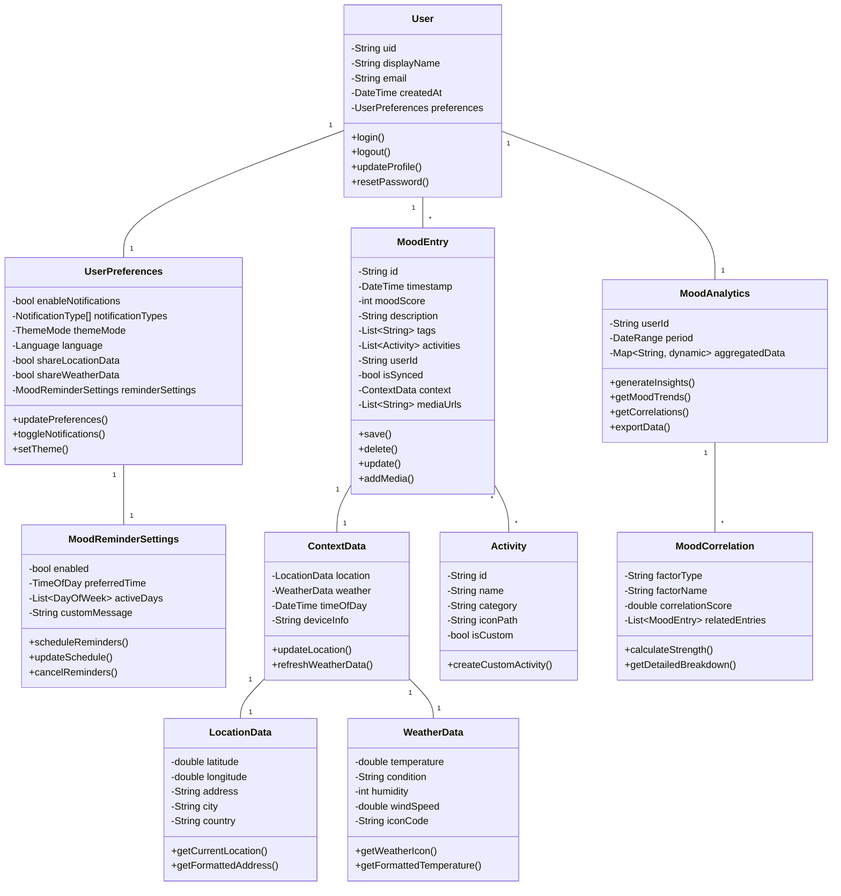

## Figure 4.10: Class Diagram - Pro Mood Tracker Data Model

This class diagram represents the core data structures and their relationships in the Pro Mood Tracker application, illustrating how user data, mood entries, and analytical components are organized.

### Key Classes:

1. **User Class**:
   - Represents the application user with authentication details
   - Contains personal information and references to user-specific settings
   - Provides methods for authentication and profile management

2. **UserPreferences Class**:
   - Stores user configuration options
   - Manages notification settings, theme preferences, and privacy controls
   - Connected to reminder settings for mood tracking

3. **MoodEntry Class**:
   - Core data structure that stores individual mood records
   - Contains the mood score, description, associated activities, and contextual information
   - Handles persistence operations (save, update, delete)
   - Links to media attachments and contextual data

4. **ContextData Class**:
   - Captures environmental and situational information when a mood is recorded
   - Aggregates location data, weather conditions, and device information
   - Provides enriched context for mood analysis

5. **Activity Class**:
   - Represents activities that can be associated with mood entries
   - Includes both predefined and custom user-created activities
   - Categorized for better organization and analysis

6. **MoodAnalytics Class**:
   - Processes mood data to generate insights and identify patterns
   - Calculates trends over specified time periods
   - Discovers correlations between activities, context, and mood states

### Key Relationships:

- Each user has one set of preferences and many mood entries
- Mood entries contain contextual data (location and weather)
- Mood entries can be associated with multiple activities
- Analytics components process mood entries to generate insights
- Reminder settings are configured as part of user preferences

### Design Patterns Applied:

- **Composition**: Complex objects like MoodEntry composed of smaller specialized objects
- **Aggregation**: User aggregates multiple mood entries
- **Association**: Activities are associated with mood entries in a many-to-many relationship
- **Encapsulation**: Each class encapsulates its data with relevant methods

This data model enables the application to efficiently store, retrieve, and analyze mood information while maintaining relationships between different entities, supporting both the core tracking functionality and advanced analytical features. 