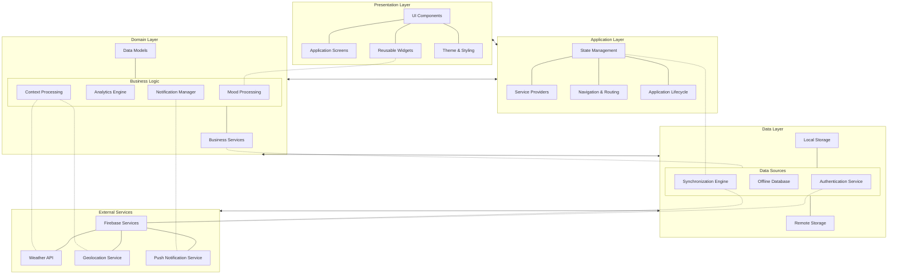

## Figure 4.11: Architecture Diagram - Pro Mood Tracker Application

This architecture diagram illustrates the layered design of the Pro Mood Tracker application, showcasing the separation of concerns and interactions between various components. The architecture follows a clean, modular approach that enhances maintainability, testability, and scalability.

### Architectural Layers:

1. **Presentation Layer**:
   - Contains all UI components, screens, widgets, and theming
   - Responsible for rendering the user interface and capturing user interactions
   - Implements responsive design for cross-device compatibility
   - Composed of reusable Flutter widgets organized by functionality

2. **Application Layer**:
   - Manages application state using Provider pattern
   - Handles navigation and routing between screens
   - Orchestrates the application lifecycle
   - Provides dependency injection and service locator functionality

3. **Domain Layer**:
   - Contains the core business logic of the application
   - Implements features like mood processing, analytics, context enrichment
   - Defines service interfaces and business rules
   - Processes data and implements application-specific algorithms

4. **Data Layer**:
   - Manages data persistence and retrieval
   - Implements the repository pattern for data access
   - Provides offline-first capabilities through local storage
   - Handles synchronization with remote services

5. **External Services**:
   - Integrates with third-party APIs and services
   - Includes Firebase for authentication, storage, and analytics
   - Interfaces with weather and location services
   - Manages push notifications

### Key Architectural Features:

1. **Separation of Concerns**:
   - Each layer has distinct responsibilities
   - Dependencies flow downward, with upper layers depending on lower layers
   - Clean interfaces between layers promote modularity

2. **Offline-First Approach**:
   - Local storage serves as the primary data source
   - Synchronization engine handles data reconciliation with remote storage
   - Application remains fully functional without network connectivity

3. **Cross-Cutting Concerns**:
   - Authentication spans multiple layers for secure data access
   - Error handling and logging integrated throughout the architecture
   - Configuration management accessible across layers

4. **Scalability Considerations**:
   - Modular design allows for feature expansion
   - Service-oriented approach enables easy integration of new external services
   - Clear boundaries facilitate team collaboration on different parts of the system

This architecture supports the application's requirements for reliability, performance, and user experience while providing a solid foundation for future enhancements and feature additions. 