```mermaid
sequenceDiagram
    title Pro Mood Tracker - Authentication Flow
    
    actor User
    participant UI as User Interface
    participant AuthService as Authentication Service
    participant LocalDB as Local Storage
    participant Firebase as Firebase Auth
    participant Firestore as Firestore Database
    
    %% User Registration Flow
    User->>UI: Tap "Sign Up"
    UI->>User: Display registration form
    User->>UI: Enter email/password
    UI->>AuthService: register(email, password)
    AuthService->>Firebase: createUserWithEmailAndPassword()
    
    alt Registration Success
        Firebase->>AuthService: Return user credentials
        AuthService->>Firestore: createUserProfile()
        Firestore->>AuthService: Profile created confirmation
        AuthService->>LocalDB: storeAuthToken()
        AuthService->>UI: Registration successful
        UI->>User: Navigate to home screen
    else Registration Failed
        Firebase->>AuthService: Return error
        AuthService->>UI: Display error message
        UI->>User: Show error feedback
    end
    
    %% User Login Flow
    User->>UI: Tap "Sign In"
    UI->>User: Display login form
    User->>UI: Enter credentials
    UI->>AuthService: login(email, password)
    AuthService->>Firebase: signInWithEmailAndPassword()
    
    alt Login Success
        Firebase->>AuthService: Return user credentials
        AuthService->>LocalDB: storeAuthToken()
        AuthService->>Firestore: getUserProfile()
        Firestore->>AuthService: Return user profile
        AuthService->>LocalDB: cacheUserProfile()
        AuthService->>UI: Login successful
        UI->>User: Navigate to home screen
    else Login Failed
        Firebase->>AuthService: Return error
        AuthService->>UI: Display error message
        UI->>User: Show error feedback
    end
    
    %% Social Authentication
    User->>UI: Tap "Sign in with Google"
    UI->>AuthService: socialLogin(provider)
    AuthService->>Firebase: signInWithCredential()
    Firebase->>AuthService: Return OAuth credentials
    
    alt Social Login Success
        AuthService->>Firestore: checkUserExists()
        
        alt New User
            AuthService->>Firestore: createUserProfile()
            Firestore->>AuthService: Profile created confirmation
        else Existing User
            Firestore->>AuthService: Return user profile
        end
        
        AuthService->>LocalDB: storeAuthToken()
        AuthService->>LocalDB: cacheUserProfile()
        AuthService->>UI: Login successful
        UI->>User: Navigate to home screen
    else Social Login Failed
        Firebase->>AuthService: Return error
        AuthService->>UI: Display error message
        UI->>User: Show error feedback
    end
    
    %% Auto Login Flow
    User->>UI: Open application
    UI->>AuthService: checkAuthState()
    AuthService->>LocalDB: getStoredToken()
    
    alt Token Exists
        LocalDB->>AuthService: Return token
        AuthService->>Firebase: verifyToken()
        
        alt Token Valid
            Firebase->>AuthService: Token verified
            AuthService->>LocalDB: getUserProfile()
            LocalDB->>AuthService: Return cached profile
            AuthService->>UI: Auto login successful
            UI->>User: Navigate to home screen
        else Token Invalid/Expired
            Firebase->>AuthService: Token invalid
            AuthService->>LocalDB: clearAuthData()
            AuthService->>UI: Token invalid
            UI->>User: Display login screen
        end
    else No Token
        LocalDB->>AuthService: No token found
        AuthService->>UI: Not authenticated
        UI->>User: Display login screen
    end
    
    %% Logout Flow
    User->>UI: Tap "Logout"
    UI->>AuthService: logout()
    AuthService->>Firebase: signOut()
    Firebase->>AuthService: Signout confirmation
    AuthService->>LocalDB: clearAuthData()
    AuthService->>UI: Logout successful
    UI->>User: Navigate to login screen
```

## Figure 4.13: Authentication Sequence Diagram - Pro Mood Tracker Application

This sequence diagram illustrates the detailed authentication flow in the Pro Mood Tracker application, showing the interactions between the user, application interface, authentication service, local storage, and Firebase authentication.

### Key Authentication Flows:

1. **User Registration Process**:
   - User initiates registration by entering email and password
   - Application validates input and creates a new account in Firebase
   - User profile is created in Firestore database
   - Authentication token is stored locally for persistent sessions
   - Error handling for registration failures

2. **Standard Login Process**:
   - User enters credentials in the login form
   - Application authenticates with Firebase
   - Upon successful authentication, user profile is retrieved from Firestore
   - User data is cached locally for offline access
   - Authentication tokens are stored for session management
   - Appropriate error handling for login failures

3. **Social Authentication Flow**:
   - User selects social authentication provider (e.g., Google)
   - OAuth flow is initiated with the selected provider
   - Firebase handles the OAuth token exchange
   - Application checks if user already exists in the system
   - New profiles are created for first-time users
   - Authentication state is persisted locally
   
4. **Automatic Authentication**:
   - Application checks for stored authentication tokens on startup
   - Tokens are verified with Firebase for validity
   - Expired or invalid tokens trigger logout
   - Valid tokens allow automatic login without user input
   - User profile is loaded from local cache for immediate display
   
5. **Logout Process**:
   - User initiates logout from the application
   - Authentication service clears the Firebase session
   - Local authentication data and cached profile are removed
   - User is redirected to the login screen

### Security Considerations:

- Token-based authentication for secure sessions
- Local storage of authentication state for offline access
- Token verification on each application start
- Secure handling of social authentication providers
- Clear separation between authentication and data services
- Comprehensive error handling for all authentication scenarios

This authentication flow ensures that the Pro Mood Tracker application provides secure and convenient user authentication while maintaining a smooth user experience across different login methods and scenarios. The implementation supports both online and offline usage patterns, with appropriate security measures in place for protecting user credentials and data. 