```mermaid
flowchart TD
    subgraph "User Interaction"
        User([User])
        MobileApp[Mobile Application]
    end
    
    subgraph "Client Processing"
        AuthModule[Authentication Module]
        MoodEntryModule[Mood Entry & Tracking]
        AnalyticsModule[Analytics & Reporting]
        NotificationModule[Notifications]
        OfflineCache[(Local Storage/Cache)]
    end
    
    subgraph "Firebase Backend"
        FireAuth[Firebase Authentication]
        FireDB[(Firestore Database)]
        FireStorage[(Cloud Storage)]
        FireFunctions[Cloud Functions]
        FireAnalytics[Firebase Analytics]
    end
    
    subgraph "External Services"
        WeatherAPI[Weather API]
        LocationService[Location Services]
        PushService[Push Notification Service]
    end
    
    %% User to App Interactions
    User -->|Input mood data| MobileApp
    User -->|Request reports| MobileApp
    User -->|Manage settings| MobileApp
    MobileApp -->|Display mood trends| User
    MobileApp -->|Show insights| User
    MobileApp -->|Notifications| User
    
    %% App to Module Flow
    MobileApp <-->|Login/Register| AuthModule
    MobileApp <-->|Record mood| MoodEntryModule
    MobileApp <-->|View statistics| AnalyticsModule
    MobileApp <-->|Manage alerts| NotificationModule
    
    %% Authentication Flow
    AuthModule <-->|Authenticate| FireAuth
    AuthModule -->|Store tokens| OfflineCache
    FireAuth -->|User profile| FireDB
    
    %% Mood Data Flow
    MoodEntryModule -->|Save entries| OfflineCache
    MoodEntryModule <-->|Sync data| FireDB
    MoodEntryModule -->|Store media| FireStorage
    MoodEntryModule <-->|Get weather| WeatherAPI
    MoodEntryModule <-->|Get location| LocationService
    
    %% Analytics Flow
    AnalyticsModule -->|Cache results| OfflineCache
    AnalyticsModule <-->|Retrieve data| FireDB
    AnalyticsModule -->|Usage metrics| FireAnalytics
    FireFunctions -->|Generate insights| FireDB
    
    %% Notification Flow
    NotificationModule -->|Local reminders| OfflineCache
    NotificationModule <-->|Remote notifications| PushService
    FireFunctions -->|Trigger alerts| PushService
    
    %% Offline Synchronization
    OfflineCache <-.->|Sync when online| FireDB
    
    %% Data Processing
    FireFunctions <-->|Process data| FireDB
    FireFunctions -->|Store results| FireDB

    %% Data Types & Annotations
    classDef userInteraction fill:#f9f,stroke:#333,stroke-width:2px
    classDef clientModules fill:#bbf,stroke:#333,stroke-width:1px
    classDef firebaseServices fill:#bfb,stroke:#333,stroke-width:1px
    classDef externalAPIs fill:#fbb,stroke:#333,stroke-width:1px
    classDef dataStore fill:#fffacd,stroke:#333,stroke-width:1px
    
    class User,MobileApp userInteraction
    class AuthModule,MoodEntryModule,AnalyticsModule,NotificationModule clientModules
    class FireAuth,FireDB,FireStorage,FireFunctions,FireAnalytics firebaseServices
    class WeatherAPI,LocationService,PushService externalAPIs
    class OfflineCache dataStore
```

## Figure 4.14: Data Flow Diagram - Pro Mood Tracker Application

This data flow diagram illustrates how information moves through the Pro Mood Tracker application, from user input to storage, processing, and presentation of insights.

### Key Components and Data Flows:

1. **User Interaction Layer**:
   - Users input mood data, journal entries, and contextual information
   - Application displays processed data as trends, insights, and notifications
   - Bidirectional flow ensures real-time feedback and interaction

2. **Client Processing Layer**:
   - Authentication Module: Handles user identity and security
   - Mood Entry Module: Captures and processes mood data with context
   - Analytics Module: Generates insights and visualizations
   - Notification Module: Manages reminders and alerts
   - Local Storage: Enables offline functionality and caches frequently accessed data

3. **Firebase Backend Layer**:
   - Authentication: Secures user identity and access control
   - Firestore Database: Stores structured user data and mood entries
   - Cloud Storage: Houses media attachments like photos and audio notes
   - Cloud Functions: Processes data for insights and triggers notifications
   - Analytics: Tracks usage patterns for application improvement

4. **External Services Layer**:
   - Weather API: Provides contextual weather information for mood correlation
   - Location Services: Adds geographical context to mood entries
   - Push Notification Service: Delivers alerts and reminders

### Data Flow Patterns:

1. **Offline-First Architecture**:
   - Data is first stored locally before synchronizing with the cloud
   - Enables application functionality without constant connectivity
   - Bidirectional synchronization when connection is available

2. **Real-time Data Processing**:
   - Mood entries trigger immediate feedback and quick insights
   - Cloud functions process aggregate data for deeper analysis
   - Changes propagate to all user devices through Firebase

3. **Secure Data Handling**:
   - Authentication governs all data access
   - Sensitive information remains encrypted
   - User data segregation ensures privacy

4. **Contextual Enrichment**:
   - Basic mood data is enhanced with weather, location, and time context
   - External APIs provide environmental factors for correlation analysis
   - Rich context enables more meaningful insights

This data flow architecture enables the Pro Mood Tracker application to provide valuable personal insights while maintaining responsiveness, reliability, and security. The design prioritizes user privacy, offline functionality, and meaningful analysis of emotional patterns. 