```mermaid
sequenceDiagram
    title Pro Mood Tracker - Key User Interaction Flows
    
    actor User
    participant UI as Mobile App UI
    participant Logic as App Logic
    participant Local as Local Storage
    participant Auth as Firebase Auth
    participant DB as Firestore
    participant Storage as Cloud Storage
    participant Functions as Cloud Functions
    participant External as External APIs

    %% Authentication Flow
    rect rgb(200, 230, 255)
    Note over User, External: Authentication Flow
    User->>UI: Open App
    UI->>Logic: Check Auth Status
    Logic->>Local: Get Auth Token
    
    alt New User
        Logic->>UI: Show Login/Register Screen
        User->>UI: Enter Credentials
        UI->>Logic: Submit Credentials
        Logic->>Auth: Authenticate User
        Auth-->>Logic: Auth Response
        Logic->>Local: Store Auth Token
    else Returning User
        Local-->>Logic: Return Valid Token
        Logic->>Auth: Validate Token
        Auth-->>Logic: Validation Response
    end
    
    Logic->>UI: Update Auth State
    UI->>User: Show Dashboard
    end

    %% Mood Entry Flow
    rect rgb(220, 255, 220)
    Note over User, External: Mood Entry Flow
    User->>UI: Tap "Add Mood Entry"
    UI->>User: Display Mood Entry Form
    User->>UI: Select Mood & Factors
    
    opt Add Context
        User->>UI: Tap "Add Context"
        UI->>External: Request Location
        External-->>UI: Return Location
        UI->>External: Request Weather
        External-->>UI: Return Weather Data
        UI->>User: Display Context Options
        User->>UI: Confirm Context
    end
    
    User->>UI: Add Notes/Media
    opt Add Photo
        User->>UI: Capture Photo
        UI->>Logic: Process Photo
        Logic->>Local: Store Locally
    end
    
    User->>UI: Submit Entry
    UI->>Logic: Process Entry
    Logic->>Local: Save Entry Locally
    
    alt Online
        Logic->>DB: Sync Entry
        DB-->>Logic: Sync Confirmation
        
        opt Has Media
            Logic->>Storage: Upload Media
            Storage-->>Logic: Upload Confirmation
            Logic->>DB: Update Entry with Media URLs
        end
        
        Logic->>Functions: Trigger Analysis
        Functions->>DB: Update Insights
        Functions-->>Logic: Analysis Complete
    end
    
    Logic->>UI: Confirm Submission
    UI->>User: Show Success Message
    end
    
    %% Data Visualization Flow
    rect rgb(255, 230, 230)
    Note over User, External: Data Visualization Flow
    User->>UI: Open Insights Section
    UI->>Logic: Request Insights Data
    Logic->>Local: Get Local Data
    
    alt Online
        Logic->>DB: Request Latest Insights
        DB-->>Logic: Return Insights Data
        Logic->>Local: Update Local Cache
    end
    
    Local-->>Logic: Return Mood Data
    Logic->>Logic: Process Data for Visualization
    Logic->>UI: Provide Formatted Data
    UI->>User: Display Charts & Patterns
    
    User->>UI: Interact with Visualization
    UI->>Logic: Process Interaction
    Logic->>UI: Update Visualization
    UI->>User: Show Updated View
    end
    
    %% Data Sync Flow
    rect rgb(255, 255, 220)
    Note over User, External: Data Synchronization Flow
    User->>UI: App Returns to Foreground
    UI->>Logic: Check for Pending Sync
    Logic->>Local: Get Unsynchronized Data
    
    alt Has Pending Data
        Local-->>Logic: Return Pending Data
        Logic->>Logic: Check Network Status
        
        alt Online
            Logic->>DB: Sync Pending Entries
            DB-->>Logic: Sync Confirmation
            
            opt Has Pending Media
                Logic->>Storage: Upload Pending Media
                Storage-->>Logic: Upload Confirmation
                Logic->>DB: Update Entries with Media URLs
            end
            
            Logic->>DB: Get Remote Changes
            DB-->>Logic: Return Remote Changes
            Logic->>Local: Merge Remote Changes
            Logic->>UI: Update UI with New Data
        end
    end
    
    Logic->>UI: Sync Status Update
    UI->>User: Indicate Sync Status
    end
    
    %% Settings & Preferences Flow
    rect rgb(230, 230, 255)
    Note over User, External: Settings & Preferences Flow
    User->>UI: Open Settings
    UI->>Logic: Get Current Settings
    Logic->>Local: Retrieve Settings
    Local-->>Logic: Return Settings
    Logic->>UI: Display Settings
    
    User->>UI: Modify Settings
    UI->>Logic: Save Settings
    Logic->>Local: Update Local Settings
    
    alt Online
        Logic->>DB: Sync Settings
        DB-->>Logic: Confirm Settings Update
    end
    
    Logic->>UI: Confirm Settings Saved
    UI->>User: Show Settings Updated
    end
```

## Figure 4.17: Sequence Diagram - Key User Interaction Flows in Pro Mood Tracker

This sequence diagram illustrates the primary user interaction flows in the Pro Mood Tracker application, showing how data and control flow between different system components during key user actions.

### Main Interaction Flows:

#### 1. Authentication Flow
- Handles user authentication for both new and returning users
- Securely manages authentication tokens
- Provides appropriate UI states based on authentication status

#### 2. Mood Entry Flow
- Captures user mood data through an intuitive form interface
- Enriches entries with contextual data (location, weather)
- Supports media attachments
- Implements dual-storage strategy (local first, then cloud)
- Triggers analysis for insights generation

#### 3. Data Visualization Flow
- Retrieves mood data from local and cloud sources
- Processes data into meaningful visualizations
- Supports interactive exploration of mood patterns
- Adapts to online/offline status

#### 4. Data Synchronization Flow
- Automatically detects and syncs pending data when connectivity is available
- Handles media uploads separately from text data
- Merges remote changes with local data
- Provides users with sync status feedback

#### 5. Settings & Preferences Flow
- Allows users to customize their experience
- Stores settings locally for immediate access
- Synchronizes settings to the cloud for cross-device consistency

### Key Design Patterns Demonstrated:

1. **Offline-First Architecture**: All user actions are first processed and stored locally before being synchronized to the cloud.

2. **Optimistic Updates**: The UI immediately reflects user changes while synchronization happens in the background.

3. **Progressive Enhancement**: Core functionality works offline, with additional features available when online.

4. **Context Enrichment**: Mood entries are automatically enhanced with relevant contextual information when available.

5. **Asynchronous Processing**: Heavy operations like media uploads and data analysis happen asynchronously without blocking the UI.

6. **State Management**: The application maintains clear state transitions throughout user interactions.

This sequence diagram highlights the Pro Mood Tracker's focus on providing a seamless user experience while efficiently managing data flow between local storage and cloud services. The architecture prioritizes responsiveness and reliability, ensuring users can record their moods under any network condition. 