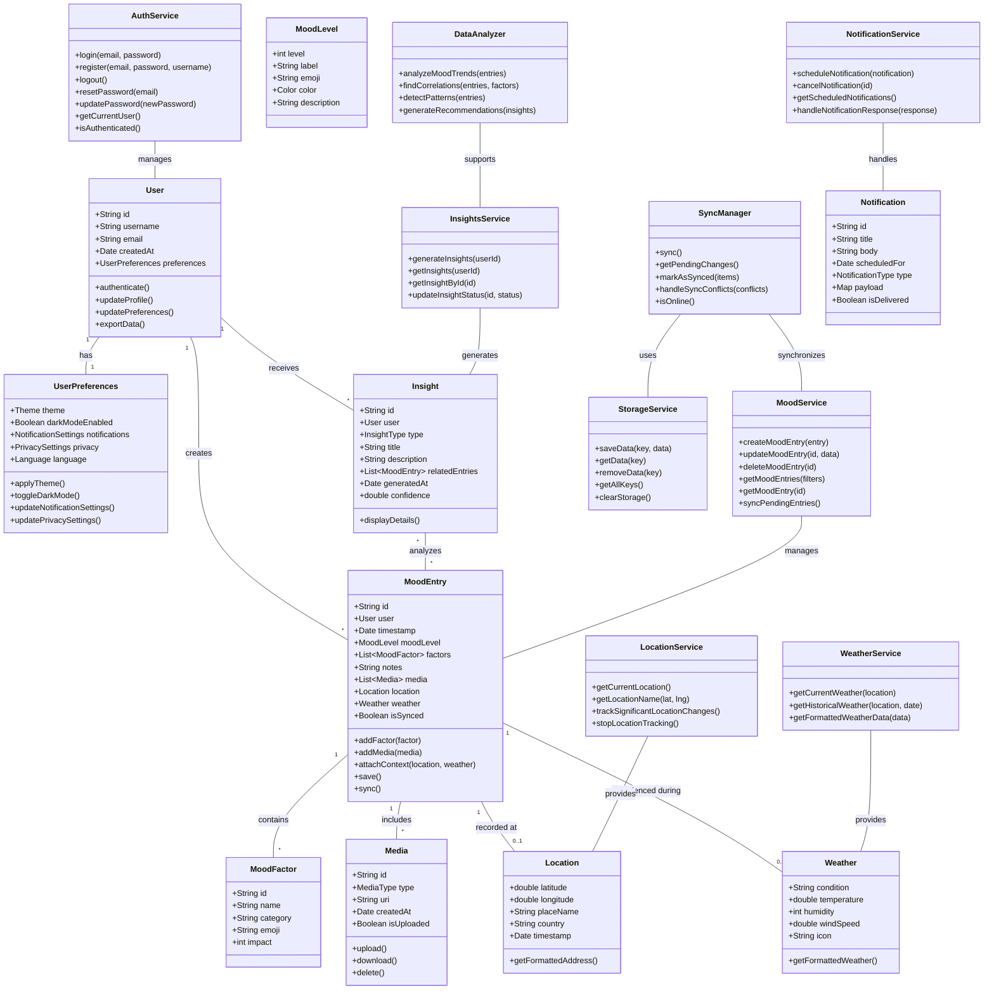

## Figure 4.19: Class Diagram - Pro Mood Tracker Domain Model

This class diagram illustrates the core domain model of the Pro Mood Tracker application, showing the main classes, their attributes, methods, and relationships.

### Key Domain Areas:

#### 1. User Management
- **User**: Represents an application user with authentication information and preferences.
- **UserPreferences**: Stores user customization settings including theme, notifications, and privacy options.
- **AuthService**: Manages authentication operations including login, registration, and password management.

#### 2. Mood Tracking
- **MoodEntry**: The central entity representing a user's mood record at a specific point in time.
- **MoodLevel**: Defines the intensity and characteristics of a mood.
- **MoodFactor**: Represents contributing factors that influence a user's mood.
- **Media**: Handles photos, audio notes, or other media attachments to mood entries.
- **MoodService**: Provides operations for creating, retrieving, updating, and syncing mood entries.

#### 3. Contextual Information
- **Location**: Stores geographical information about where a mood was recorded.
- **Weather**: Captures weather conditions at the time of a mood entry.
- **LocationService**: Provides location-related functionality including geocoding.
- **WeatherService**: Retrieves current and historical weather information.

#### 4. Insights and Analytics
- **Insight**: Represents a discovered pattern, correlation, or recommendation based on mood data.
- **InsightsService**: Manages the generation and retrieval of insights.
- **DataAnalyzer**: Implements algorithms for analyzing mood data and identifying patterns.

#### 5. Storage and Synchronization
- **StorageService**: Handles local data persistence.
- **SyncManager**: Coordinates data synchronization between local storage and cloud backend.

#### 6. Notifications
- **Notification**: Represents a system or reminder notification.
- **NotificationService**: Manages the scheduling and delivery of notifications.

### Key Relationships:

1. **User-Centered Design**: The User class is central, connected to mood entries, insights, and preferences.

2. **Rich Mood Context**: MoodEntry is associated with multiple contextual elements (factors, location, weather, media).

3. **Data Analysis Pipeline**: Connections between MoodEntry, DataAnalyzer, and Insight classes show how raw data transforms into actionable insights.

4. **Service-Based Architecture**: Service classes encapsulate functionality and provide clear interfaces for operations.

5. **Separation of Concerns**: Clear distinctions between data entities, services, and utility classes.

This domain model provides a foundation for understanding the core entities in the Pro Mood Tracker application and how they interact with each other. The design emphasizes rich contextual information around mood data, enabling sophisticated analysis and insights while maintaining a user-centered approach. 