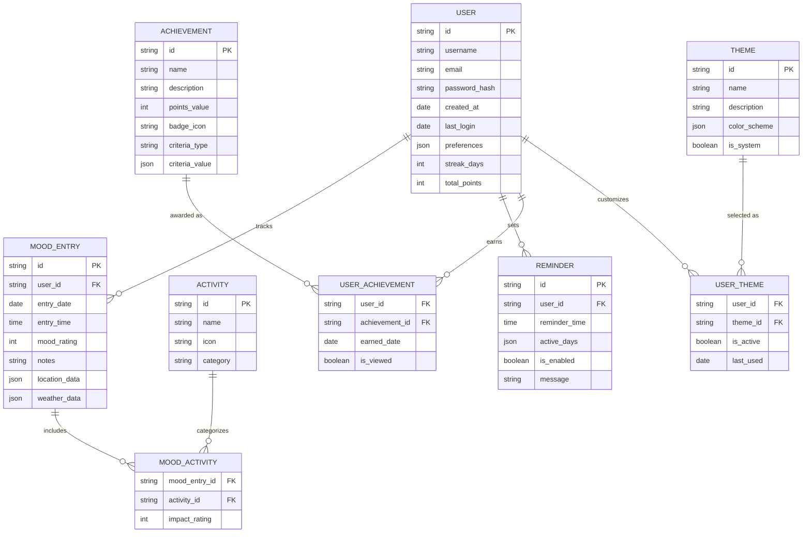

## Figure 4.2: Entity Relationship Diagram

The Entity Relationship Diagram (ERD) illustrates the database structure for the Pro Mood Tracker application, showing the relationships between different entities that store and organize application data.

### Primary Entities

1. **USER**: 
   - Central entity storing user authentication and profile information
   - Tracks user engagement metrics like streak days and points
   - Stores user preferences as a JSON object for flexibility

2. **MOOD_ENTRY**:
   - Core data entity capturing mood tracking information
   - Linked to users through a foreign key relationship
   - Stores contextual information like location and weather data
   - Contains the primary mood rating and optional notes

3. **ACTIVITY**:
   - Reference table for predefined and user-created activities
   - Categorized to allow for organizational grouping
   - Includes visual representation (icon) for UI display

4. **ACHIEVEMENT**:
   - Defines gamification elements to encourage app engagement
   - Contains criteria for earning achievements stored as flexible JSON
   - Associates point values and visual badges with accomplishments

5. **THEME**:
   - Enables UI customization through predefined and custom themes
   - Stores color schemes as JSON for flexible styling options
   - Distinguishes between system defaults and user-created themes

### Junction Tables

1. **MOOD_ACTIVITY**:
   - Links mood entries with associated activities
   - Allows tracking impact rating of activities on mood
   - Enables many-to-many relationship between entries and activities

2. **USER_ACHIEVEMENT**:
   - Tracks which achievements have been earned by which users
   - Records when achievements were earned
   - Tracks viewing status for notification purposes

3. **USER_THEME**:
   - Manages theme preferences for each user
   - Tracks active theme and usage history

### Key Relationships

- Each user can have multiple mood entries, reminders, achievements, and themes
- Mood entries can be associated with multiple activities through the junction table
- Achievements and themes are reusable across users with personalized tracking
- All entity relationships maintain referential integrity through foreign key constraints

This database design supports the core functionality of mood tracking while enabling engagement features like achievements and customization options that enhance the user experience. 