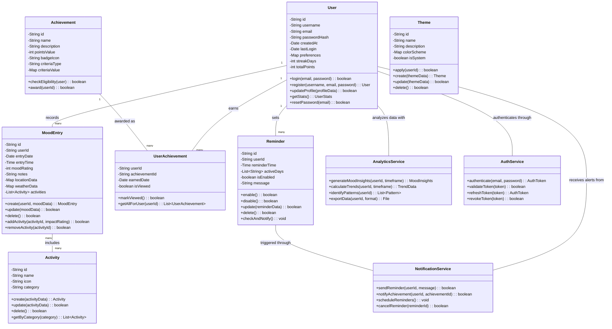

## Figure 4.3: Class Diagram

The class diagram illustrates the structure of the Pro Mood Tracker application, showcasing the primary classes, their attributes, methods, and relationships that form the application's architecture.

### Core Domain Classes

1. **User**
   - Central class representing application users
   - Contains authentication and profile information
   - Tracks engagement metrics and preferences
   - Provides methods for account management

2. **MoodEntry**
   - Represents individual mood records
   - Stores contextual data (location, weather, time)
   - Contains the core mood rating and notes
   - Manages relationships with activities

3. **Activity**
   - Represents categorized activities that influence mood
   - Provides organization through categories
   - Includes visual representation through icons

4. **Achievement**
   - Implements gamification elements
   - Defines criteria for earning achievements
   - Awards points and badges to users

### Supporting Classes

1. **Theme**
   - Enables UI customization
   - Stores color schemes for application appearance
   - Distinguishes between system and user-created themes

2. **Reminder**
   - Manages notification scheduling
   - Supports recurring reminders on specified days
   - Contains customizable messages

### Junction Classes

1. **UserAchievement**
   - Connects users with their earned achievements
   - Tracks achievement status and earning date
   - Provides notification management for new achievements

### Service Classes

1. **AnalyticsService**
   - Processes mood data to generate insights
   - Identifies patterns and calculates trends
   - Exports data for external analysis

2. **NotificationService**
   - Handles all application notifications
   - Manages reminder scheduling and delivery
   - Sends achievement notifications

3. **AuthService**
   - Manages user authentication and security
   - Handles token generation and validation
   - Provides secure access to the application

### Key Relationships

- Each user can record many mood entries and set multiple reminders
- Mood entries can include multiple activities
- Users earn achievements based on their engagement and mood tracking behavior
- Service classes provide cross-cutting functionality to the domain classes

This class structure supports both the core functionality of mood tracking and the extended features like achievements, analytics, and customization that enhance the user experience. 