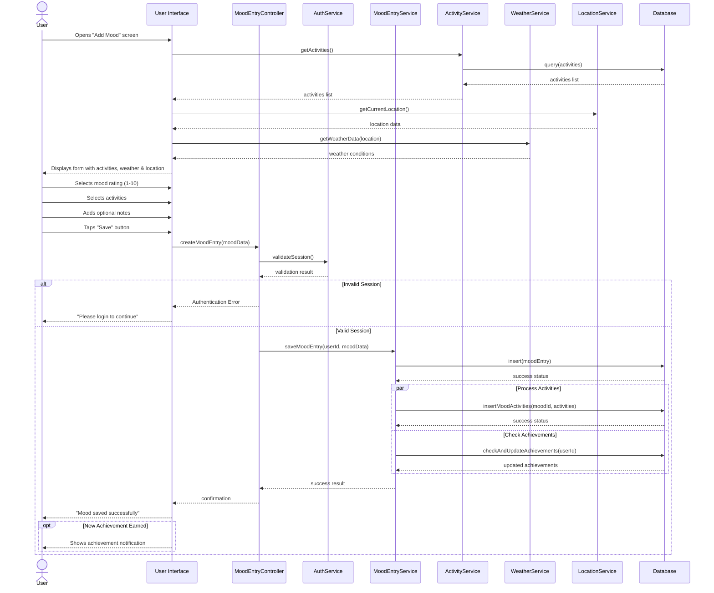

## Figure 4.4: Sequence Diagram - Adding a Mood Entry

This sequence diagram illustrates the process of adding a new mood entry in the Pro Mood Tracker application, showing the interactions between the user, interface, and various system components.

### Process Flow

1. **Initial Setup**
   - User opens the "Add Mood" screen
   - The system retrieves available activities from the database
   - Location and weather data are automatically collected to provide context

2. **User Input**
   - User selects a mood rating on a scale of 1-10
   - User selects relevant activities that influenced their mood
   - User can add optional notes for additional context
   - User submits the entry by tapping "Save"

3. **Processing and Validation**
   - The system validates the user's authentication session
   - If authentication fails, the user is prompted to log in
   - If authenticated, the mood entry processing continues

4. **Data Storage**
   - The mood entry is saved to the database
   - Associated activities are linked to the mood entry
   - The system checks if any achievements have been unlocked

5. **Feedback to User**
   - Confirmation is displayed when the mood entry is saved
   - If a new achievement is earned, a notification is shown

### Key Components

- **User Interface**: Handles data collection and display of information
- **Controllers**: Manage workflow and communication between components
- **Services**: Provide specialized functionality (authentication, mood entries, activities)
- **External Services**: Provide contextual data (weather, location)
- **Database**: Stores all persistent data

This sequence demonstrates the application's user-centered design while highlighting the behind-the-scenes processes that enhance the mood tracking experience with contextual data and achievement recognition. 