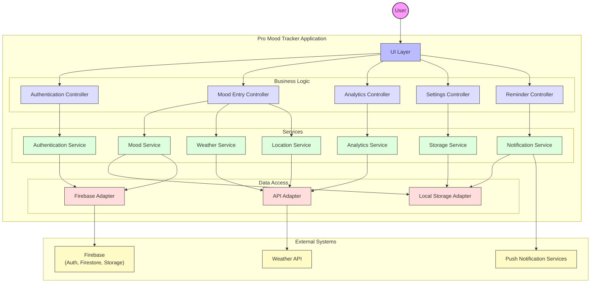

## Figure 4.6: Component Diagram - Pro Mood Tracker System

This component diagram illustrates the architectural components of the Pro Mood Tracker application and their relationships, showcasing the modular design of the system.

### Key Components

#### UI Layer
The user interface layer provides the visual components and interactions for users to interact with the application. This includes mood entry forms, dashboards, settings screens, and analytics visualizations.

#### Business Logic
- **Authentication Controller**: Manages user authentication flows and session state.
- **Mood Entry Controller**: Coordinates the creation, viewing, and modification of mood entries.
- **Analytics Controller**: Handles requests for mood data analysis and insight generation.
- **Settings Controller**: Manages user preferences and application configuration.
- **Reminder Controller**: Coordinates the creation and management of mood entry reminders.

#### Services
- **Authentication Service**: Implements user authentication, registration, and profile management.
- **Mood Service**: Implements core functionality related to mood data management.
- **Weather Service**: Retrieves and processes weather information for mood context.
- **Location Service**: Handles location determination and geocoding.
- **Storage Service**: Manages persistent storage of application data.
- **Notification Service**: Handles scheduling and delivery of reminders and insights.
- **Analytics Service**: Processes mood data to generate insights and trends.

#### Data Access
- **Local Storage Adapter**: Provides an interface for storing and retrieving data from device storage.
- **Firebase Adapter**: Interfaces with Firebase services for cloud storage and authentication.
- **API Adapter**: Handles communication with external APIs for weather and other services.

#### External Systems
- **Firebase**: Cloud services for authentication, data storage, and file storage.
- **Weather API**: External service for retrieving weather data.
- **Push Notification Services**: Platform-specific notification services (FCM for Android, APNS for iOS).

### Component Interactions

The diagram shows how user interactions flow through the system:

1. Users interact with the UI layer.
2. The UI layer communicates with the appropriate controllers in the business logic layer.
3. Controllers coordinate with services to perform business operations.
4. Services use data access adapters to interact with local storage or external systems.
5. Data access adapters communicate with external systems like Firebase and weather APIs.

This architecture follows separation of concerns principles, with clear boundaries between layers. The use of service and adapter patterns provides flexibility for future changes or extensions to the system, such as swapping out storage mechanisms or integrating with different external services. 