```mermaid
classDiagram
    %% Core Domain Classes
    class MoodEntry {
        +String id
        +DateTime timestamp
        +String userId
        +Int moodScore
        +List~String~ activities
        +String notes
        +Location location
        +WeatherInfo weather
        +createMoodEntry()
        +updateMoodEntry()
        +deleteMoodEntry()
    }
    
    class User {
        +String id
        +String email
        +String displayName
        +DateTime createdAt
        +UserPreferences preferences
        +List~Reminder~ reminders
        +createUser()
        +updateUser()
        +updatePreferences()
    }
    
    class UserPreferences {
        +bool notificationsEnabled
        +List~TimeOfDay~ reminderTimes
        +ThemeType theme
        +bool useLocation
        +bool trackWeather
        +List~String~ customActivities
        +updatePreferences()
    }
    
    class Reminder {
        +String id
        +String title
        +String message
        +TimeOfDay time
        +List~DayOfWeek~ days
        +bool isActive
        +createReminder()
        +updateReminder()
        +deleteReminder()
        +toggleActive()
    }
    
    class WeatherInfo {
        +String condition
        +double temperature
        +double humidity
        +DateTime recordedAt
    }
    
    class Location {
        +double latitude
        +double longitude
        +String placeName
        +getFormattedAddress()
    }
    
    class MoodAnalytics {
        +DateTime startDate
        +DateTime endDate
        +calculateAverageMood()
        +identifyPatterns()
        +generateInsights()
        +getMoodTrends()
    }
    
    %% Service Classes
    class AuthService {
        +loginWithEmailPassword(String email, String password)
        +registerUser(String email, String password)
        +resetPassword(String email)
        +getCurrentUser()
        +logoutUser()
        +updateUserProfile(UserProfile profile)
    }
    
    class MoodService {
        +createMoodEntry(MoodEntry entry)
        +getMoodEntries(DateTime start, DateTime end)
        +updateMoodEntry(MoodEntry entry)
        +deleteMoodEntry(String id)
        +syncMoodEntries()
    }
    
    class LocationService {
        +getCurrentLocation()
        +getLocationName(double lat, double lng)
        +requestLocationPermission()
    }
    
    class WeatherService {
        +getCurrentWeather(Location location)
        +getWeatherForecast(Location location)
    }
    
    class NotificationService {
        +scheduleReminder(Reminder reminder)
        +cancelReminder(String id)
        +sendNotification(String title, String body)
    }
    
    class AnalyticsService {
        +getMoodTrends(DateTime start, DateTime end)
        +getActivityCorrelations()
        +getWeatherImpact()
        +generateInsights()
    }
    
    class StorageService {
        +saveData(String key, dynamic data)
        +getData(String key)
        +removeData(String key)
        +clearAll()
    }
    
    %% Repository Classes
    class Repository~T~ {
        <<interface>>
        +create(T item)
        +read(String id)
        +update(T item)
        +delete(String id)
        +getAll()
    }
    
    class MoodRepository {
        +createMoodEntry(MoodEntry entry)
        +getMoodEntry(String id)
        +updateMoodEntry(MoodEntry entry)
        +deleteMoodEntry(String id)
        +getAllEntries()
        +getEntriesByDateRange(DateTime start, DateTime end)
    }
    
    class UserRepository {
        +createUser(User user)
        +getUser(String id)
        +updateUser(User user)
        +updateUserPreferences(UserPreferences prefs)
        +getUserReminders()
    }
    
    %% Relationships
    User "1" -- "many" MoodEntry : creates
    User "1" -- "1" UserPreferences : has
    User "1" -- "many" Reminder : has
    MoodEntry "1" -- "0..1" WeatherInfo : contains
    MoodEntry "1" -- "0..1" Location : contains
    
    MoodService --> MoodRepository : uses
    AuthService --> UserRepository : uses
    MoodAnalytics --> MoodRepository : uses
    
    MoodRepository --|> Repository : implements
    UserRepository --|> Repository : implements
```

## Figure 4.7: Class Diagram - Pro Mood Tracker Application

This class diagram illustrates the object-oriented structure of the Pro Mood Tracker application, showing the key classes, their attributes, methods, and relationships.

### Core Domain Classes

- **MoodEntry**: Represents a single mood recording, containing all context information.
- **User**: Represents an application user with their profile and preferences.
- **UserPreferences**: Contains user-specific application settings.
- **Reminder**: Defines a scheduled notification to prompt mood entry.
- **WeatherInfo**: Stores weather conditions associated with a mood entry.
- **Location**: Stores geographical information for a mood entry.
- **MoodAnalytics**: Provides methods for analyzing mood data and generating insights.

### Service Classes

- **AuthService**: Handles user authentication operations.
- **MoodService**: Manages the core functionality for mood entries.
- **LocationService**: Manages location detection and geolocation features.
- **WeatherService**: Interfaces with weather API to retrieve weather data.
- **NotificationService**: Manages scheduling and delivery of reminders.
- **AnalyticsService**: Processes mood data to generate insights and trends.
- **StorageService**: Provides a uniform interface for data persistence.

### Repository Classes

- **Repository<T>**: Generic interface defining common data operations.
- **MoodRepository**: Implements Repository for MoodEntry storage and retrieval.
- **UserRepository**: Implements Repository for User data operations.

### Key Relationships

1. A User creates many MoodEntries
2. Each User has one UserPreferences object
3. A User can have multiple Reminders
4. A MoodEntry may contain WeatherInfo and Location data
5. Service classes use corresponding Repository classes for data operations
6. Repository classes implement the generic Repository interface
7. The MoodAnalytics class uses the MoodRepository to access data for analysis

The design follows clean architecture principles with:
- Clear separation between domain models and service implementations
- Repository pattern for data access abstraction
- Dependency inversion through interfaces
- Rich domain models with associated behavior

This object-oriented structure supports the application's requirements for offline functionality, synchronization, and extensible data analysis. 