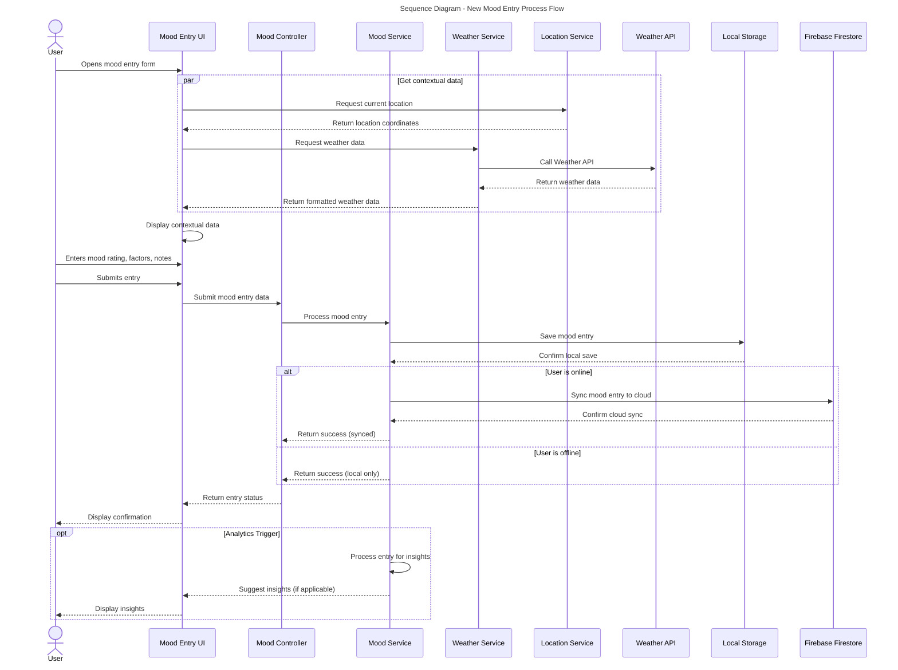

## Figure 4.7: Sequence Diagram - New Mood Entry Process Flow

This sequence diagram illustrates the process flow and interactions between different components when a user creates a new mood entry in the Pro Mood Tracker application.

### Process Flow

1. **User Interaction**:
   - The user opens the mood entry form in the application interface.
   - After completing the form with mood rating, factors, and notes, the user submits the entry.

2. **Contextual Data Collection** (parallel processes):
   - The application retrieves the current location coordinates.
   - The application fetches current weather data from the external Weather API.
   - This contextual data is displayed to the user before they submit their entry.

3. **Data Processing**:
   - The Mood Entry UI passes the submitted data to the Mood Controller.
   - The Mood Controller delegates processing to the Mood Service.

4. **Data Storage**:
   - The mood entry is first saved to local storage for immediate persistence.
   - If the user is online, the entry is synchronized to Firebase Firestore cloud storage.
   - If offline, the entry remains in local storage until connectivity is restored.

5. **Confirmation**:
   - The UI displays a confirmation message to the user.

6. **Optional Analytics**:
   - The system processes the entry for potential insights.
   - If applicable, insights or patterns are displayed to the user.

### Key Features Illustrated

- **Parallel Processing**: Contextual data (location, weather) is fetched simultaneously.
- **Offline Support**: The system handles both online and offline scenarios.
- **Local-First Approach**: Data is saved locally before cloud synchronization.
- **Real-time Feedback**: Users receive immediate confirmation of their entries.
- **Proactive Insights**: The system may provide relevant feedback based on the mood data.

This sequence demonstrates the application's robust architecture for handling user inputs while enhancing the experience with contextual data and real-time processing. 