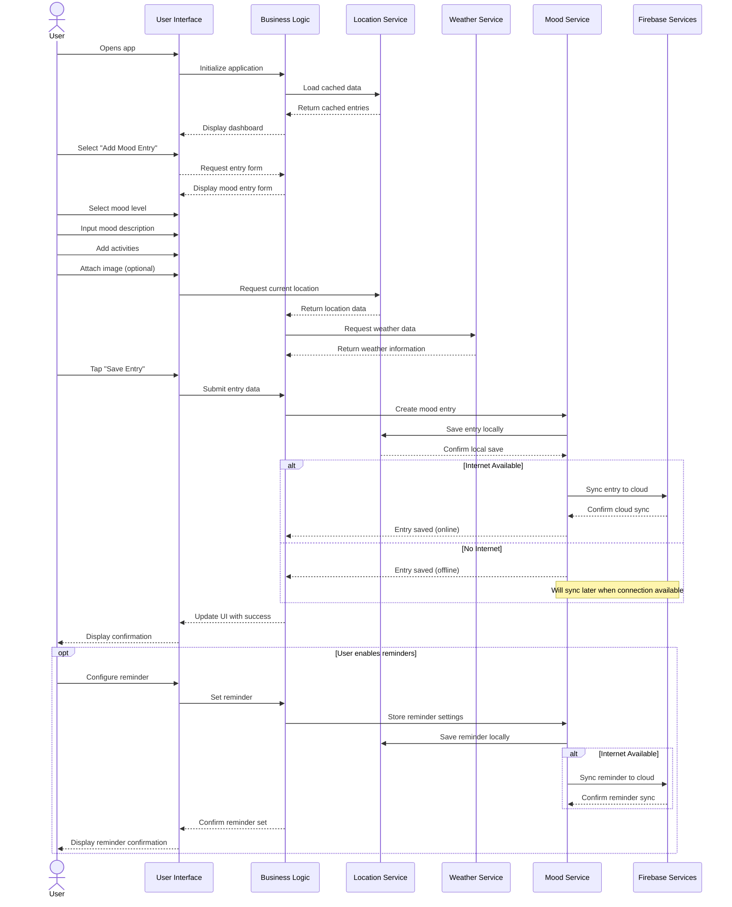

## Figure 4.9: Sequence Diagram - Creating a Mood Entry

This sequence diagram illustrates the workflow for creating and saving a mood entry in the Pro Mood Tracker application, showcasing the interactions between the user, application components, and external services.

### Key Workflow Steps:

1. **Application Initialization**:
   - User opens the application
   - System loads cached data from local storage
   - Dashboard is displayed with existing mood entries

2. **Entry Creation Initiation**:
   - User selects "Add Mood Entry" option
   - Application displays the mood entry form with various input options

3. **Data Input**:
   - User selects mood level (e.g., happy, sad, anxious)
   - User inputs mood description text
   - User adds associated activities
   - User optionally attaches an image

4. **Contextual Data Collection**:
   - System automatically requests location data
   - System fetches current weather information based on location

5. **Data Persistence**:
   - User saves the entry
   - Entry is stored in local storage for offline access
   - If internet connection is available, entry synchronizes to cloud storage
   - If offline, entry is marked for future synchronization

6. **Optional Reminder Setting**:
   - User can configure a reminder related to the mood entry
   - Reminder settings are saved locally and synchronized to cloud when possible

### Key Technical Features Demonstrated:

- **Offline-First Architecture**: Data is always saved locally first
- **Automatic Contextual Enrichment**: Weather and location data automatically attached
- **Asynchronous Synchronization**: Cloud sync happens independently of local operations
- **Graceful Degradation**: System functions even without internet connectivity
- **Multi-Component Coordination**: Various services collaborate to create a complete entry

This workflow demonstrates the application's robust design principles including data persistence, seamless online/offline transitions, and automatic contextual data enrichment - all contributing to a smooth user experience. 